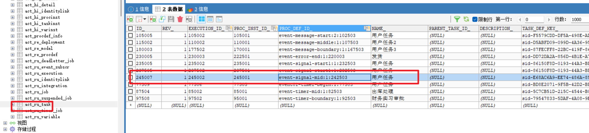
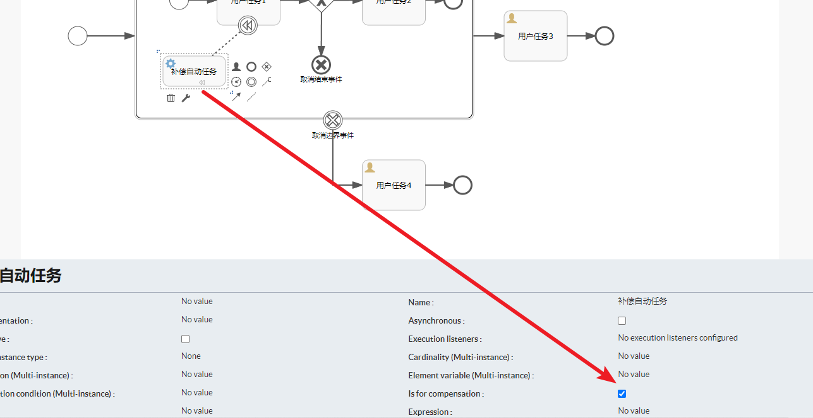
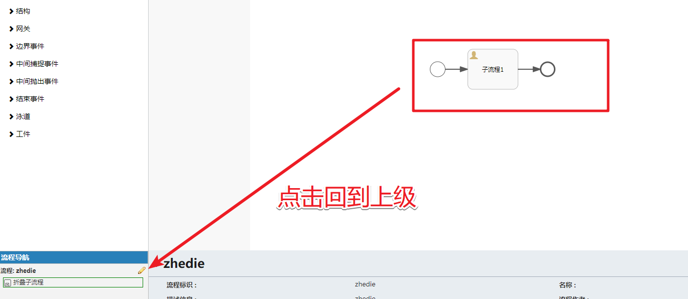
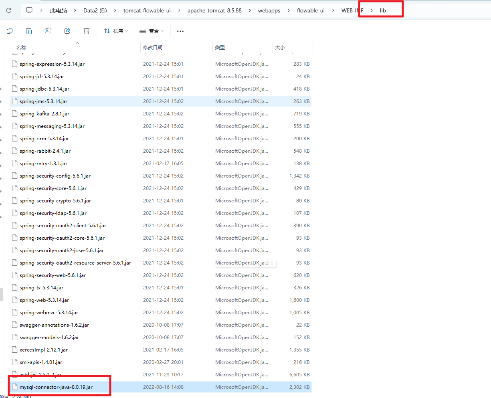
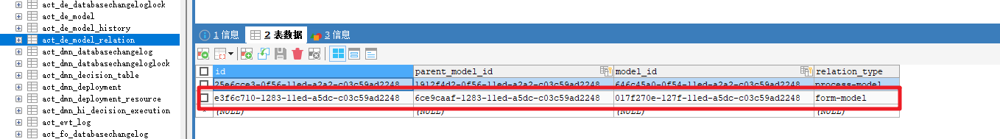
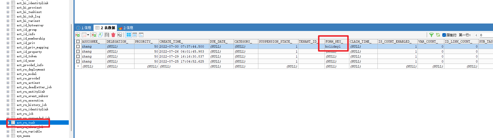

# Flowable高级篇

> lecture：波哥


# 一、事件篇

`事件`（event）通常用于为流程生命周期中发生的事情建模。事件总是图形化为圆圈。在BPMN 2.0中，有两种主要的事件分类：*捕获（catching）*与*抛出（throwing）*事件。

- **捕获:** 当流程执行到达这个事件时，会等待直到触发器动作。触发器的类型由其中的图标，或者说XML中的类型声明而定义。捕获事件与抛出事件显示上的区别，是其内部的图标没有填充（即是白色的）。
- **抛出:** 当流程执行到达这个事件时，会触发一个触发器。触发器的类型，由其中的图标，或者说XML中的类型声明而定义。抛出事件与捕获事件显示上的区别，是其内部的图标填充为黑色。


## 1. 定时器事件

&emsp;&emsp;定时器事件是一种在特定时间触发的事件。在Flowable中，可以通过定时器事件来实现定时执行某个任务或者触发某个流程实例，具体包括定时器启动事件，定时器捕获中间件事件，定时器边界事件,在很多的业务场景中。

### 1.1 定时器开始事件

&emsp;&emsp;定时器启动事件（timer start event）在指定时间创建流程实例。在流程只需要启动一次，或者流程需要在特定的时间间隔重复启动时，都可以使用。在使用时我们需要注意如下几个点：

1. 子流程不能有定时器启动事件。
2. 定时器启动事件，在流程部署的同时就开始计时。不需要调用startProcessInstanceByXXX就会在时间启动。调用startProcessInstanceByXXX时会在定时启动之外额外启动一个流程。
3. 当部署带有定时器启动事件的流程的更新版本时，上一版本的定时器作业会被移除。这是因为通常并不希望旧版本的流程仍然自动启动新的流程实例。
4. asyncExecutorActivate:需要设置为`true`,否则定时器不会生效，因为这块需要开启异步任务。


定时器启动事件，用其中有一个钟表图标的`圆圈`来表示。我们通过具体案例来介绍


部署流程后会在我们设置的时间开启一个流程实例，在没有到达定时时间的时候在`act_ru_timer_job`可以看到我们的定时任务信息


时间到达后会触发`定时开启`事件。


定时器开始事件除了上面的指定固定时间启动外我们还可以通过循环和持续时间来处理

- `timeDate`：指定一个具体的日期和时间，例如`2022-01-01T00:00:00`。
- `timeCycle`：指定一个重复周期，例如`R/PT1H`表示每隔1小时触发一次。
- `timeDuration`：指定一个持续时间，例如`PT2H30M`表示持续2小时30分钟。


然后我们增加一个重复周期的案例。这块我们可以通过自动任务来演示案例


在自动任务这块绑定了一个`JavaDelegate`来处理

```java
public class MyJavaDelegate implements JavaDelegate {
    @Override
    public void execute(DelegateExecution execution) {
        System.out.println("自动任务执行了..." + LocalDateTime.now());
    }
}
```


然后部署流程测试，在`act_ru_timer_job`查看定义信息


可以看到执行了3次。都间隔了30秒


### 1.2 定时器中间事件

&emsp;&emsp;在开始事件和结束事件之间发生的事件称为`中间事件`,定时器中间捕获事件指在流程中将一个定时器作为独立的节点来运行，是一个捕获事件。当流程流转到定时器中间捕获事件时，会启动一个定时器，并一直等待触发，只有到达指定时间定时器才被触发。


&emsp;&emsp;当我们审批通过`申请出库`后，等待一分钟触发定时器。然后会进入到`出库处理`。同时在触发前在`act_ru_timer_job`中可以查询到对应的任务信息。


### 1.3 定时器边界事件

&emsp;&emsp;当某个用户任务或者子流程在规定的时间后还没有执行。那么我们就可以通过定时器边界事件来触发执行特定的处理流程。

&emsp;&emsp;注意在定时器边界事件配置了cancelActivity属性，用于说明该事件是否为中断事件。cancelActivity属性值默认为true，表示它是边界中断事件，当该边界事件触发时，它所依附的活动实例被终止，原有的执行流会被中断，流程将沿边界事件的外出顺序流继续流转。如果将其设置为false，表示它是边界非中断事件，当边界事件触发时，则原来的执行流仍然存在，所依附的活动实例继续执行，同时也执行边界事件的外出顺序流。


部署后启动流程。那么会进入到`合同审批-总经理审判`的这个节点。同时在`act_ru_timer_job`中可以看到这个边界事件的定义


等待了一分钟定时器边界事件触发。我们可以在控制台中看到`JavaDelegate`任务的执行。


因为这块的边界事件我们定义的是`非中断`。所以用户任务还在，只是在边界事件中触发了服务任务。来通知用户审批处理。


然后`总经理`审批通过。后会进入到财务审批的节点


同时会开启我们的中间边界事件。`act_ru_timer_job`中会生成对应的记录。


同时`act_ru_task`中的审批是`财务审核`。


等待一分钟后。因为边界事件设置的是`中断`类型。所以触发后`财务审核`终止。只剩下触发后的新的出口中的`财务实习审批`


## 2.消息事件

&emsp;&emsp;消息事件（message event），是指引用具名消息的事件。消息具有名字与载荷。与信号不同，消息事件只有一个接收者

### 2.1 开始事件

 `消息开始事件`，也就是我们通过接收到某些消息后来启动流程实例，比如接收到了一封邮件，一条短信等，具体通过案例来讲解.


做消息的定义


在消息开始事件中我们需要绑定上面定义的消息


然后就可以部署流程

```java
    /**
     * 流程部署操作
     */
    @Test
    public void test1(){
        // 1.获取ProcessEngine对象
        ProcessEngine processEngine = ProcessEngines.getDefaultProcessEngine();
        // 2.完成流程的部署操作 需要通过RepositoryService来完成
        RepositoryService repositoryService = processEngine.getRepositoryService();
        // 3.完成部署操作
        Deployment deploy = repositoryService.createDeployment()
                .addClasspathResource("flow/event-message-start.bpmn20.xml")
                .name("消息启动事件")
                .deploy(); // 是一个流程部署的行为 可以部署多个流程定义的
        System.out.println(deploy.getId());
        System.out.println(deploy.getName());

    }

```

部署完流程后。消息启动事件会在`act_ru_event_subscr`中记录我们的定义信息。


然后就可以发送相关的消息。来激活该流程实例，`注意`:消息的名称我们不要使用`驼峰命名法`来定义


当我们发送消息后

```java
/**
 * 发送消息。触发流程
 */
@Test
public void test3() throws InterruptedException {
    ProcessEngine engine = ProcessEngines.getDefaultProcessEngine();
    RuntimeService runtimeService = engine.getRuntimeService();
    // 发送消息 发送的消息应该是具体的消息的名称而不应该是id
    runtimeService.startProcessInstanceByMessage("msg01");
    TimeUnit.SECONDS.sleep(Integer.MAX_VALUE);
}
```

可以看到消息开始事件触发了。


### 2.2 中间事件

&emsp;&emsp;消息中间事件就是在流程运作中需要消息来触发的场景，案例演示，`自动流程1`处理完成后，需要接收特定的消息之后才能进入到`自动流程2`


然后在消息中间事件的图标中我们需要绑定刚刚定义的消息


部署启动和审批流程后进入到消息中间事件的节点


然后发送消息触发消息中间事件

```java
/**
 * 触发消息中间事件
 */
@Test
public void test5(){
    ProcessEngine engine = ProcessEngines.getDefaultProcessEngine();
    RuntimeService runtimeService = engine.getRuntimeService();
    // 查询出当前的 执行实例的 编号
    Execution execution = runtimeService.createExecutionQuery()
            .processInstanceId("110001")
            .onlyChildExecutions()
            .singleResult();
    runtimeService.messageEventReceived("msg02",execution.getId());
}
```

然后进入到了`用户任务2`的审批。说明触发了


### 2.3 边界事件

&emsp;&emsp;消息边界事件同样的针对是用户节点在消息触发前如果还没有审批。就会触发消息事件的处理逻辑。同样我们通过具体的案例来介绍。


定义两个消息


部署流程、启动流程后进入到`用户任务1`后。在`act_ru_event_subscr`表中就可以看到对应的消息事件，这时我们就可以发送相关的消息。


```java
public void test5(){
    ProcessEngine engine = ProcessEngines.getDefaultProcessEngine();
    RuntimeService runtimeService = engine.getRuntimeService();
    runtimeService.messageEventReceived("msg03","170005");
}
```

然后在控制台就可以看到`JavaDelegate`被执行调用了


这里我们需要注意当前的边界事件是非中断的。所以还是需要`用户任务1`来审批推进，审批后会绑定`msg04`


当我们触发了第二个消息边界事件。那么任务会进入到`用户任务3`。同时`用户任务2`被中断了。然后`msg04`的任务也结束了。


## 3.错误事件

&emsp;&emsp;`错误事件`可以用做一个流程的开始事件或者作为一个任务或者子流程的边界事件，错误事件没有提供作用中间事件的功能，这一点和前面介绍的定时器事件和消息事件还有区别的。在错误事件中提供了`错误结束事件`。我们在案例中会详细的讲解。

### 3.1 开始事件

&emsp;&emsp;错误开始事件（error start event）可以触发一个`事件子流程`，且总是在另外一个流程异常结束时触发。BPMN 2.0规定了错误开始事件只能在事件子流程中被触发，不能在其他流程中被触发，包括顶级流程、嵌套子流程和调用活动。**错误启动事件不能用于启动流程实例**。

&emsp;&emsp;错误启动事件总是`中断`。我们通过案例来介绍


在对应的`自动任务1`中我们需要显示的抛出异常信息

```java
/**
 * 自定义的委托类
 */
public class MyFirstDelegate implements JavaDelegate {
    /**
     * 回调方法
     * @param execution
     */
    @Override
    public void execute(DelegateExecution execution) {
        System.out.println("服务任务执行了..." + LocalDateTime.now().toString());
        // 抛出错误 触发 子流程中的错误开始事件
        throw new BpmnError("error01");
    }
}
```

&emsp;&emsp;那么部署完流程后。然后发起一个新的流程就会走`事件子流程`中的逻辑了。错误开始事件可以在如下的场景中使用：

1. 输入验证失败：当用户提交工作流启动请求时，需要对输入的数据进行验证。如果数据不符合预期的格式或规则，可以使用错误开始事件来捕获并处理验证失败的情况。

2. 权限验证失败：在某些情况下，只有特定的用户或用户组才能启动某个工作流。当非授权用户尝试启动工作流时，可以使用错误开始事件来捕获并处理权限验证失败的情况。

3. 前置条件不满足：在工作流启动之前，可能需要满足一些前置条件，例如某个数据已经存在或某个服务可用。如果前置条件不满足，可以使用错误开始事件来捕获并处理这种情况。

4. 数据源异常：在工作流启动过程中，可能需要从外部数据源获取数据。如果数据源出现异常导致无法获取数据，可以使用错误开始事件来捕获并处理数据源异常的情况。

总的来说，错误开始事件可以用于捕获工作流启动时可能出现的各种错误情况，并根据具体的业务需求进行相应的处理。

### 3.2 边界事件

&emsp;&emsp;当某个任务发生错误时，可以通过错误边界事件来捕获并处理该错误，以保证流程的正常执行。

&emsp;&emsp;`错误边界事件`可以在流程中的任务节点上定义，并与该任务节点关联。当任务节点执行过程中发生错误时，错误边界事件会被触发，并执行相应的处理逻辑，如发送错误通知、重新分配任务、跳转到其他节点等。

&emsp;&emsp;错误边界事件可以捕获多种类型的错误，如异常、超时、网络故障等。通过使用错误边界事件，可以增加流程的容错性，并提供更好的错误处理机制，保证流程的稳定性和可靠性。

&emsp;&emsp;`需要注意`的是，错误边界事件只能与任务节点关联，而不能与其他类型的节点（如网关、开始节点、结束节点）关联。此外，在设计流程时，需要准确定义错误边界事件的触发条件和处理逻辑，以确保错误能够被正确捕获和处理。具体我们通过案例来演示。


&emsp;&emsp;案例中我们把错误边界事件绑定在了普通的用户任何和一个子流程上。如果对应的节点抛出的相关的错误。对应的边界事件就可以被触发。

错误边界事件可能的应用场景：

1. 任务执行失败：当某个任务执行失败时，可以使用错误边界事件来捕获该异常，并执行一些恢复操作，例如重新分配任务给其他用户或记录错误信息。

2. 子流程异常：当子流程执行过程中发生异常时，可以使用错误边界事件捕获该异常，并执行一些补救措施，例如回退到上一个节点或重新启动子流程。

3. 超时处理：当某个任务或子流程在规定的时间内没有完成时，可以使用错误边界事件来捕获超时异常，并执行相应的超时处理逻辑，例如发送提醒邮件或自动终止流程。

4. 数据校验失败：在某些场景下，需要对流程中的数据进行校验，如果校验失败，则可以使用错误边界事件来捕获校验异常，并进行相应的处理，例如返回错误信息给用户或中止流程。

总之，错误边界事件可以帮助我们在流程执行过程中及时捕获并处理异常情况，提高流程的可靠性和稳定性。

### 3.3 结束事件

&emsp;&emsp;在Flowable中，`错误结束事件`（Error End Event）是一个用于标记流程实例在特定错误条件下结束的节点。当流程实例执行到错误结束事件时，流程实例将立即终止执行，并且流程实例的状态将被标记为“错误结束”。

&emsp;&emsp;错误结束事件可以与错误边界事件（Error Boundary Event）结合使用，用于在流程中捕获和处理特定的错误。当错误边界事件触发时，流程会跳转到与错误边界事件关联的错误结束事件，从而使流程实例结束。

&emsp;&emsp;错误结束事件可以配置一个错误代码，用于标识特定的错误类型。在流程定义中，可以定义多个错误结束事件，每个事件可以有不同的错误代码。当流程实例执行到错误结束事件时，可以根据错误代码进行相应的处理，例如记录日志、发送通知等。

&emsp;&emsp;错误结束事件可以用于处理各种错误情况，例如系统异常、业务规则异常等。通过使用错误结束事件，可以使流程能够在错误发生时进行合理的处理，提高系统的可靠性和稳定性。

总之，错误结束事件是Flowable中的一个节点，用于标记流程实例在特定错误条件下结束。它可以与错误边界事件结合使用，用于捕获和处理特定的错误。通过使用错误结束事件，可以实现对流程中各种错误情况的处理和管理。


当子流程中的支付失败的情况下会触发错误结束事件。该事件会被错误边界事件捕获。错误边界事件捕获后会重新发起支付的流程。这就是我们介绍的案例流程。

## 4. 信号事件

&emsp;&emsp;信号事件是Flowable中的一种事件类型，用于在流程执行过程中通知其他流程实例或任务实例。

&emsp;&emsp;信号事件是一种`全局事件`，可以在任何流程实例或任务实例中触发和捕获。当一个流程实例或任务实例触发了一个信号事件，其他等待捕获相同信号的流程实例或任务实例将被唤醒并继续执行。

信号事件可以用于以下场景：

1. 并行流程实例之间的协作：当一个流程实例需要与其他并行流程实例进行协作时，可以触发一个信号事件来通知其他流程实例执行相应的任务。

2. 动态流程控制：当流程的执行需要根据外部条件进行动态调整时，可以使用信号事件来触发相应的流程变化。

3. 异常处理：当发生异常情况时，可以触发一个信号事件来通知其他流程实例或任务实例进行异常处理。

使用信号事件需要以下几个步骤：

1. 定义信号事件：在流程定义中定义一个信号事件，指定信号的名称和其他属性。

2. 触发信号事件：在流程实例或任务实例中触发一个信号事件。

3. 捕获信号事件：在其他流程实例或任务实例中捕获相同名称的信号事件。

4. 响应信号事件：在捕获的信号事件中定义相应的处理逻辑，例如执行任务或流程变化。

&emsp;&emsp;信号事件我们可以分为`开始事件`、`中间捕获事件`、`中间抛出事件`、`边界事件`，具体的介绍如下

### 4.1 开始事件

- 启动事件是一个特殊的信号事件，用于在流程启动时触发。
- 当流程启动时，如果存在一个启动事件，并且该事件匹配到了被触发的信号，流程将会被启动。
- 启动事件可以用于实现流程启动前的条件判断，例如当某个条件满足时，才允许启动流程。

具体的案例如下：


定义信号信息：


在定义信号的时候有一个`Scope`属性可以设置为Global或processInstance

- Global：全局范围的信号定义，表示可以在任何流程实例中触发和捕获信号。当一个信号事件被触发时，所有等待捕获该信号的节点都会被唤醒。
- processInstance：流程实例范围的信号定义，表示只能在当前流程实例中触发和捕获信号。当一个信号事件被触发时，只有等待在当前流程实例中捕获该信号的节点会被唤醒。

&emsp;&emsp;而当前的启动事件是在流程实例启动时触发的事件，用于执行一些初始化操作。启动事件可以在流程定义的开始节点上定义，并在开始节点上设置事件类型为start。**启动事件只有一个全局范围的信号定义，即scope属性只能设置为Global**。当一个启动事件被触发时，所有等待捕获该信号的节点都会被唤醒。

然后在`信号开始节点`中绑定刚刚定义的信号：


接下就可以部署流程。然后通过`信号`来启动对应的流程实例了。

```java
/**
 * 通过信号启动一个新的流程
 */
@Test
public void test2() throws InterruptedException {
    ProcessEngine engine = ProcessEngines.getDefaultProcessEngine();
    // 发起流程 需要通过 runtimeService来实现
    RuntimeService runtimeService = engine.getRuntimeService();
    // 通过发送信号。触发对应订阅了该信号的流程
    runtimeService.signalEventReceived("signal1");
    TimeUnit.SECONDS.sleep(Integer.MAX_VALUE);
}
```

执行上面的方法就可以看到`act_ru_task`中对应的就有了一条`用户任务`的待办信息


同时对应的信号事件存储在了`act_ru_event_subscr`中。


当然触发该事件的方式并不仅仅只有这一种方案还有：

- 由流程中的信号中间抛出事件抛出信号，所有订阅了该信号的信号开始事件所在的流程定义都会被启动；
- 作为普通开始事件，启动流程。

事件抛出我们在后面的案例中讲解。而作为普通的开始事件。直接执行下面的启动代码即可

```java
// 通过流程定义ID来启动流程  返回的是流程实例对象
        ProcessInstance processInstance = runtimeService
                .startProcessInstanceById("event-signal-start1:1:232503");
```


### 4.2 中间事件

&emsp;&emsp;`信号中间事件`分为`捕获事件`和`抛出事件`.当流程流转到信号中间捕获事件时会中断并等待触发，直到接收到相应的信号后沿信号中间捕获事件的外出顺序流继续流转。信号事件默认是全局的，与其他事件（如错误事件）不同，其信号不会在捕获之后被消费。如果存在多个引用了相同信号的事件被激活，即使它们不在同一个流程实例中，当接收到该信号时，这些事件也会被一并触发。具体我们通过案例来讲解


消息定义我们用的scope是 processInstance。也就是只在当前流程实例生效。部署运行后可以看具体的效果


启动流程后在`act_ru_event_subscr`中记录了信号事件的相关信息。同时记录了作用域信息


然后我们审批用户节点进入到`抛出信号事件`的节点。



审批任务完成

```java
/**
 * 任务审批
 */
@Test
public void test7() throws Exception{
    ProcessEngine engine = ProcessEngines.getDefaultProcessEngine();
    TaskService taskService = engine.getTaskService();
    taskService.complete("245007");
    Thread.sleep(100000000);
}
```

可以看到`自动任务2`执行了


同时因为`scope`是`processInstance`在`act_ru_event_subscr`中记录的信号事件也被消费了。如果是`global`则该信号事件还是继续监听。


### 4.3 边界事件

&emsp;&emsp;`信号边界事件`会捕获与其信号事件定义引用的信号具有相同信号名称的信号。当流程流转到信号边界事件依附的流程活动（如用户任务、子流程等）时，工作流引擎会创建一个捕获事件，在其依附的流程活动的生命周期内等待一个抛出信号。该信号可以由`信号中间抛出事件`抛出或由`API触发`。信号边界事件被触发后流程会沿其外出顺序流继续流转。如果该边界事件设置为`中断`，则依附的流程活动将被终止。


部署流程后启动流程那么具有的相关的数据`act_ru_event_subscr`表中记录的信号事件


然后流程会进入到`用户任务1`节点。当然可以正常的审批。还有就是可以发布相关的信号事件。在当前的环境下我们可以通过`runtimeService`的API来触发

```java
/**
 * 通过信号启动事件
 * 发起一个流程
 * 1.通过runtimeService中提供的API来发送信号
 * 2.通过其他流程实例中的信号中间抛出事件来触发
 * 3.作为普通的流程实例来启动即可
 */
@Test
public void test2() throws InterruptedException {
    ProcessEngine engine = ProcessEngines.getDefaultProcessEngine();
    // 发起流程 需要通过 runtimeService来实现
    RuntimeService runtimeService = engine.getRuntimeService();
    // 通过runtimeService的API来发布信号
    runtimeService.signalEventReceived("signal02");
    TimeUnit.SECONDS.sleep(Integer.MAX_VALUE);
}
```


同时因为是`非中断`的，所以`用户任务1`还在。接下来我们就需要做审批操作。审批通过就会进入到`用户任务2`。


进入到`用户任务2`后。继续审批就会触发`信号抛出事件`，然后被`信号边界`事件捕获。


## 5. 其他事件

### 5.1 终止结束事件

&emsp;&emsp;`终止结束事件`也称为`中断结束事件`，主要是对流程进行终止的事件，可以在一个复杂的流程中，如果某方想要提前中断这个流程，可以采用这个事件来处理，可以在并行处理任务中。如果你是在流程实例层处理，整个流程都会被中断，如果是在子流程中使用，那么当前作用和作用域内的所有的内部流程都会被终止。具体还是通过两个案例来给大家介绍：

第一个案例：终止结束事件是在主流程中触发的场景


设置终止结束事件。里面有一个`terminateAll`默认为false。含义是当`终止结束事件`在多实例或者嵌套的子流程中。那么不会终止整个流程。如果设置为true那么不管是否嵌套都会终止整个的流程实例。


通过案例的演示。我们发下在`用户任务1`和`用户任何2`没有审批的情况下当`用户任务3`审批通过后同时`flag`设置为`false`的情况下触发了`终止结束事件`那么整个流程实例都被终止了。

另一个流程案例：在子流程中触发`终止结束事件`


在本案例中我们可以通过`terminateAll`属性非常方便的控制终止的范围。

### 5.2 取消结束事件

&emsp;&emsp;取消结束事件（cancel end event）只能与BPMN事务子流程（BPMN transaction subprocess）一起使用。当到达取消结束事件时，会抛出取消事件，且必须由取消边界事件（cancel boundary event）捕获。取消边界事件将取消事务，并触发补偿（compensation）。

具体通过案例来讲解：


`注意`：结束取消事件我们只能在`事务子流程`中使用.


在流程设计器中没有直接提供`事务子流程`的图标，我们需要通过普通的子流程来设置事务的属性即可


然后就是补偿的任务我们需要勾选可补偿的选项



部署任务后我们再继续启动流程实例的时候。出现了如下的错误


检查xml文件中发现少了该属性。那么我们需要收到的加上


然后做正常的审批。触发`取消结束事件`，结合上面的流程图我们可以看到如下的效果


补充任务触发。可以看到控制台的日志信息


用户任务4在`act_ru_task`中可以看到对应的记录


### 5.3 补偿事件

&emsp;&emsp;在Flowable中，补偿事件（Compensation Event）是一种用于处理流程中发生异常或错误的特殊事件。当流程中的某个任务或活动发生错误或无法继续执行时，补偿事件可以被触发来回滚或修复之前已经完成的任务或活动。

&emsp;&emsp;补偿事件通常与错误边界事件（Error Boundary Event）结合使用。错误边界事件是在流程中的任务或活动周围设置的捕获异常的事件。当任务或活动发生异常时，错误边界事件将被触发，进而触发相应的补偿事件。

&emsp;&emsp;补偿事件可以执行一系列的补偿操作，包括撤销之前已经完成的任务、还原数据、发送通知等。补偿操作的具体步骤和逻辑可以在流程定义中定义，并且可以使用Java代码或脚本来实现。

&emsp;&emsp;补偿事件的触发和执行是自动完成的，无需人工干预。一旦补偿事件被触发，Flowable引擎会自动查找相应的补偿事件，并按照定义的补偿操作进行执行。

&emsp;&emsp;通过使用补偿事件，可以有效地处理流程中的异常情况，提高流程的稳定性和容错性。补偿事件可以帮助流程在发生错误时自动进行修复，确保流程能够正常完成。


```xml
<?xml version="1.0" encoding="UTF-8"?>
<definitions xmlns="http://www.omg.org/spec/BPMN/20100524/MODEL" xmlns:xsi="http://www.w3.org/2001/XMLSchema-instance" xmlns:xsd="http://www.w3.org/2001/XMLSchema" xmlns:activiti="http://activiti.org/bpmn" xmlns:bpmndi="http://www.omg.org/spec/BPMN/20100524/DI" xmlns:omgdc="http://www.omg.org/spec/DD/20100524/DC" xmlns:omgdi="http://www.omg.org/spec/DD/20100524/DI" typeLanguage="http://www.w3.org/2001/XMLSchema" expressionLanguage="http://www.w3.org/1999/XPath" targetNamespace="http://www.activiti.org/test">
    <error id="payFail" errorCode="payFail" ></error>
    <process id="myProcess" name="My process" isExecutable="true">
        <startEvent id="startevent1" name="开始事件"></startEvent>
        <parallelGateway id="parallelgateway1" name="并行网关"></parallelGateway>
        <sequenceFlow id="flow1" sourceRef="startevent1" targetRef="parallelgateway1"></sequenceFlow>
        <serviceTask id="servicetask1" name="预订机票" activiti:class="com.bobo.delegate.MyTwoDelegate"></serviceTask>
        <serviceTask id="servicetask2" name="微信支付" activiti:class="com.bobo.delegate.MyOneDelegate"></serviceTask>
        <userTask id="usertask1" name="人工出票" activiti:assignee="zhangsan"></userTask>
        <sequenceFlow id="flow2" sourceRef="servicetask1" targetRef="usertask1"></sequenceFlow>
        <parallelGateway id="parallelgateway2" name="Parallel Gateway"></parallelGateway>
        <sequenceFlow id="flow3" sourceRef="usertask1" targetRef="parallelgateway2"></sequenceFlow>
        <sequenceFlow id="flow4" sourceRef="parallelgateway1" targetRef="servicetask1"></sequenceFlow>
        <sequenceFlow id="flow5" sourceRef="parallelgateway1" targetRef="servicetask2"></sequenceFlow>
        <sequenceFlow id="flow6" sourceRef="servicetask2" targetRef="parallelgateway2"></sequenceFlow>
        <serviceTask id="servicetask3" name="取消预订" isForCompensation="true" activiti:class="com.bobo.delegate.MyThreeDelegate"></serviceTask>
        <boundaryEvent id="boundarycompensation1" name="补偿边界事件" attachedToRef="servicetask1" cancelActivity="true">
            <compensateEventDefinition></compensateEventDefinition>
        </boundaryEvent>
        <boundaryEvent id="boundaryerror1" name="错误边界事件" attachedToRef="servicetask2">
            <errorEventDefinition errorRef="payFail"></errorEventDefinition>
        </boundaryEvent>
        <intermediateThrowEvent id="compensationintermediatethrowevent1" name="补偿抛出中间事件">
            <compensateEventDefinition></compensateEventDefinition>
        </intermediateThrowEvent>
        <sequenceFlow id="flow7" sourceRef="boundaryerror1" targetRef="compensationintermediatethrowevent1"></sequenceFlow>
        <endEvent id="endevent1" name="End"></endEvent>
        <sequenceFlow id="flow8" sourceRef="compensationintermediatethrowevent1" targetRef="endevent1"></sequenceFlow>
        <endEvent id="endevent2" name="End"></endEvent>
        <sequenceFlow id="flow9" sourceRef="parallelgateway2" targetRef="endevent2"></sequenceFlow>
        <association id="association1" sourceRef="boundarycompensation1" targetRef="servicetask3" associationDirection="None"></association>
    </process>
    <bpmndi:BPMNDiagram id="BPMNDiagram_myProcess">
        <bpmndi:BPMNPlane bpmnElement="myProcess" id="BPMNPlane_myProcess">
            <bpmndi:BPMNShape bpmnElement="startevent1" id="BPMNShape_startevent1">
                <omgdc:Bounds height="35.0" width="35.0" x="160.0" y="360.0"></omgdc:Bounds>
            </bpmndi:BPMNShape>
            <bpmndi:BPMNShape bpmnElement="parallelgateway1" id="BPMNShape_parallelgateway1">
                <omgdc:Bounds height="40.0" width="40.0" x="380.0" y="357.0"></omgdc:Bounds>
            </bpmndi:BPMNShape>
            <bpmndi:BPMNShape bpmnElement="servicetask1" id="BPMNShape_servicetask1">
                <omgdc:Bounds height="55.0" width="105.0" x="580.0" y="220.0"></omgdc:Bounds>
            </bpmndi:BPMNShape>
            <bpmndi:BPMNShape bpmnElement="boundarycompensation1" id="BPMNShape_boundarycompensation1">
                <omgdc:Bounds height="30.0" width="30.0" x="650.0" y="270.0"></omgdc:Bounds>
            </bpmndi:BPMNShape>
            <bpmndi:BPMNShape bpmnElement="servicetask2" id="BPMNShape_servicetask2">
                <omgdc:Bounds height="55.0" width="105.0" x="580.0" y="450.0"></omgdc:Bounds>
            </bpmndi:BPMNShape>
            <bpmndi:BPMNShape bpmnElement="boundaryerror1" id="BPMNShape_boundaryerror1">
                <omgdc:Bounds height="30.0" width="30.0" x="650.0" y="490.0"></omgdc:Bounds>
            </bpmndi:BPMNShape>
            <bpmndi:BPMNShape bpmnElement="usertask1" id="BPMNShape_usertask1">
                <omgdc:Bounds height="55.0" width="105.0" x="820.0" y="220.0"></omgdc:Bounds>
            </bpmndi:BPMNShape>
            <bpmndi:BPMNShape bpmnElement="parallelgateway2" id="BPMNShape_parallelgateway2">
                <omgdc:Bounds height="40.0" width="40.0" x="1140.0" y="336.0"></omgdc:Bounds>
            </bpmndi:BPMNShape>
            <bpmndi:BPMNShape bpmnElement="servicetask3" id="BPMNShape_servicetask3">
                <omgdc:Bounds height="55.0" width="105.0" x="830.0" y="336.0"></omgdc:Bounds>
            </bpmndi:BPMNShape>
            <bpmndi:BPMNShape bpmnElement="compensationintermediatethrowevent1" id="BPMNShape_compensationintermediatethrowevent1">
                <omgdc:Bounds height="35.0" width="35.0" x="740.0" y="590.0"></omgdc:Bounds>
            </bpmndi:BPMNShape>
            <bpmndi:BPMNShape bpmnElement="endevent1" id="BPMNShape_endevent1">
                <omgdc:Bounds height="35.0" width="35.0" x="820.0" y="590.0"></omgdc:Bounds>
            </bpmndi:BPMNShape>
            <bpmndi:BPMNShape bpmnElement="endevent2" id="BPMNShape_endevent2">
                <omgdc:Bounds height="35.0" width="35.0" x="1225.0" y="339.0"></omgdc:Bounds>
            </bpmndi:BPMNShape>
            <bpmndi:BPMNEdge bpmnElement="flow1" id="BPMNEdge_flow1">
                <omgdi:waypoint x="195.0" y="377.0"></omgdi:waypoint>
                <omgdi:waypoint x="380.0" y="377.0"></omgdi:waypoint>
            </bpmndi:BPMNEdge>
            <bpmndi:BPMNEdge bpmnElement="flow2" id="BPMNEdge_flow2">
                <omgdi:waypoint x="685.0" y="247.0"></omgdi:waypoint>
                <omgdi:waypoint x="820.0" y="247.0"></omgdi:waypoint>
            </bpmndi:BPMNEdge>
            <bpmndi:BPMNEdge bpmnElement="flow3" id="BPMNEdge_flow3">
                <omgdi:waypoint x="925.0" y="247.0"></omgdi:waypoint>
                <omgdi:waypoint x="1160.0" y="247.0"></omgdi:waypoint>
                <omgdi:waypoint x="1160.0" y="336.0"></omgdi:waypoint>
            </bpmndi:BPMNEdge>
            <bpmndi:BPMNEdge bpmnElement="flow4" id="BPMNEdge_flow4">
                <omgdi:waypoint x="400.0" y="357.0"></omgdi:waypoint>
                <omgdi:waypoint x="400.0" y="247.0"></omgdi:waypoint>
                <omgdi:waypoint x="580.0" y="247.0"></omgdi:waypoint>
            </bpmndi:BPMNEdge>
            <bpmndi:BPMNEdge bpmnElement="flow5" id="BPMNEdge_flow5">
                <omgdi:waypoint x="400.0" y="397.0"></omgdi:waypoint>
                <omgdi:waypoint x="400.0" y="477.0"></omgdi:waypoint>
                <omgdi:waypoint x="580.0" y="477.0"></omgdi:waypoint>
            </bpmndi:BPMNEdge>
            <bpmndi:BPMNEdge bpmnElement="flow6" id="BPMNEdge_flow6">
                <omgdi:waypoint x="685.0" y="477.0"></omgdi:waypoint>
                <omgdi:waypoint x="1160.0" y="477.0"></omgdi:waypoint>
                <omgdi:waypoint x="1160.0" y="376.0"></omgdi:waypoint>
            </bpmndi:BPMNEdge>
            <bpmndi:BPMNEdge bpmnElement="flow7" id="BPMNEdge_flow7">
                <omgdi:waypoint x="665.0" y="520.0"></omgdi:waypoint>
                <omgdi:waypoint x="664.0" y="607.0"></omgdi:waypoint>
                <omgdi:waypoint x="740.0" y="607.0"></omgdi:waypoint>
            </bpmndi:BPMNEdge>
            <bpmndi:BPMNEdge bpmnElement="flow8" id="BPMNEdge_flow8">
                <omgdi:waypoint x="775.0" y="607.0"></omgdi:waypoint>
                <omgdi:waypoint x="820.0" y="607.0"></omgdi:waypoint>
            </bpmndi:BPMNEdge>
            <bpmndi:BPMNEdge bpmnElement="flow9" id="BPMNEdge_flow9">
                <omgdi:waypoint x="1180.0" y="356.0"></omgdi:waypoint>
                <omgdi:waypoint x="1225.0" y="356.0"></omgdi:waypoint>
            </bpmndi:BPMNEdge>
            <bpmndi:BPMNEdge bpmnElement="association1" id="BPMNEdge_association1">
                <omgdi:waypoint x="665.0" y="300.0"></omgdi:waypoint>
                <omgdi:waypoint x="664.0" y="363.0"></omgdi:waypoint>
                <omgdi:waypoint x="830.0" y="363.0"></omgdi:waypoint>
            </bpmndi:BPMNEdge>
        </bpmndi:BPMNPlane>
    </bpmndi:BPMNDiagram>
</definitions>
```

然后部署流程和启动流程实例。通过控制台的输出可以看到微信支付失败后触发了补偿中间事件。然后补偿边界事件触发。触发了补偿自动任务


# 二、任务专题


## 1.用户任务

### 1.1 基本使用

`用户任务`:用于定义流程中需要人工参与的任务。

用户任务可以在流程中创建并分配给特定的用户或用户组。当流程执行到用户任务时，流程将暂停，并等待相应的用户完成该任务。完成用户任务后，流程将继续执行。

用户任务可以有以下属性：

- 名称：用户任务的名称，用于标识任务。
- 分配人：用户任务分配给的具体用户或用户组。
- 优先级：用户任务的优先级，用于确定任务的重要程度。
- 截止日期：用户任务的截止日期，用于确定任务的完成期限。
- 表单：用户任务需要填写的表单，用于指导用户完成任务。

在 Flowable 中，可以使用 BPMN（业务流程建模与标记语言）来定义用户任务。以下是一个使用 Flowable 定义用户任务的 BPMN 示例：


```xml
<process id="userTaskProcess" name="User Task Process" isExecutable="true">
  <startEvent id="startEvent" name="Start Event"></startEvent>
  <userTask id="userTask" name="User Task" activiti:assignee="user1"></userTask>
  <endEvent id="endEvent" name="End Event"></endEvent>
  <sequenceFlow id="flow1" sourceRef="startEvent" targetRef="userTask"></sequenceFlow>
  <sequenceFlow id="flow2" sourceRef="userTask" targetRef="endEvent"></sequenceFlow>
</process>
```

在上述示例中，定义了一个名为 "User Task Process" 的流程，其中包含了一个用户任务 "User Task"，并将其分配给 "user1"。流程从 "Start Event" 开始，经过用户任务后，最终到达 "End Event"。

通过 Flowable 用户任务，可以有效管理和跟踪流程中需要人工参与的任务，并提高流程的效率和可靠性。

部署流程后启动流程

```java
@SpringBootTest
class FlowableDemo02ApplicationTests {

    @Autowired
    private ProcessEngine processEngine;

    @Autowired
    private TaskService taskService;

    private RepositoryService repositoryService;

    /**
     * 部署流程
     */
    @Test
    void deployFlow() {
        Deployment deploy = processEngine.getRepositoryService().createDeployment()
                .addClasspathResource("flow/user-task-demo.bpmn20.xml")
                .name("用户任务")
                .deploy();
        System.out.println(deploy.getId());
    }

    /**
     * 发起流程
     */
    @Test
    void startFlow(){
        RuntimeService runtimeService = processEngine.getRuntimeService();
        ProcessInstance processInstance = runtimeService.startProcessInstanceById("event-compensation:2:340003");
        String description = processInstance.getDescription();
        System.out.println("description = " + description);
        System.out.println("processInstance.getId() = " + processInstance.getId());
    }

}
```

在`act_ru_task`可以看到我们定义的过期时间


然后我们也可以通过`API`来查询对应的任务信息

```java
/**
 * 任务查询
 */
@Test
void queryTask(){
    Task task = taskService.createTaskQuery().taskId("342505").singleResult();
    System.out.println("task.getDescription() = " + task.getDescription());
    System.out.println("task.getDueDate() = " + task.getDueDate());
}
```

&emsp;&emsp;这里需要注意dueDate属性只是标识该用户任务何时过期，但过期后不会自动完成。我们可以利用这个字段做相关的逻辑处理。


### 1.2 委派转办

&emsp;&emsp;用些情况下当前的审批人不想审批了。可以通过委派的方式来指定

```java
        // 单纯的指派
        taskService.setAssignee(taskId,userId);
        // 委派任务的处理人。还可以撤销委派
        taskService.delegateTask(taskId,userId);
        // 撤销委派操作
        taskService.resolveTask(taskId);
```


### 1.3 发起人审批

用户节点在审批开始的时候我们可能会碰到UserTask 由任务的发起人处理，任务是谁发起的，谁来处理这个 UserTask。这时我们来看看如何来实现。


然后在`用户任务`节点配置和发起人一致的流程变量


对应的流程图定义如下：


然后在流程发起的时候需要绑定这个变量即可

```java
    /**
     * 启动流程实例
     */
    @Test
    void startFlow() throws InterruptedException{
        // 在流程定义表中动态维护
        String processId = "UserTaskExapmle:4:d4d3bac7-8480-11ee-8449-c03c59ad2248";
        // 设置当前登录用户
        Map<String,Object> map = new HashMap<>();
        map.put("INITATOR","bobo123");
        ProcessInstance processInstance = runtimeService.startProcessInstanceById(processId,map);
    }
```

然后就可以在`act_ru_task`中可以看到对应的审批人是`boge123`.

UEL表达式中的 $ 和 # 的区别:

1. $ 符号表示瞬时表达式，只在当前表达式中有效。它可以用于访问当前上下文中的变量或属性。例如，$ {var} 表示当前上下文中的变量 var 的值。

2. #符号表示延迟表达式，它在整个应用程序上下文中都有效。它可以用于访问应用程序上下文中的变量或属性。例如，# {app.var} 表示应用程序上下文中的变量 var 的值。


官方说明：https://docs.oracle.com/javaee/6/tutorial/doc/bnahr.html


### 1.4 跳过表达式

&emsp;&emsp;在流程审批中如果连续的两个节点的审批人是同一个。或者满足我们特定的条件下我们可以通过`跳过表达式`来快速自动完成审批工作。具体实现如下：


然后在启动流程的时候设置放开自动跳过的属性

```java
/**
 * 启动流程实例
 */
@Test
void startFlow() throws InterruptedException{
    // 在流程定义表中动态维护
    String processId = "UserExample2:1:935e638e-8523-11ee-86ff-c03c59ad2248";
    // 设置当前登录用户
    Map<String,Object> map = new HashMap<>();
    // 放开自动跳过的配置
    map.put("_FLOWABLE_SKIP_EXPRESSION_ENABLED", true);
    ProcessInstance processInstance = runtimeService.startProcessInstanceById(processId,map);

}
```

然后在审批进入到待跳过的节点前设置`skipExpression`属性为`true`即可

```java 
@Test
void completeTask() throws InterruptedException {
    Map<String, Object> map = new HashMap<>();
    map.put("jumpFlag",true);
    taskService.complete("6759817c-8524-11ee-9d42-c03c59ad2248",map);
}
```


## 2. 手动任务

&emsp;&emsp;在Flowable中，手动任务是一种用户任务，需要`人工干预`才能完成的任务。手动任务不需要任何自动化逻辑，只需要一个人工干预的环节。

&emsp;&emsp;`手动任务`可以用来引导用户参与流程的执行。当流程执行到手动任务时，流程将会暂停，直到有人手动完成该任务。

&emsp;&emsp;手动任务可以有多种形式，比如填写表单、审批文件、上传附件等。根据实际需求，可以自定义手动任务的表单和处理逻辑。


在手动任务中我们通过`executionListener`来监听任务的执行

```java
public class ManualTaskExecutionListener implements ExecutionListener {
    @Override
    public void notify(DelegateExecution execution) {
        FlowElement currentFlowElement = execution.getCurrentFlowElement();
        System.out.println("当前的节点："+currentFlowElement.getName());

    }
}
```


部署审批任务后`手动任务`是直接走过。而且在`act_hi_taskinst`中也不会有相关的记录信息


## 3. 接收任务

&emsp;&emsp;`接收任务`和`手动任务`类似，不同之处在于`手动任务`会直接通过，而`接收任务`则会停下来等待触发，只有被触发才会继续流转。Flowable 中的接收任务用于在流程中等待特定的消息或事件的到来，然后继续流程的执行。接收任务可以看作是一个等待状态，直到接收到相关的消息或事件，然后流程会根据接收到的消息或事件继续向下执行。


然后我们正常的`部署`->`启动`->`审批`到了`接收任务`这个节点。在`act_ru_task`是没有对应的待办任务的。当是在`act_ru_execution`中是可以看到相关的执行实例的。


处理完线下的逻辑后我们就可以触发这个节点的执行了

```java
/**
 * 触发接收任务
 */
@Test
public void test9() throws Exception{
    ProcessEngine engine = ProcessEngines.getDefaultProcessEngine();
    RuntimeService runtimeService = engine.getRuntimeService();
    runtimeService.trigger("362502"); // 触发 接收任务
}
```

当然我们也可以在`接收任务`节点绑定相关的监听器来记录相关的信息


```java
public class ReceiveTaskListener implements ExecutionListener {
    @Override
    public void notify(DelegateExecution execution) {
        FlowElement currentFlowElement = execution.getCurrentFlowElement();
        System.out.println("当前任务节点："+currentFlowElement.getName());
        System.out.println("接收任务节点已被触发...");
    }
}
```

触发任务后可以看到相关的日志信息


## 4. 服务任务

&emsp;&emsp;服务任务是一种自动执行的活动，无须人工参与，可以通过调用Java代码实现自定义的业务逻辑。

### 4.1 基本应用

通过案例来介绍


&emsp;&emsp;在服务任务中我们可以通过三种方式来设置对应的处理对象。

- 通过flowable:class来指定Java类
- 通过flowable:delegateExpression类使用委托表达式
- 通过flowable:expression来使用UEL表达式

上面的案例中我们就可以使用这三种方式来处理：


然后对应的java类：

```java
public class MyFirstDelegate implements JavaDelegate {
    /**
     * 回调方法
     * @param execution
     */
    @Override
    public void execute(DelegateExecution execution) {
        System.out.println("服务任务1..." + LocalDateTime.now().toString());
        FlowElement currentFlowElement = execution.getCurrentFlowElement();
        System.out.println("currentFlowElement = " + currentFlowElement);
    }
}

@Component
public class MySecondDelegate implements JavaDelegate {
    /**
     * 回调方法
     * @param execution
     */
    @Override
    public void execute(DelegateExecution execution) {
        System.out.println("服务任务2..." + LocalDateTime.now().toString());
        FlowElement currentFlowElement = execution.getCurrentFlowElement();
        System.out.println("currentFlowElement = " + currentFlowElement);
    }
}

@Component
public class MyThirdDelegate  {
    /**
     * 处理方法
     * @param execution
     */
    public void handleFun1(DelegateExecution execution) {
        System.out.println("服务任务3..." + LocalDateTime.now().toString());
        FlowElement currentFlowElement = execution.getCurrentFlowElement();
        System.out.println("currentFlowElement = " + currentFlowElement);
    }
}
```


后面两种情况我们需要把对象注入到Spring容器中。第二种情况需要实现`JavaDelegate`接口。然后测试即可。

部署流程后的启动操作可以看到相关的日志信息


当然在通过UEL表达式处理的时候我们是可以声明相关的变量的。

```java
@Component
public class MyThirdDelegate  {
    /**
     * 处理方法
     * @param execution
     */
    public void handleFun1(DelegateExecution execution,Integer age) {
        System.out.println("服务任务3..." + LocalDateTime.now().toString());
        FlowElement currentFlowElement = execution.getCurrentFlowElement();
        System.out.println("currentFlowElement = " + currentFlowElement);
    }
}
```

比如上面的`handleFun1`中既有`DelegateExecution`也有自定义的`Integer`属性。这时我们在声明的时候就需要同步的声明

```xml
<serviceTask id="sid-185E2348-E3FC-437E-8DC1-E71A9750F507" 
             name="服务任务3" activiti:expression="${myThirdDelegate.handleFun1(execution,age)}">
</serviceTask>
```

上面的第一个参数是`DelegateExecution`在表达式中默认的名称是`execution`,第二个参数是当前流程实例中的名称为`age`的流程变量。


### 4.2 属性信息

&emsp;&emsp;在针对`服务任务`的处理中，有时需要接收相关的属性信息。这块我们介绍下具体应该要如何的实现。首先针对的是需要传递的是`常量`信息或者是固定值的方式，比如下面的情况

```java 
/**
 * 自定义的委托类
 */
public class MyFirstDelegate implements JavaDelegate {

    @Setter
    private Expression name;

    @Setter
    private Expression age;

    @Setter
    private Expression desc;

    /**
     * 回调方法
     * @param execution
     */
    @Override
    public void execute(DelegateExecution execution) {
        System.out.println("服务任务1..." + LocalDateTime.now().toString());
        FlowElement currentFlowElement = execution.getCurrentFlowElement();
        System.out.println("currentFlowElement = " + currentFlowElement);
        System.out.println("name.getExpressionText() = " + name.getExpressionText());
        System.out.println("age.getExpressionText() = " + age.getExpressionText());
        System.out.println("desc.getExpressionText() = " + desc.getExpressionText());
        
    }
}
```

那么我们就可以通过class:field来指定


这块我们在`class fields `中通过`固定值`的方式来绑定


具体的xml中的定义信息：

```xml
<serviceTask id="sid-33AB5184-9C6A-4061-A2BF-CF2E7272AFAF" name="服务任务1" activiti:class="com.boge.activit.delegate.MyFirstDelegate">
  <extensionElements>
    <activiti:field name="name">
      <activiti:string><![CDATA[波哥]]></activiti:string>
    </activiti:field>
    <activiti:field name="age">
      <activiti:string><![CDATA[18]]></activiti:string>
    </activiti:field>
    <activiti:field name="desc">
      <activiti:string><![CDATA[这是一个励志的故事]]></activiti:string>
    </activiti:field>
  </extensionElements>
</serviceTask>
```

启动流程后通过日志信息可以看到相关的数据获取到了


上面的例子中通过固定值的方式来处理显然不是太灵活。这时我们同样可以通过`UEL`表达式的方式来注入：


对应绑定的`JavaDelegate`类为：

```java
public class MyFirstDelegate implements JavaDelegate {
    @Setter
    private Expression name;

    @Setter
    private Expression age;

    @Setter
    private Expression desc;

    /**
     * 回调方法
     * @param execution
     */
    @Override
    public void execute(DelegateExecution execution) {
        System.out.println("服务任务1..." + LocalDateTime.now().toString());
        FlowElement currentFlowElement = execution.getCurrentFlowElement();
        System.out.println("currentFlowElement = " + currentFlowElement);
        System.out.println("name.getExpressionText() = " + name.getExpressionText());
        System.out.println("age.getExpressionText() = " + age.getExpressionText());
        System.out.println("desc.getExpressionText() = " + desc.getExpressionText());
        System.out.println("name = " + name.getValue(execution));
        System.out.println("age = " + age.getValue(execution));
        System.out.println("desc = " + desc.getValue(execution));
    }
}
```

然后在绑定`class field`中我们设置相关的表达式：


然后我们在部署流程后发起流程实例。在进入该服务任务前我们需要设置相关的流程变量信息

```java
/**
 * 发起流程
 */
@Test
void startFlow(){
    RuntimeService runtimeService = processEngine.getRuntimeService();
    // 启动流程实例的时候就需要绑定相关的流程变量
    Map<String,Object> map = new HashMap<>();
    map.put("name","boge3306");
    map.put("age",66);
    map.put("desc","服务任务的动态属性...");
    ProcessInstance processInstance = runtimeService
            .startProcessInstanceById("demo1:1:3",map);

}
```

触发`JavaDelegate`后可以看到相关的日志信息：


### 4.3 执行结果

&emsp;&emsp;有些情况下我们在`服务任务`处理完相关业务后在下一个节点中也需要服务任务执行的返回值，这时可以通过服务执行的返回值处理，具体通过为服务任务定义的flowable:resultVariable属性设置为流程变量，它可以是新的流程变量，也可以是已经存在的流程变量。如果指定为已存在的流程变量，则流程变量的值会被服务执行的结果覆盖。如果不指定返回变量名，则服务任务的结果值将被忽略。


在服务任务中我们通过表达式来定义了`${businessStu.getTotalScore()}`，并通过`Result variable name`来绑定方法的返回信息

```xml
<serviceTask id="sid-CF377576-9674-432F-B950-044EBD097E07" name="服务任务1" activiti:expression="${businessStu.getTotalScore()}" activiti:resultVariableName="totalScore">
```

然后对应的定义相关的Java类。并注入到Spring容器中。

```java
@Component
public class BusinessStu {

    public Integer getTotalScore(){
        System.out.println("BusinessStu....执行了");
        return 999;
    }
}
```

然后在第二个服务任务中绑定`JavaDelegate`。并获取返回的信息

```java
public class MySecondDelegate implements JavaDelegate {


    /**
     * 回调方法
     * @param execution
     */
    @Override
    public void execute(DelegateExecution execution) {
        System.out.println("服务任务1..." + LocalDateTime.now().toString());
        FlowElement currentFlowElement = execution.getCurrentFlowElement();
        System.out.println("currentFlowElement = " + currentFlowElement);
        Object totalScore = execution.getVariable("totalScore");
        System.out.println("totalScore = " + totalScore);
    }
}
```

流程执行后的日志输出


### 4.4 异常处理

&emsp;&emsp;使用服务任务，当执行自定义逻辑时，经常需要捕获对应的业务异常，并在流程中进行处理。对于该问题，Flowable提供了多种解决方式。

&emsp;&emsp;可以在服务任务或脚本任务的用户代码中抛出BPMN错误。可以在Java委托、脚本、表达式与委托表达式中，抛出特殊的FlowableException：*BpmnError*。引擎会捕获这个异常，并将其转发至合适的错误处理器，如错误边界事件或错误事件子流程。

```java 
public class MySecondDelegate implements JavaDelegate {


    /**
     * 回调方法
     * @param execution
     */
    @Override
    public void execute(DelegateExecution execution) {
        try {
            System.out.println("服务任务1..." + LocalDateTime.now().toString());
            FlowElement currentFlowElement = execution.getCurrentFlowElement();
            System.out.println("currentFlowElement = " + currentFlowElement);
            Object totalScore = execution.getVariable("totalScore");
            System.out.println("totalScore = " + totalScore);
        } catch (Exception e) {
            throw new BpmnError("BusinessExceptionOccurred");
        }
    }
}
```

&emsp;&emsp;在这个JavaDelegate类的execute()方法中，执行自定义业务逻辑发生异常时，抛出了BpmnError（加粗部分的代码），该构造函数的参数是业务错误代码，用于决定由哪个错误处理器来响应这个错误。
&emsp;需要注意的是，这种方式只适用于业务错误，需要通过流程中定义的错误边界事件或错误事件子流程进行处理。而技术上的错误应该使用其他异常类型，通常不在流程内部处理。


### 4.5 JavaDelegate中使用Flowable服务

&emsp;&emsp;有的时候，需要在Java服务任务中使用Flowable服务（例如调用活动（call activity）不满足需要的场景下，使用RuntimeService启动流程实例）。

```java
    /**
     * 回调方法
     * @param execution
     */
    @Override
    public void execute(DelegateExecution execution) {
        RuntimeService runtimeService = Context.getProcessEngineConfiguration().getRuntimeService();
        runtimeService.startProcessInstanceById("myProcess");
    }
```

&emsp;&emsp;在以上代码中，JavaDelegate类的execute()方法通过调用Context.getProcessEngineConfiguration()获取了RuntimeService服务，然后调用了其startProcessInstanceByKey(String processDefinitionKey)方法。可以通过这种方式访问所有Flowable服务的API。


## 5.脚本任务

&emsp;&emsp;脚本任务（script task）是自动执行的活动。当流程执行到达脚本任务时，会执行相应的脚本。Flowable 脚本任务的作用是允许开发者在工作流程中嵌入脚本语言的代码，以执行特定的任务。脚本任务可以使用多种脚本语言，如JavaScript、Groovy、Python等，根据具体需求选择合适的脚本语言。

脚本任务的主要作用包括：

1. 执行复杂的业务逻辑：脚本任务可以执行复杂的计算、条件判断和数据处理等操作，以满足特定的业务需求。

2. 数据转换和处理：脚本任务可以对输入的数据进行转换、处理和验证，以确保数据的有效性和一致性。

3. 接口调用和集成：脚本任务可以调用外部系统的接口，实现与外部系统的集成和交互。

4. 自定义行为和规则：脚本任务可以根据特定的业务规则和条件，执行自定义的行为和操作。

5. 动态决策和流程控制：脚本任务可以根据动态的条件和数据，实现流程的动态决策和控制，以适应不同的业务场景。

总之，脚本任务是Flowable中非常有用的工具，可以在工作流程中执行复杂的业务逻辑和操作，以实现灵活性和可扩展性。


在使用脚本任务时需要指定`Script format`和`Script`,其中，scriptFormat属性表示脚本格式，其值必须兼容JSR-223（Java平台的脚本语言）。Flowable支持三种脚本任务类型：javascript、groovy和juel。使用groovy需要单独的添加相关的依赖

```xml
<dependency>
    <groupId>org.codehaus.groovy</groupId>
    <artifactId>groovy-all</artifactId>
    <version>2.4.16</version>
</dependency>
```

脚本的具体代码为


然后在启动流程中我们需要设置`inputArray`的这个流程变量。注意这个是一个Integer的数组哦

```java
/**
 * 任务审批
 */
@Test
void completeTask(){
    Map<String,Object> map = new HashMap<>();
    map.put("inputArray",new Integer[]{1,2,3,4,5,6,7,8,9});
    taskService.complete("32505",map);
}
```

然后执行任务后可以看到相关的日志信息


## 6.邮件服务

### 6.1 开启邮箱设置

&emsp;&emsp;以QQ邮箱为例我们需要设置开启相关的服务。`设置`--》`账户` 然后往下面找到`POP3/IMAP/SMTP/Exchange/CardDAV/CalDAV服务`


&emsp;开启服务。并且记住相关的授权码信息：


这块我们需要记住对应的授权码信息。https://wx.mail.qq.com/list/readtemplate?name=app_intro.html#/agreement/authorizationCode  官方的说明信息


### 6.2 服务配置

&emsp;&emsp;然后我们需要在自己的服务中配置对应的邮箱服务。

```yml
flowable:
  async-executor-activate: true #关闭定时任务JOB
  #  将databaseSchemaUpdate设置为true。当Flowable发现库与数据库表结构不一致时，会自动将数据库表结构升级至新版本。
  database-schema-update: true
  mail:
    server:
      host: smtp.qq.com
      use-ssl: true
      username: 279583842@qq.com
      password: vkaffbzroxqgbghd
      default-from: 279583842@qq.com
      s-s-l-port: 465 ## 注意端口的配置 不是 port 属性
```


### 6.3 流程案例

&emsp;&emsp;然后我们来绘制相关的流程图来讲解。


部署流程后启动实例我们在相关的邮箱账号中就可以接收到相关的邮件信息：


# 三、子流程和调用活动

## 1.子流程

&emsp;&emsp;当业务流程非常复杂时，可以将流程拆分为一条父流程和若干条子流程。当父流程执行一部分后便进入子流程流转，子流程流转完成后又回到父流程继续流转。子流程经常用于分解大的业务流程。同时子流程也会伴随各种事件一块来使用。在子流程中包括了`内嵌子流程`、`事件子流程`和`事务子流程`这些我们在前面介绍`事件`的时候都有讲解。本章节我们在前面的基础上再给大家详细讲解下。

### 1.1 内嵌子流程

&emsp;&emsp;**子流程**（sub-process）是包含其他的活动、网关、事件等的活动。其本身构成一个流程，并作为更大流程的一部分。子流程完全在父流程中定义（这就是为什么经常被称作嵌入式子流程）。

子流程有两个主要的使用场景：

- 子流程可以**分层建模**。很多建模工具都可以*折叠*子流程，隐藏子流程的所有细节，而只显示业务流程的高层端到端总览。
- 子流程会创建新的**事件范围**。在子流程执行中抛出的事件可以通过子流程边界上的[边界事件](https://tkjohn.github.io/flowable-userguide/#bpmnBoundaryEvent)捕获，为该事件创建了限制在子流程内的范围。

使用子流程也要注意以下几点：

- 子流程只能有**一个空启动事件**，而不允许有其他类型的启动事件。请注意BPMN 2.0规范允许省略子流程的启动与结束事件，但目前Flowable的实现尚不支持省略。
- 顺序流不能跨越子流程边界。


部署后开启流程并且审批了第一个节点后会进入到子流程中。同时会有`调查硬件`和`调查软件`的两个待办


而且在`act_ru_timer_job`中会记录相关的定时器边界事件


如果事件没有触发记得开启`异步执行器`。也就是需要设置*asyncExecutorActivate*为`true`

```xml
spring.activiti.async-executor-activate=true
```

触发后可以看到进入了`调查超期`的节点了


同时我们也可以关注下`act_ru_execution`执行实例表


如果子流程比较复杂。这时我们可以通过`折叠子流程`来实现这种需求




部署审批操作和普通的流程一样


### 1.2 事件子流程

&emsp;&emsp;事件子流程（event sub-process）是BPMN 2.0新定义的。事件子流程是通过事件触发的子流程。可以在流程级别，或者任何子流程级别，添加事件子流程。用于触发事件子流程的事件，使用启动事件进行配置。因此可知，不能在事件子流程中使用空启动事件。事件子流程可以通过消息事件、错误事件、信号事件、定时器事件或补偿事件等触发。在事件子流程的宿主范围（流程实例或子流程）创建时，创建对启动事件的订阅。当该范围销毁时，删除订阅。

&emsp;&emsp;事件子流程可以是中断或不中断的。中断的子流程将取消当前范围内的任何执行。非中断的事件子流程将创建新的并行执行。宿主范围内的每个活动，只能触发一个中断事件子流程，而非中断事件子流程可以多次触发。子流程是否是中断的，通过触发事件子流程的启动事件配置。

&emsp;&emsp;事件子流程不能有任何入口或出口顺序流。事件子流程是由事件触发的，因此入口顺序流不合逻辑。当事件子流程结束时，要么同时结束当前范围（中断事件子流程的情况），要么是非中断子流程创建的并行执行结束。

#### 1.2.1 流程级别

&emsp;&emsp;我们设置的事件子流程是独立设置的。


部署启动流程后。在第一个用户任务节点审批的时候设置`flag==false`的流程变量会触发错误结束事件的执行。然后抛出错误码`error01`这时会被事件子流程中的`错误启动事件`绑定的`error01`捕获到。下面的代码验证了说明。


#### 1.2.1 子流程级别

&emsp;&emsp;我们可以把事件子流程内嵌到内嵌子流程中。如下：


通过审批的处理触发了事件子流程后。我们完成事件子流程的审批后会回到主流程中`用户任务3`。也就是内嵌的`事件子流程`其实也是内嵌子流程中的一部分。当然上面的案例也有等价的设计方案如下：


也就是我们可以通过`错误边界事件`来替换掉`内嵌的事件子流程`。

### 1.3 事务子流程

&emsp;&emsp;事务子流程（transaction sub-process）是一种嵌入式子流程，用于将多个活动组织在一个事务里。事务是工作的逻辑单元，可以组织一组独立活动，使得它们可以一起成功或失败。

**事务的可能结果：**事务有三种不同的结果：

- `事务成功`，没有取消也没有因为异常终止。如果事务子流程是成功的，就会使用外出顺序流继续执行。如果流程后来抛出了一个补偿事件，成功的事务可能被补偿。需要注意的是，与普通内嵌子流程一样，事务可能在成功后，使用中间补偿事件进行补偿。
- `事务取消`，流程流转到取消结束事件。在这种情况下，所有的执行都被终止并被删除，然后剩余的一个执行被设置为取消边界事件，这会触发补偿。在补偿完成之后，事务子流程会沿着取消边界事务的外出顺序流向下流转。
- `事务异常`。如果有错误事件被抛出，而且没有在事务子流程中捕获，事务将异常结束（在事务子流程的边界上捕获错误也适用于这种情况）。在这种情况下，不会执行补偿。


还有需要记得手动添加可补偿的属性


## 2.调用活动

&emsp;&emsp;`调用活动`一般又被称为`调用子流程`。概念上，子流程与调用活动在流程流转到该节点时，都会调用一个子流程实例。两者的不同之处在于，子流程嵌入在原有流程定义内，而调用活动是引用一个流程定义外部的流程。调用活动的主要用于归纳一个有共性、可重复使用的流程定义，供多个其他流程定义调用。具体通过案例来讲解。

我们先创建一个普通的流程，也就是需要被调用的流程：


在这个流程的审批的排他网关中使用的流程变量是`total`,这个信息的值我们可以在主流程调用的时候传递过来。当然这个流程也可以作为独立的流程来执行。


对应的xml文件为：

```xml
<?xml version="1.0" encoding="UTF-8"?>
<definitions xmlns="http://www.omg.org/spec/BPMN/20100524/MODEL" xmlns:xsi="http://www.w3.org/2001/XMLSchema-instance" xmlns:xsd="http://www.w3.org/2001/XMLSchema" xmlns:activiti="http://activiti.org/bpmn" xmlns:bpmndi="http://www.omg.org/spec/BPMN/20100524/DI" xmlns:omgdc="http://www.omg.org/spec/DD/20100524/DC" xmlns:omgdi="http://www.omg.org/spec/DD/20100524/DI" typeLanguage="http://www.w3.org/2001/XMLSchema" expressionLanguage="http://www.w3.org/1999/XPath" targetNamespace="http://www.activiti.org/processdef">
  <process id="call-sub-process" name="call-sub-process" isExecutable="true">
    <documentation>call-sub-process</documentation>
    <startEvent id="startEvent1"></startEvent>
    <userTask id="he-subProcess" name="合同审批" activiti:assignee="c1">
      <extensionElements>
        <modeler:initiator-can-complete xmlns:modeler="http://activiti.com/modeler"><![CDATA[false]]></modeler:initiator-can-complete>
      </extensionElements>
    </userTask>
    <sequenceFlow id="sid-9D071068-2902-4353-947F-9A7FDACC4C17" sourceRef="startEvent1" targetRef="he-subProcess"></sequenceFlow>
    <exclusiveGateway id="sid-E3CBEBF1-8DA5-4EAB-B087-76C226DF7AE1"></exclusiveGateway>
    <sequenceFlow id="sid-F193D93D-FAF2-47AE-801E-13078EF6F9F0" sourceRef="he-subProcess" targetRef="sid-E3CBEBF1-8DA5-4EAB-B087-76C226DF7AE1"></sequenceFlow>
    <endEvent id="sid-47CADC9A-32D4-4394-8A38-C7C2A1CA537A"></endEvent>
    <userTask id="he2-subProcess" name="总经理审批" activiti:assignee="c2">
      <extensionElements>
        <modeler:initiator-can-complete xmlns:modeler="http://activiti.com/modeler"><![CDATA[false]]></modeler:initiator-can-complete>
      </extensionElements>
    </userTask>
    <sequenceFlow id="sid-EB4A7224-7D35-410D-9AAB-D937A3AF743A" sourceRef="he2-subProcess" targetRef="sid-47CADC9A-32D4-4394-8A38-C7C2A1CA537A"></sequenceFlow>
    <sequenceFlow id="sid-9C83B229-8F3E-4374-B816-C1D7DF30A21D" name="合同金额小于100W" sourceRef="sid-E3CBEBF1-8DA5-4EAB-B087-76C226DF7AE1" targetRef="sid-47CADC9A-32D4-4394-8A38-C7C2A1CA537A">
      <conditionExpression xsi:type="tFormalExpression"><![CDATA[${total<100}]]></conditionExpression>
    </sequenceFlow>
    <sequenceFlow id="sid-BC5AA11A-E1D4-4D8F-8BB4-D49C00E7D3D2" name="合同金额大于等于100W" sourceRef="sid-E3CBEBF1-8DA5-4EAB-B087-76C226DF7AE1" targetRef="he2-subProcess">
      <conditionExpression xsi:type="tFormalExpression"><![CDATA[${total>=100}]]></conditionExpression>
    </sequenceFlow>
  </process>
  <bpmndi:BPMNDiagram id="BPMNDiagram_call-sub-process">
    <bpmndi:BPMNPlane bpmnElement="call-sub-process" id="BPMNPlane_call-sub-process">
      <bpmndi:BPMNShape bpmnElement="startEvent1" id="BPMNShape_startEvent1">
        <omgdc:Bounds height="30.0" width="30.0" x="100.0" y="163.0"></omgdc:Bounds>
      </bpmndi:BPMNShape>
      <bpmndi:BPMNShape bpmnElement="he-subProcess" id="BPMNShape_he-subProcess">
        <omgdc:Bounds height="80.0" width="100.0" x="175.0" y="138.0"></omgdc:Bounds>
      </bpmndi:BPMNShape>
      <bpmndi:BPMNShape bpmnElement="sid-E3CBEBF1-8DA5-4EAB-B087-76C226DF7AE1" id="BPMNShape_sid-E3CBEBF1-8DA5-4EAB-B087-76C226DF7AE1">
        <omgdc:Bounds height="40.0" width="40.0" x="320.0" y="158.0"></omgdc:Bounds>
      </bpmndi:BPMNShape>
      <bpmndi:BPMNShape bpmnElement="sid-47CADC9A-32D4-4394-8A38-C7C2A1CA537A" id="BPMNShape_sid-47CADC9A-32D4-4394-8A38-C7C2A1CA537A">
        <omgdc:Bounds height="28.0" width="28.0" x="540.0" y="165.0"></omgdc:Bounds>
      </bpmndi:BPMNShape>
      <bpmndi:BPMNShape bpmnElement="he2-subProcess" id="BPMNShape_he2-subProcess">
        <omgdc:Bounds height="80.0" width="100.0" x="405.0" y="300.0"></omgdc:Bounds>
      </bpmndi:BPMNShape>
      <bpmndi:BPMNEdge bpmnElement="sid-9D071068-2902-4353-947F-9A7FDACC4C17" id="BPMNEdge_sid-9D071068-2902-4353-947F-9A7FDACC4C17">
        <omgdi:waypoint x="130.0" y="178.0"></omgdi:waypoint>
        <omgdi:waypoint x="175.0" y="178.0"></omgdi:waypoint>
      </bpmndi:BPMNEdge>
      <bpmndi:BPMNEdge bpmnElement="sid-EB4A7224-7D35-410D-9AAB-D937A3AF743A" id="BPMNEdge_sid-EB4A7224-7D35-410D-9AAB-D937A3AF743A">
        <omgdi:waypoint x="505.0" y="340.0"></omgdi:waypoint>
        <omgdi:waypoint x="554.0" y="340.0"></omgdi:waypoint>
        <omgdi:waypoint x="554.0" y="193.0"></omgdi:waypoint>
      </bpmndi:BPMNEdge>
      <bpmndi:BPMNEdge bpmnElement="sid-9C83B229-8F3E-4374-B816-C1D7DF30A21D" id="BPMNEdge_sid-9C83B229-8F3E-4374-B816-C1D7DF30A21D">
        <omgdi:waypoint x="359.4556074766355" y="178.54439252336448"></omgdi:waypoint>
        <omgdi:waypoint x="540.0000383919794" y="178.96721320466506"></omgdi:waypoint>
      </bpmndi:BPMNEdge>
      <bpmndi:BPMNEdge bpmnElement="sid-BC5AA11A-E1D4-4D8F-8BB4-D49C00E7D3D2" id="BPMNEdge_sid-BC5AA11A-E1D4-4D8F-8BB4-D49C00E7D3D2">
        <omgdi:waypoint x="340.5" y="197.5"></omgdi:waypoint>
        <omgdi:waypoint x="340.5" y="340.0"></omgdi:waypoint>
        <omgdi:waypoint x="405.0" y="340.0"></omgdi:waypoint>
      </bpmndi:BPMNEdge>
      <bpmndi:BPMNEdge bpmnElement="sid-F193D93D-FAF2-47AE-801E-13078EF6F9F0" id="BPMNEdge_sid-F193D93D-FAF2-47AE-801E-13078EF6F9F0">
        <omgdi:waypoint x="275.0" y="178.2164502164502"></omgdi:waypoint>
        <omgdi:waypoint x="320.4130434782609" y="178.41304347826087"></omgdi:waypoint>
      </bpmndi:BPMNEdge>
    </bpmndi:BPMNPlane>
  </bpmndi:BPMNDiagram>
</definitions>
```

然后创建主流程：


其中的`合同审批`即是`调用活动`节点。我们需要在该节点的属性中指定三个关键属性

- Called element: 这个是需要调用的流程的key
- In parameters:是主流程调用子流程时需要传递给子流程的数据
- Out parameters:是子流程执行完成后返回给主流程的数据

当然如果我们需要在子流程中使用父流程中的所有的流程变量。我们可以设置`inheritVariables="true"`改属性。具体的xml内容

```xml
<?xml version="1.0" encoding="UTF-8"?>
<definitions xmlns="http://www.omg.org/spec/BPMN/20100524/MODEL" xmlns:xsi="http://www.w3.org/2001/XMLSchema-instance" xmlns:xsd="http://www.w3.org/2001/XMLSchema" xmlns:activiti="http://activiti.org/bpmn" xmlns:bpmndi="http://www.omg.org/spec/BPMN/20100524/DI" xmlns:omgdc="http://www.omg.org/spec/DD/20100524/DC" xmlns:omgdi="http://www.omg.org/spec/DD/20100524/DI" typeLanguage="http://www.w3.org/2001/XMLSchema" expressionLanguage="http://www.w3.org/1999/XPath" targetNamespace="http://www.activiti.org/processdef">
  <process id="call-main-process" name="call-main-process" isExecutable="true">
    <documentation>call-main-process</documentation>
    <startEvent id="startEvent1"></startEvent>
    <userTask id="project-main" name="项目审批" activiti:assignee="m1">
      <extensionElements>
        <modeler:initiator-can-complete xmlns:modeler="http://activiti.com/modeler"><![CDATA[false]]></modeler:initiator-can-complete>
      </extensionElements>
    </userTask>
    <sequenceFlow id="sid-1A8AB334-5C07-4764-9EDD-31B28B405F16" sourceRef="startEvent1" targetRef="project-main"></sequenceFlow>
    <callActivity id="sid-F1A4826E-6FF0-4D26-920D-EC4F028B227B" name="合同审批" calledElement="call-sub-process" activiti:inheritVariables="false">
      <extensionElements>
        <activiti:in source="totalAmount" target="total"></activiti:in>
        <activiti:out source="total" target="totalAmount"></activiti:out>
      </extensionElements>
    </callActivity>
    <sequenceFlow id="sid-8AD3D568-8FC2-42C8-85DE-DFD2B63663DF" sourceRef="project-main" targetRef="sid-F1A4826E-6FF0-4D26-920D-EC4F028B227B"></sequenceFlow>
    <userTask id="project-main1" name="项目签约" activiti:assignee="m2">
      <extensionElements>
        <modeler:initiator-can-complete xmlns:modeler="http://activiti.com/modeler"><![CDATA[false]]></modeler:initiator-can-complete>
      </extensionElements>
    </userTask>
    <sequenceFlow id="sid-147E528A-397E-4071-A608-4893242D6BBF" sourceRef="sid-F1A4826E-6FF0-4D26-920D-EC4F028B227B" targetRef="project-main1"></sequenceFlow>
    <endEvent id="sid-3FD45A11-5825-4863-9B1D-503AE84204AA"></endEvent>
    <sequenceFlow id="sid-F930B258-2911-41D4-809A-38614C2286F3" sourceRef="project-main1" targetRef="sid-3FD45A11-5825-4863-9B1D-503AE84204AA"></sequenceFlow>
  </process>
  <bpmndi:BPMNDiagram id="BPMNDiagram_call-main-process">
    <bpmndi:BPMNPlane bpmnElement="call-main-process" id="BPMNPlane_call-main-process">
      <bpmndi:BPMNShape bpmnElement="startEvent1" id="BPMNShape_startEvent1">
        <omgdc:Bounds height="30.0" width="30.0" x="100.0" y="163.0"></omgdc:Bounds>
      </bpmndi:BPMNShape>
      <bpmndi:BPMNShape bpmnElement="project-main" id="BPMNShape_project-main">
        <omgdc:Bounds height="80.0" width="100.0" x="175.0" y="138.0"></omgdc:Bounds>
      </bpmndi:BPMNShape>
      <bpmndi:BPMNShape bpmnElement="sid-F1A4826E-6FF0-4D26-920D-EC4F028B227B" id="BPMNShape_sid-F1A4826E-6FF0-4D26-920D-EC4F028B227B">
        <omgdc:Bounds height="80.0" width="100.0" x="390.0" y="138.0"></omgdc:Bounds>
      </bpmndi:BPMNShape>
      <bpmndi:BPMNShape bpmnElement="project-main1" id="BPMNShape_project-main1">
        <omgdc:Bounds height="80.0" width="100.0" x="555.0" y="138.0"></omgdc:Bounds>
      </bpmndi:BPMNShape>
      <bpmndi:BPMNShape bpmnElement="sid-3FD45A11-5825-4863-9B1D-503AE84204AA" id="BPMNShape_sid-3FD45A11-5825-4863-9B1D-503AE84204AA">
        <omgdc:Bounds height="28.0" width="28.0" x="700.0" y="164.0"></omgdc:Bounds>
      </bpmndi:BPMNShape>
      <bpmndi:BPMNEdge bpmnElement="sid-147E528A-397E-4071-A608-4893242D6BBF" id="BPMNEdge_sid-147E528A-397E-4071-A608-4893242D6BBF">
        <omgdi:waypoint x="490.0" y="178.0"></omgdi:waypoint>
        <omgdi:waypoint x="555.0" y="178.0"></omgdi:waypoint>
      </bpmndi:BPMNEdge>
      <bpmndi:BPMNEdge bpmnElement="sid-1A8AB334-5C07-4764-9EDD-31B28B405F16" id="BPMNEdge_sid-1A8AB334-5C07-4764-9EDD-31B28B405F16">
        <omgdi:waypoint x="130.0" y="178.0"></omgdi:waypoint>
        <omgdi:waypoint x="175.0" y="178.0"></omgdi:waypoint>
      </bpmndi:BPMNEdge>
      <bpmndi:BPMNEdge bpmnElement="sid-8AD3D568-8FC2-42C8-85DE-DFD2B63663DF" id="BPMNEdge_sid-8AD3D568-8FC2-42C8-85DE-DFD2B63663DF">
        <omgdi:waypoint x="275.0" y="178.0"></omgdi:waypoint>
        <omgdi:waypoint x="390.0" y="178.0"></omgdi:waypoint>
      </bpmndi:BPMNEdge>
      <bpmndi:BPMNEdge bpmnElement="sid-F930B258-2911-41D4-809A-38614C2286F3" id="BPMNEdge_sid-F930B258-2911-41D4-809A-38614C2286F3">
        <omgdi:waypoint x="655.0" y="178.0"></omgdi:waypoint>
        <omgdi:waypoint x="700.0" y="178.0"></omgdi:waypoint>
      </bpmndi:BPMNEdge>
    </bpmndi:BPMNPlane>
  </bpmndi:BPMNDiagram>
</definitions>
```

在属性中的含义说明：

```xml
<activiti:in source="totalAmount" target="total"></activiti:in>
<activiti:out source="total" target="totalAmount"></activiti:out>
```

- source:totalAmout 表示在当前流程中的流程变量
- target：表示在流向的流程中的流程变量


然后我们分别把这两个流程部署起来。


然后启动主流程，并审批通过第一个用户节点。然后会发起子流程的调用活动

```java
/**
 * 任务审批
 */
@Test
void completeTask() throws InterruptedException {
    Map<String,Object> map = new HashMap<>();
    map.put("totalAmount",120);
    taskService.setVariables("65005",map);
    taskService.complete("65005");
}
```

这时在子流程中可以看到对应的待办任务


同时在流程执行实例中可以看到对应的实例信息：


可以看到四个执行实例。两个主流程和两个子流程的执行实例，同时可以查询到对应的流程变量`total=120`.


然后我们对子流程实例审批通过。同时调整total的值为200.

```java 
/**
 * 任务审批
 */
@Test
void completeTask() throws InterruptedException {
    Map<String,Object> map = new HashMap<>();
    map.put("total",200);
    taskService.setVariables("67510",map);
    taskService.complete("67510");
}
```

审批通过后会进入到`总经理审批`。


然后我们继续审批。结束子流程。然后会回到主流程中。同时在执行实例表中子流程的相关信息就没有了


那么同时我们也可以查询下在主流程中的流程变量的值：


可以看到值为200，说明子流程的信息回传到了主流程中。搞定!


## 3.泳池泳道

&emsp;&emsp;我们设计的流程图涉及到多人多部门时，为了能够更加直观的跟着每个步骤的负责人。我们可以通过BPMN中提供的泳池与泳道来解决这个问题。泳池与泳道在流程图中主要用于区分不同的功能和职责，不影响流程流转，仅对流程节点进行区域划分，使多节点流程显示得更加直观。


完整的流程图的xml文件

```xml
<?xml version="1.0" encoding="UTF-8"?>
<definitions xmlns="http://www.omg.org/spec/BPMN/20100524/MODEL" xmlns:xsi="http://www.w3.org/2001/XMLSchema-instance" xmlns:xsd="http://www.w3.org/2001/XMLSchema" xmlns:activiti="http://activiti.org/bpmn" xmlns:bpmndi="http://www.omg.org/spec/BPMN/20100524/DI" xmlns:omgdc="http://www.omg.org/spec/DD/20100524/DC" xmlns:omgdi="http://www.omg.org/spec/DD/20100524/DI" typeLanguage="http://www.w3.org/2001/XMLSchema" expressionLanguage="http://www.w3.org/1999/XPath" targetNamespace="http://activiti.org/test">
  <collaboration id="Collaboration">
    <participant id="sid-93AD7327-6BF3-4F62-94A1-8076876963D4" name="请假流程" processRef="process"></participant>
  </collaboration>
  <process id="process" name="请假流程" isExecutable="true">
    <laneSet id="laneSet_process">
      <lane id="sid-2DCC7129-A37C-44CD-869B-195F257C5826" name="员工">
        <flowNodeRef>sid-43B99655-BA08-4712-A3B1-455A340F5DA8</flowNodeRef>
        <flowNodeRef>sid-03CC3765-DC6E-4BED-B516-BABCD405ADF8</flowNodeRef>
        <flowNodeRef>sid-DE7CEF1C-0A10-47EE-8B49-51D8A0918A3A</flowNodeRef>
        <flowNodeRef>sid-D5ACDEC0-84B7-4520-8679-08C799B96373</flowNodeRef>
        <flowNodeRef>sid-A7846724-FFC1-4CA6-B0C5-044383B380C7</flowNodeRef>
      </lane>
      <lane id="sid-DC95C51A-8275-45C7-872D-1554BC6B10B5" name="领导">
        <flowNodeRef>sid-AEE869E3-5CE5-4391-A193-033C4B185A5A</flowNodeRef>
        <flowNodeRef>sid-4ACF9307-6308-4E7F-9A11-7EED59AB6094</flowNodeRef>
      </lane>
      <lane id="sid-54D41EFE-3E4D-44B0-A792-0B215C9B2DB8" name="人事">
        <flowNodeRef>sid-554AE7BF-60E4-4D58-8970-DD4E5FA75E48</flowNodeRef>
        <flowNodeRef>sid-DF631A69-52F4-443A-BFA2-20E68BBE47EA</flowNodeRef>
        <flowNodeRef>sid-187B2EAD-31D7-4497-938F-67B4F436D8B0</flowNodeRef>
        <flowNodeRef>sid-B0EC1F88-FBC8-459B-91DA-D80F20707CD7</flowNodeRef>
        <flowNodeRef>sid-4DC4BE73-D44E-49BE-AEE7-4432C52091C7</flowNodeRef>
        <flowNodeRef>sid-0D92A70A-AD37-402D-922F-09CE4B150232</flowNodeRef>
        <flowNodeRef>sid-47AE3352-1CB4-4BCA-AA10-299204990152</flowNodeRef>
      </lane>
    </laneSet>
    <startEvent id="sid-43B99655-BA08-4712-A3B1-455A340F5DA8"></startEvent>
    <userTask id="sid-03CC3765-DC6E-4BED-B516-BABCD405ADF8" name="请假申请" activiti:assignee="l1">
      <extensionElements>
        <modeler:initiator-can-complete xmlns:modeler="http://activiti.com/modeler"><![CDATA[false]]></modeler:initiator-can-complete>
      </extensionElements>
    </userTask>
    <endEvent id="sid-DE7CEF1C-0A10-47EE-8B49-51D8A0918A3A"></endEvent>
    <userTask id="sid-AEE869E3-5CE5-4391-A193-033C4B185A5A" name="领导审批" activiti:assignee="l3">
      <extensionElements>
        <modeler:initiator-can-complete xmlns:modeler="http://activiti.com/modeler"><![CDATA[false]]></modeler:initiator-can-complete>
      </extensionElements>
    </userTask>
    <userTask id="sid-554AE7BF-60E4-4D58-8970-DD4E5FA75E48" name="人事审批" activiti:assignee="l2">
      <extensionElements>
        <modeler:initiator-can-complete xmlns:modeler="http://activiti.com/modeler"><![CDATA[false]]></modeler:initiator-can-complete>
      </extensionElements>
    </userTask>
    <exclusiveGateway id="sid-DF631A69-52F4-443A-BFA2-20E68BBE47EA"></exclusiveGateway>
    <userTask id="sid-187B2EAD-31D7-4497-938F-67B4F436D8B0" name="人事主管" activiti:assignee="l4">
      <extensionElements>
        <modeler:initiator-can-complete xmlns:modeler="http://activiti.com/modeler"><![CDATA[false]]></modeler:initiator-can-complete>
      </extensionElements>
    </userTask>
    <sequenceFlow id="sid-D5ACDEC0-84B7-4520-8679-08C799B96373" sourceRef="sid-43B99655-BA08-4712-A3B1-455A340F5DA8" targetRef="sid-03CC3765-DC6E-4BED-B516-BABCD405ADF8"></sequenceFlow>
    <sequenceFlow id="sid-A7846724-FFC1-4CA6-B0C5-044383B380C7" sourceRef="sid-03CC3765-DC6E-4BED-B516-BABCD405ADF8" targetRef="sid-554AE7BF-60E4-4D58-8970-DD4E5FA75E48"></sequenceFlow>
    <sequenceFlow id="sid-B0EC1F88-FBC8-459B-91DA-D80F20707CD7" sourceRef="sid-554AE7BF-60E4-4D58-8970-DD4E5FA75E48" targetRef="sid-DF631A69-52F4-443A-BFA2-20E68BBE47EA"></sequenceFlow>
    <sequenceFlow id="sid-4DC4BE73-D44E-49BE-AEE7-4432C52091C7" sourceRef="sid-187B2EAD-31D7-4497-938F-67B4F436D8B0" targetRef="sid-DE7CEF1C-0A10-47EE-8B49-51D8A0918A3A"></sequenceFlow>
    <sequenceFlow id="sid-4ACF9307-6308-4E7F-9A11-7EED59AB6094" sourceRef="sid-AEE869E3-5CE5-4391-A193-033C4B185A5A" targetRef="sid-DE7CEF1C-0A10-47EE-8B49-51D8A0918A3A"></sequenceFlow>
    <sequenceFlow id="sid-0D92A70A-AD37-402D-922F-09CE4B150232" name="小于等于3天" sourceRef="sid-DF631A69-52F4-443A-BFA2-20E68BBE47EA" targetRef="sid-187B2EAD-31D7-4497-938F-67B4F436D8B0">
      <conditionExpression xsi:type="tFormalExpression"><![CDATA[${num<=3}]]></conditionExpression>
    </sequenceFlow>
    <sequenceFlow id="sid-47AE3352-1CB4-4BCA-AA10-299204990152" name="大于3天" sourceRef="sid-DF631A69-52F4-443A-BFA2-20E68BBE47EA" targetRef="sid-AEE869E3-5CE5-4391-A193-033C4B185A5A">
      <conditionExpression xsi:type="tFormalExpression"><![CDATA[${num>3}]]></conditionExpression>
    </sequenceFlow>
  </process>
  <bpmndi:BPMNDiagram id="BPMNDiagram_Collaboration">
    <bpmndi:BPMNPlane bpmnElement="Collaboration" id="BPMNPlane_Collaboration">
      <bpmndi:BPMNShape bpmnElement="sid-93AD7327-6BF3-4F62-94A1-8076876963D4" id="BPMNShape_sid-93AD7327-6BF3-4F62-94A1-8076876963D4">
        <omgdc:Bounds height="366.99999999999994" width="958.0" x="60.0" y="60.0"></omgdc:Bounds>
      </bpmndi:BPMNShape>
      <bpmndi:BPMNShape bpmnElement="sid-2DCC7129-A37C-44CD-869B-195F257C5826" id="BPMNShape_sid-2DCC7129-A37C-44CD-869B-195F257C5826">
        <omgdc:Bounds height="125.97860316588098" width="928.0" x="90.0" y="60.0"></omgdc:Bounds>
      </bpmndi:BPMNShape>
      <bpmndi:BPMNShape bpmnElement="sid-43B99655-BA08-4712-A3B1-455A340F5DA8" id="BPMNShape_sid-43B99655-BA08-4712-A3B1-455A340F5DA8">
        <omgdc:Bounds height="30.0" width="30.0" x="165.0" y="105.0"></omgdc:Bounds>
      </bpmndi:BPMNShape>
      <bpmndi:BPMNShape bpmnElement="sid-03CC3765-DC6E-4BED-B516-BABCD405ADF8" id="BPMNShape_sid-03CC3765-DC6E-4BED-B516-BABCD405ADF8">
        <omgdc:Bounds height="80.0" width="100.0" x="243.5" y="80.41480696783393"></omgdc:Bounds>
      </bpmndi:BPMNShape>
      <bpmndi:BPMNShape bpmnElement="sid-DE7CEF1C-0A10-47EE-8B49-51D8A0918A3A" id="BPMNShape_sid-DE7CEF1C-0A10-47EE-8B49-51D8A0918A3A">
        <omgdc:Bounds height="28.0" width="28.0" x="780.0" y="105.99999999999997"></omgdc:Bounds>
      </bpmndi:BPMNShape>
      <bpmndi:BPMNShape bpmnElement="sid-DC95C51A-8275-45C7-872D-1554BC6B10B5" id="BPMNShape_sid-DC95C51A-8275-45C7-872D-1554BC6B10B5">
        <omgdc:Bounds height="105.54468380617465" width="928.0" x="90.0" y="321.4553161938253"></omgdc:Bounds>
      </bpmndi:BPMNShape>
      <bpmndi:BPMNShape bpmnElement="sid-AEE869E3-5CE5-4391-A193-033C4B185A5A" id="BPMNShape_sid-AEE869E3-5CE5-4391-A193-033C4B185A5A">
        <omgdc:Bounds height="80.0" width="100.0" x="451.5" y="334.2276580969126"></omgdc:Bounds>
      </bpmndi:BPMNShape>
      <bpmndi:BPMNShape bpmnElement="sid-54D41EFE-3E4D-44B0-A792-0B215C9B2DB8" id="BPMNShape_sid-54D41EFE-3E4D-44B0-A792-0B215C9B2DB8">
        <omgdc:Bounds height="135.4767130279443" width="928.0" x="90.0" y="185.978603165881"></omgdc:Bounds>
      </bpmndi:BPMNShape>
      <bpmndi:BPMNShape bpmnElement="sid-554AE7BF-60E4-4D58-8970-DD4E5FA75E48" id="BPMNShape_sid-554AE7BF-60E4-4D58-8970-DD4E5FA75E48">
        <omgdc:Bounds height="80.0" width="100.0" x="336.5" y="206.39341013371492"></omgdc:Bounds>
      </bpmndi:BPMNShape>
      <bpmndi:BPMNShape bpmnElement="sid-DF631A69-52F4-443A-BFA2-20E68BBE47EA" id="BPMNShape_sid-DF631A69-52F4-443A-BFA2-20E68BBE47EA">
        <omgdc:Bounds height="40.0" width="40.0" x="481.5" y="226.39341013371492"></omgdc:Bounds>
      </bpmndi:BPMNShape>
      <bpmndi:BPMNShape bpmnElement="sid-187B2EAD-31D7-4497-938F-67B4F436D8B0" id="BPMNShape_sid-187B2EAD-31D7-4497-938F-67B4F436D8B0">
        <omgdc:Bounds height="80.0" width="100.0" x="600.0" y="206.3934101337149"></omgdc:Bounds>
      </bpmndi:BPMNShape>
      <bpmndi:BPMNEdge bpmnElement="sid-A7846724-FFC1-4CA6-B0C5-044383B380C7" id="BPMNEdge_sid-A7846724-FFC1-4CA6-B0C5-044383B380C7">
        <omgdi:waypoint x="343.5" y="120.41480696783393"></omgdi:waypoint>
        <omgdi:waypoint x="386.5" y="120.41480696783393"></omgdi:waypoint>
        <omgdi:waypoint x="386.5" y="206.39341013371492"></omgdi:waypoint>
      </bpmndi:BPMNEdge>
      <bpmndi:BPMNEdge bpmnElement="sid-47AE3352-1CB4-4BCA-AA10-299204990152" id="BPMNEdge_sid-47AE3352-1CB4-4BCA-AA10-299204990152">
        <omgdi:waypoint x="501.9250990946644" y="265.96831103905055"></omgdi:waypoint>
        <omgdi:waypoint x="501.6570669346222" y="334.2276580969126"></omgdi:waypoint>
      </bpmndi:BPMNEdge>
      <bpmndi:BPMNEdge bpmnElement="sid-D5ACDEC0-84B7-4520-8679-08C799B96373" id="BPMNEdge_sid-D5ACDEC0-84B7-4520-8679-08C799B96373">
        <omgdi:waypoint x="194.9998998254787" y="120.0548199380125"></omgdi:waypoint>
        <omgdi:waypoint x="243.5" y="120.23207262077052"></omgdi:waypoint>
      </bpmndi:BPMNEdge>
      <bpmndi:BPMNEdge bpmnElement="sid-4ACF9307-6308-4E7F-9A11-7EED59AB6094" id="BPMNEdge_sid-4ACF9307-6308-4E7F-9A11-7EED59AB6094">
        <omgdi:waypoint x="551.5" y="374.2276580969126"></omgdi:waypoint>
        <omgdi:waypoint x="794.0" y="374.2276580969126"></omgdi:waypoint>
        <omgdi:waypoint x="794.0" y="133.99999999999997"></omgdi:waypoint>
      </bpmndi:BPMNEdge>
      <bpmndi:BPMNEdge bpmnElement="sid-B0EC1F88-FBC8-459B-91DA-D80F20707CD7" id="BPMNEdge_sid-B0EC1F88-FBC8-459B-91DA-D80F20707CD7">
        <omgdi:waypoint x="436.5" y="246.60986035016515"></omgdi:waypoint>
        <omgdi:waypoint x="481.9130434782609" y="246.8064536119758"></omgdi:waypoint>
      </bpmndi:BPMNEdge>
      <bpmndi:BPMNEdge bpmnElement="sid-4DC4BE73-D44E-49BE-AEE7-4432C52091C7" id="BPMNEdge_sid-4DC4BE73-D44E-49BE-AEE7-4432C52091C7">
        <omgdi:waypoint x="650.0" y="206.3934101337149"></omgdi:waypoint>
        <omgdi:waypoint x="650.0" y="119.99999999999997"></omgdi:waypoint>
        <omgdi:waypoint x="780.0" y="119.99999999999997"></omgdi:waypoint>
      </bpmndi:BPMNEdge>
      <bpmndi:BPMNEdge bpmnElement="sid-0D92A70A-AD37-402D-922F-09CE4B150232" id="BPMNEdge_sid-0D92A70A-AD37-402D-922F-09CE4B150232">
        <omgdi:waypoint x="521.064406779661" y="246.8290033540539"></omgdi:waypoint>
        <omgdi:waypoint x="600.0" y="246.56232905263383"></omgdi:waypoint>
      </bpmndi:BPMNEdge>
    </bpmndi:BPMNPlane>
  </bpmndi:BPMNDiagram>
</definitions>
```

然后我们就可以按照正常的流程操作的步骤：部署，审批来操作了。就是一个普通的流程任务而已。

# 四、监听器

## 1.执行监听器

&emsp;&emsp;在流程实例执行过程中触发某个事件时，Flowable提供的执行监听器可以捕获该事件并执行相应的外部的Java代码，或者对指定的表达式求值。在流程实例执行过程中触发某个事件时，Flowable提供的执行监听器可以捕获该事件并执行相应的外部的Java代码，或者对指定的表达式求值。

- start:开始事件
- take:执行事件，只能在顺序流中
- end:结束事件

具体通过案例来介绍


对应的执行监听器完成的生命周期：


然后在这个过程中我们可以配置监听器的方式：

1. 直接配置class:需要配置实现了ExecutionListener接口的实现类型
2. DelegateExpression：需要从Spring容器中获取实现了ExecutionListener接口的实现类
3. Expression：需要从Spring中获取对应的bean对象及要调用的相关的方法


上面案例中完整的xml文件：

```xml
<?xml version="1.0" encoding="UTF-8"?>
<definitions xmlns="http://www.omg.org/spec/BPMN/20100524/MODEL" xmlns:xsi="http://www.w3.org/2001/XMLSchema-instance" xmlns:xsd="http://www.w3.org/2001/XMLSchema" xmlns:activiti="http://activiti.org/bpmn" xmlns:bpmndi="http://www.omg.org/spec/BPMN/20100524/DI" xmlns:omgdc="http://www.omg.org/spec/DD/20100524/DC" xmlns:omgdi="http://www.omg.org/spec/DD/20100524/DI" typeLanguage="http://www.w3.org/2001/XMLSchema" expressionLanguage="http://www.w3.org/1999/XPath" targetNamespace="http://www.activiti.org/processdef">
  <process id="execution-listener1" name="execution-listener1" isExecutable="true">
    <documentation>execution-listener1</documentation>
    <startEvent id="start-el1" name="开始节点">
      <extensionElements>
        <activiti:executionListener event="start" class="com.boge.activiti.execution.ExecutionListener1">
          <activiti:field name="msg1">
            <activiti:string><![CDATA[boge666]]></activiti:string>
          </activiti:field>
          <activiti:field name="msg2">
            <activiti:expression><![CDATA[${msg2}]]></activiti:expression>
          </activiti:field>
        </activiti:executionListener>
        <activiti:executionListener event="end" class="com.boge.activiti.execution.ExecutionListener1">
          <activiti:field name="msg1">
            <activiti:string><![CDATA[boge-end]]></activiti:string>
          </activiti:field>
          <activiti:field name="msg2">
            <activiti:string><![CDATA[boge-msg2-end]]></activiti:string>
          </activiti:field>
        </activiti:executionListener>
      </extensionElements>
    </startEvent>
    <userTask id="sid-065D83B9-2D5A-4770-A1E8-A1D0A154DD86" name="用户节点1" activiti:assignee="s1">
      <extensionElements>
        <activiti:executionListener event="start" expression="${executionListener2.test1(execution)}"></activiti:executionListener>
        <modeler:initiator-can-complete xmlns:modeler="http://activiti.com/modeler"><![CDATA[false]]></modeler:initiator-can-complete>
      </extensionElements>
    </userTask>
    <endEvent id="sid-C8D80560-62C9-44CE-AE7A-65235F11B7F6"></endEvent>
    <sequenceFlow id="sid-FF78808D-D503-4B50-9CB8-14079609F480" sourceRef="sid-C1F4513F-24AD-44A3-8596-B51E2815D604" targetRef="sid-C8D80560-62C9-44CE-AE7A-65235F11B7F6"></sequenceFlow>
    <userTask id="sid-C1F4513F-24AD-44A3-8596-B51E2815D604" name="用户节点2"></userTask>
    <sequenceFlow id="sid-157E09A5-8D4C-4D96-B938-EFC3863CE682" name="顺序流1" sourceRef="start-el1" targetRef="sid-065D83B9-2D5A-4770-A1E8-A1D0A154DD86"></sequenceFlow>
    <sequenceFlow id="sid-372284A1-CE05-4FCA-97C3-3DFB49B55CE6" name="顺序流2" sourceRef="sid-065D83B9-2D5A-4770-A1E8-A1D0A154DD86" targetRef="sid-C1F4513F-24AD-44A3-8596-B51E2815D604">
      <extensionElements>
        <activiti:executionListener event="take" delegateExpression="${executionListener3}"></activiti:executionListener>
      </extensionElements>
    </sequenceFlow>
  </process>
  <bpmndi:BPMNDiagram id="BPMNDiagram_execution-listener1">
    <bpmndi:BPMNPlane bpmnElement="execution-listener1" id="BPMNPlane_execution-listener1">
      <bpmndi:BPMNShape bpmnElement="start-el1" id="BPMNShape_start-el1">
        <omgdc:Bounds height="30.0" width="30.0" x="195.0" y="210.0"></omgdc:Bounds>
      </bpmndi:BPMNShape>
      <bpmndi:BPMNShape bpmnElement="sid-065D83B9-2D5A-4770-A1E8-A1D0A154DD86" id="BPMNShape_sid-065D83B9-2D5A-4770-A1E8-A1D0A154DD86">
        <omgdc:Bounds height="80.0" width="100.0" x="330.0" y="185.0"></omgdc:Bounds>
      </bpmndi:BPMNShape>
      <bpmndi:BPMNShape bpmnElement="sid-C8D80560-62C9-44CE-AE7A-65235F11B7F6" id="BPMNShape_sid-C8D80560-62C9-44CE-AE7A-65235F11B7F6">
        <omgdc:Bounds height="28.0" width="28.0" x="690.0" y="211.0"></omgdc:Bounds>
      </bpmndi:BPMNShape>
      <bpmndi:BPMNShape bpmnElement="sid-C1F4513F-24AD-44A3-8596-B51E2815D604" id="BPMNShape_sid-C1F4513F-24AD-44A3-8596-B51E2815D604">
        <omgdc:Bounds height="80.0" width="100.0" x="510.0" y="185.0"></omgdc:Bounds>
      </bpmndi:BPMNShape>
      <bpmndi:BPMNEdge bpmnElement="sid-FF78808D-D503-4B50-9CB8-14079609F480" id="BPMNEdge_sid-FF78808D-D503-4B50-9CB8-14079609F480">
        <omgdi:waypoint x="610.0" y="225.0"></omgdi:waypoint>
        <omgdi:waypoint x="690.0" y="225.0"></omgdi:waypoint>
      </bpmndi:BPMNEdge>
      <bpmndi:BPMNEdge bpmnElement="sid-157E09A5-8D4C-4D96-B938-EFC3863CE682" id="BPMNEdge_sid-157E09A5-8D4C-4D96-B938-EFC3863CE682">
        <omgdi:waypoint x="225.0" y="225.0"></omgdi:waypoint>
        <omgdi:waypoint x="330.0" y="225.0"></omgdi:waypoint>
      </bpmndi:BPMNEdge>
      <bpmndi:BPMNEdge bpmnElement="sid-372284A1-CE05-4FCA-97C3-3DFB49B55CE6" id="BPMNEdge_sid-372284A1-CE05-4FCA-97C3-3DFB49B55CE6">
        <omgdi:waypoint x="430.0" y="225.0"></omgdi:waypoint>
        <omgdi:waypoint x="510.0" y="225.0"></omgdi:waypoint>
      </bpmndi:BPMNEdge>
    </bpmndi:BPMNPlane>
  </bpmndi:BPMNDiagram>
</definitions>
```

对应的监听器的处理类：

```java
/**
 * 执行监听器
 *   需要实现 ExecutionListener 接口
 */
public class ExecutionListener1 implements ExecutionListener {

    @Setter
    private Expression msg1;
    @Setter
    private Expression msg2;

    @Override
    public void notify(DelegateExecution execution) {
        System.out.println("------ExecutionListener1  开始-------------");
        FlowElement currentFlowElement = execution.getCurrentFlowElement();
        System.out.println("currentFlowElement.getName() = " + currentFlowElement.getName());
        String currentActivityId = execution.getCurrentActivityId();
        System.out.println("currentActivityId = " + currentActivityId);
        String eventName = execution.getEventName();
        System.out.println("eventName = " + eventName);
        System.out.println(msg1.getValue(execution));
        System.out.println(msg2.getValue(execution));
        System.out.println("------ExecutionListener1  结束-------------");
    }
}
```

```java
@Component
public class ExecutionListener2 {


    public void test1(DelegateExecution execution){
        System.out.println("------ExecutionListener2  开始-------------");
        FlowElement currentFlowElement = execution.getCurrentFlowElement();
        System.out.println("currentFlowElement.getName() = " + currentFlowElement.getName());
        String currentActivityId = execution.getCurrentActivityId();
        System.out.println("currentActivityId = " + currentActivityId);
        String eventName = execution.getEventName();
        System.out.println("eventName = " + eventName);
        System.out.println("------ExecutionListener2  结束-------------");
    }
}
```


```java
@Component
public class ExecutionListener3 implements ExecutionListener {

    @Override
    public void notify(DelegateExecution execution) {
        System.out.println("------ExecutionListener3  开始-------------");
        FlowElement currentFlowElement = execution.getCurrentFlowElement();
        System.out.println("currentFlowElement.getName() = " + currentFlowElement.getName());
        String currentActivityId = execution.getCurrentActivityId();
        System.out.println("currentActivityId = " + currentActivityId);
        String eventName = execution.getEventName();
        System.out.println("eventName = " + eventName);
        System.out.println("------ExecutionListener3  结束-------------");
    }
}
```

## 2.任务监听器

&emsp;&emsp;`任务监听器`（Task Listener）是Flowable中的一个重要概念，用于在`任务`生命周期中执行特定的操作。任务监听器可以在`任务创建`、`任务分配`、`任务完成`等事件发生时触发，从而执行相应的逻辑。

&emsp;任务监听器可以用于执行各种操作，例如`记录任务日志`、`发送通知`、`更新任务状态`等。通过在任务监听器中编写逻辑，可以实现对任务生命周期的全面控制和管理。

&emsp;&emsp;任务监听器只能在`用户任务节点`上配置。可被任务监听器捕获的任务相关事件类型包括以下几种。

- `create`:任务创建事件，发生在任务创建后，所有属性被设置时。
- `assignment`:任务指派事件，发生在将任务指派给某人时。需要注意的是，该事件在任务创建事件前执行。
- `complete`:任务完成事件，发生在任务完成时，即任务数据从执行数据表删除之前。
- `delete`:任务删除事件，发生在任务完成时，即任务数据从执行数据表删除之前。

具体的案例讲解：


我们可以通过3中方式来配置任务监听器：


分别是：

- class属性配置
- expression属性配置
- delegateExpression属性配置

我们分别定义这三种类型的Class，分别如下:

```java 
public class MyTaskListener1 implements TaskListener {
    @Override
    public void notify(DelegateTask delegateTask) {
        System.out.println("MyTaskListener1-----------开始了");
        String taskDefinitionKey = delegateTask.getTaskDefinitionKey();
        System.out.println("taskDefinitionKey = " + taskDefinitionKey);
        String eventName = delegateTask.getEventName();
        System.out.println("eventName = " + eventName);
        System.out.println("MyTaskListener1-----------结束了");
    }
}

@Component
public class MyTaskListener2 {

    public void test1(DelegateTask delegateTask){
        System.out.println("MyTaskListener2-----------开始了");
        String taskDefinitionKey = delegateTask.getTaskDefinitionKey();
        System.out.println("taskDefinitionKey = " + taskDefinitionKey);
        String eventName = delegateTask.getEventName();
        System.out.println("eventName = " + eventName);
        System.out.println("MyTaskListener2-----------结束了");
    }
}

@Component
public class MyTaskListener3 implements TaskListener {
    @Override
    public void notify(DelegateTask delegateTask) {
        System.out.println("MyTaskListener3-----------开始了");
        String taskDefinitionKey = delegateTask.getTaskDefinitionKey();
        System.out.println("taskDefinitionKey = " + taskDefinitionKey);
        String eventName = delegateTask.getEventName();
        System.out.println("eventName = " + eventName);
        System.out.println("MyTaskListener3-----------结束了");
    }
}
```

然后再做相关的配置了


我们在一个`用户任务`上配置了4个`TaskListener`.然后部署运行看看具体的效果，启动流程的时候触发了`assignment`和`create`事件，而且审批人指派是在前面执行的

```txt
MyTaskListener2-----------开始了
taskDefinitionKey = sid-4449755D-AC66-41B5-AC4E-68012BE95880
eventName = assignment
MyTaskListener2-----------结束了
MyTaskListener1-----------开始了
taskDefinitionKey = sid-4449755D-AC66-41B5-AC4E-68012BE95880
eventName = create
MyTaskListener1-----------结束了
```

然后做用户节点的审批操作，`complete`和`delete`事件执行了。

```txt
MyTaskListener3-----------开始了
taskDefinitionKey = sid-4449755D-AC66-41B5-AC4E-68012BE95880
eventName = complete
MyTaskListener3-----------结束了
MyTaskListener1-----------开始了
taskDefinitionKey = sid-4449755D-AC66-41B5-AC4E-68012BE95880
eventName = delete
MyTaskListener1-----------结束了
```

完整的流程图信息:

```xml
<?xml version="1.0" encoding="UTF-8"?>
<definitions xmlns="http://www.omg.org/spec/BPMN/20100524/MODEL" xmlns:xsi="http://www.w3.org/2001/XMLSchema-instance" xmlns:xsd="http://www.w3.org/2001/XMLSchema" xmlns:activiti="http://activiti.org/bpmn" xmlns:bpmndi="http://www.omg.org/spec/BPMN/20100524/DI" xmlns:omgdc="http://www.omg.org/spec/DD/20100524/DC" xmlns:omgdi="http://www.omg.org/spec/DD/20100524/DI" typeLanguage="http://www.w3.org/2001/XMLSchema" expressionLanguage="http://www.w3.org/1999/XPath" targetNamespace="http://www.activiti.org/processdef">
  <process id="test111" name="test111" isExecutable="true">
    <documentation>test111</documentation>
    <startEvent id="startEvent1"></startEvent>
    <userTask id="sid-4449755D-AC66-41B5-AC4E-68012BE95880" name="用户任务" activiti:assignee="${user1}">
      <extensionElements>
        <activiti:taskListener event="create" class="com.boge.activiti.listener.MyTaskListener1"></activiti:taskListener>
        <activiti:taskListener event="assignment" expression="${myTaskListener2.test1(task)}"></activiti:taskListener>
        <activiti:taskListener event="complete" delegateExpression="${myTaskListener3}"></activiti:taskListener>
        <activiti:taskListener event="delete" class="com.boge.activiti.listener.MyTaskListener1"></activiti:taskListener>
        <modeler:initiator-can-complete xmlns:modeler="http://activiti.com/modeler"><![CDATA[false]]></modeler:initiator-can-complete>
      </extensionElements>
    </userTask>
    <sequenceFlow id="sid-07C5D7FE-48DA-4A7E-9F96-A716EB4DC825" sourceRef="startEvent1" targetRef="sid-4449755D-AC66-41B5-AC4E-68012BE95880"></sequenceFlow>
    <endEvent id="sid-3DB05158-BBE1-44FC-902B-368FBD3C5E71"></endEvent>
    <sequenceFlow id="sid-257B3F54-79C6-41A3-9CE3-103A33697253" sourceRef="sid-4449755D-AC66-41B5-AC4E-68012BE95880" targetRef="sid-3DB05158-BBE1-44FC-902B-368FBD3C5E71"></sequenceFlow>
  </process>
  <bpmndi:BPMNDiagram id="BPMNDiagram_test111">
    <bpmndi:BPMNPlane bpmnElement="test111" id="BPMNPlane_test111">
      <bpmndi:BPMNShape bpmnElement="startEvent1" id="BPMNShape_startEvent1">
        <omgdc:Bounds height="30.0" width="30.0" x="300.0" y="160.0"></omgdc:Bounds>
      </bpmndi:BPMNShape>
      <bpmndi:BPMNShape bpmnElement="sid-4449755D-AC66-41B5-AC4E-68012BE95880" id="BPMNShape_sid-4449755D-AC66-41B5-AC4E-68012BE95880">
        <omgdc:Bounds height="80.0" width="100.0" x="375.0" y="135.0"></omgdc:Bounds>
      </bpmndi:BPMNShape>
      <bpmndi:BPMNShape bpmnElement="sid-3DB05158-BBE1-44FC-902B-368FBD3C5E71" id="BPMNShape_sid-3DB05158-BBE1-44FC-902B-368FBD3C5E71">
        <omgdc:Bounds height="28.0" width="28.0" x="520.0" y="161.0"></omgdc:Bounds>
      </bpmndi:BPMNShape>
      <bpmndi:BPMNEdge bpmnElement="sid-257B3F54-79C6-41A3-9CE3-103A33697253" id="BPMNEdge_sid-257B3F54-79C6-41A3-9CE3-103A33697253">
        <omgdi:waypoint x="475.0" y="175.0"></omgdi:waypoint>
        <omgdi:waypoint x="520.0" y="175.0"></omgdi:waypoint>
      </bpmndi:BPMNEdge>
      <bpmndi:BPMNEdge bpmnElement="sid-07C5D7FE-48DA-4A7E-9F96-A716EB4DC825" id="BPMNEdge_sid-07C5D7FE-48DA-4A7E-9F96-A716EB4DC825">
        <omgdi:waypoint x="330.0" y="175.0"></omgdi:waypoint>
        <omgdi:waypoint x="375.0" y="175.0"></omgdi:waypoint>
      </bpmndi:BPMNEdge>
    </bpmndi:BPMNPlane>
  </bpmndi:BPMNDiagram>
</definitions>
```


## 3.全局事件监听器

&emsp;&emsp;咱们上面详细介绍了`执行监听器`和`任务监听器`，他们可以捕获流程在运转过程中产生的相关事件，但是是需要给特定的流程和对应的节点来绑定相关的监听器，有特殊性在这里。在Flowable中还给我们提供了`全局事件监听器`,它是引擎范围的事件监听器，可以捕获所有的Flowable事件。

### 3.1 事件监听器的实现

&emsp;&emsp;首先我们来看下针对事件监听器的实现类如何来定义。具体的定义如下，只需实现`AbstractFlowableEventListener`的接口即可。

```java
public class MyGlobalEventListener extends AbstractFlowableEventListener {
    /**
     * 事件触发执行的方法
     * @param event
     */
    @Override
    public void onEvent(FlowableEvent event) {
        FlowableEventType type = event.getType();
        System.out.println("---------->"+type.name());
        if(type==ENTITY_CREATED){
            System.out.println("-----ENTITY_CREATED------");
        }
    }

    /**
     * 上面的 onEvent 方法抛出异常的后续处理动作
     * @return
     *    false :表示忽略onEvent()方法方法中抛出的异常
     *    true :表示onEvent()方法中抛出的异常继续向上传播，导致当前操作失败
     */
    @Override
    public boolean isFailOnException() {
        return false;
    }
}
```

在自定义的监听器实现类中我们需要重写如下的两个方法：

- onEvent:事件触发执行的方法
- isFailOnException:上面的 onEvent 方法抛出异常的后续处理动作,false :表示忽略onEvent()方法方法中抛出的异常,true :表示onEvent()方法中抛出的异常继续向上传播，导致当前操作失败


### 3.2 所有支持的事件类型

&emsp;&emsp;下表列出引擎中的所有事件类型。每种类型对应`org.flowable.engine.common.api.delegate.event.FlowableEventType`中的一个枚举值。


| 事件名称                                   | 说明                                                         | 事件类                                                       |
| :----------------------------------------- | :----------------------------------------------------------- | :----------------------------------------------------------- |
| ENGINE_CREATED                             | 本监听器所属的流程引擎已经创建，并可以响应API调用。          | `org.flowable…FlowableEvent`                                 |
| ENGINE_CLOSED                              | 本监听器所属的流程引擎已经关闭，不能再对该引擎进行API调用。  | `org.flowable…FlowableEvent`                                 |
| ENTITY_CREATED                             | 新的实体已经创建。该实体包含在本事件里。                     | `org.flowable…FlowableEntityEvent`                           |
| ENTITY_INITIALIZED                         | 新的实体已经创建并完全初始化。如果任何子实体作为该实体的一部分被创建，本事件会在子实体创建/初始化后触发，与 `ENTITY_CREATE` 事件相反。 | `org.flowable…FlowableEntityEvent`                           |
| ENTITY_UPDATED                             | 实体已经更新。该实体包含在本事件里。                         | `org.flowable…FlowableEntityEvent`                           |
| ENTITY_DELETED                             | 实体已经删除。该实体包含在本事件里。                         | `org.flowable…FlowableEntityEvent`                           |
| ENTITY_SUSPENDED                           | 实体已经暂停。该实体包含在本事件里。ProcessDefinitions（流程定义）, ProcessInstances（流程实例）与Tasks（任务）会分发本事件。 | `org.flowable…FlowableEntityEvent`                           |
| ENTITY_ACTIVATED                           | 实体已经激活。该实体包含在本事件里。ProcessDefinitions, ProcessInstances与Tasks会分发本事件。 | `org.flowable…FlowableEntityEvent`                           |
| JOB_EXECUTION_SUCCESS                      | 作业已经成功执行。该作业包含在本事件里。                     | `org.flowable…FlowableEntityEvent`                           |
| JOB_EXECUTION_FAILURE                      | 作业执行失败。该作业与异常包含在本事件里。                   | `org.flowable…FlowableEntityEvent` 及 `org.flowable…FlowableExceptionEvent` |
| JOB_RETRIES_DECREMENTED                    | 作业重试次数已经由于执行失败而减少。该作业包含在本事件里。   | `org.flowable…FlowableEntityEvent`                           |
| TIMER_SCHEDULED                            | 已创建一个定时作业，并预计在未来时间点执行。                 | `org.flowable…FlowableEntityEvent`                           |
| TIMER_FIRED                                | 定时器已经触发。                                             | `org.flowable…FlowableEntityEvent`                           |
| JOB_CANCELED                               | 作业已经取消。该作业包含在本事件里。作业会由于API调用取消，任务完成导致关联的边界定时器取消，也会由于新流程定义的部署而取消。 | `org.flowable…FlowableEntityEvent`                           |
| ACTIVITY_STARTED                           | 节点开始执行                                                 | `org.flowable…FlowableActivityEvent`                         |
| ACTIVITY_COMPLETED                         | 节点成功完成                                                 | `org.flowable…FlowableActivityEvent`                         |
| ACTIVITY_CANCELLED                         | 节点将要取消。节点的取消有三个原因（MessageEventSubscriptionEntity, SignalEventSubscriptionEntity, TimerEntity）。 | `org.flowable…FlowableActivityCancelledEvent`                |
| ACTIVITY_SIGNALED                          | 节点收到了一个信号                                           | `org.flowable…FlowableSignalEvent`                           |
| ACTIVITY_MESSAGE_RECEIVED                  | 节点收到了一个消息。事件在节点接收消息前分发。节点接收消息后，会为该节点分发 `ACTIVITY_SIGNAL` 或 `ACTIVITY_STARTED` 事件，取决于其类型（边界事件，或子流程启动事件）。 | `org.flowable…FlowableMessageEvent`                          |
| ACTIVITY_MESSAGE_WAITING                   | 一个节点已经创建了一个消息事件订阅，并正在等待接收消息。     | `org.flowable…FlowableMessageEvent`                          |
| ACTIVITY_MESSAGE_CANCELLED                 | 一个节点已经取消了一个消息事件订阅，因此接收这个消息不会再触发该节点。 | `org.flowable…FlowableMessageEvent`                          |
| ACTIVITY_ERROR_RECEIVED                    | 节点收到了错误事件。在节点实际处理错误前分发。该事件的`activityId`为处理错误的节点。如果错误成功传递，后续会为节点发送 `ACTIVITY_SIGNALLED` 或 `ACTIVITY_COMPLETE` 消息。 | `org.flowable…FlowableErrorEvent`                            |
| UNCAUGHT_BPMN_ERROR                        | 抛出了未捕获的BPMN错误。流程没有该错误的处理器。该事件的`activityId`为空。 | `org.flowable…FlowableErrorEvent`                            |
| ACTIVITY_COMPENSATE                        | 节点将要被补偿(compensate)。该事件包含将要执行补偿的节点id。 | `org.flowable…FlowableActivityEvent`                         |
| MULTI_INSTANCE_ACTIVITY_STARTED            | 多实例节点开始执行                                           | `org.flowable…FlowableMultiInstanceActivityEvent`            |
| MULTI_INSTANCE_ACTIVITY_COMPLETED          | 多实例节点成功完成                                           | `org.flowable…FlowableMultiInstanceActivityEvent`            |
| MULTI_INSTANCE_ACTIVITY_CANCELLED          | 多实例节点将要取消。多实例节点的取消有三个原因（MessageEventSubscriptionEntity, SignalEventSubscriptionEntity, TimerEntity）。 | `org.flowable…FlowableMultiInstanceActivityCancelledEvent`   |
| VARIABLE_CREATED                           | 流程变量已经创建。本事件包含变量名、取值，及关联的执行和任务（若有）。 | `org.flowable…FlowableVariableEvent`                         |
| VARIABLE_UPDATED                           | 变量已经更新。本事件包含变量名、取值，及关联的执行和任务（若有）。 | `org.flowable…FlowableVariableEvent`                         |
| VARIABLE_DELETED                           | 变量已经删除。本事件包含变量名、最后取值，及关联的执行和任务（若有）。 | `org.flowable…FlowableVariableEvent`                         |
| TASK_ASSIGNED                              | 任务已经分派给了用户。该任务包含在本事件里。                 | `org.flowable…FlowableEntityEvent`                           |
| TASK_CREATED                               | 任务已经创建。本事件在 `ENTITY_CREATE` 事件之后分发。若该任务是流程的一部分，本事件会在任务监听器执行前触发。 | `org.flowable…FlowableEntityEvent`                           |
| TASK_COMPLETED                             | 任务已经完成。本事件在 `ENTITY_DELETE` 事件前分发。若该任务是流程的一部分，本事件会在流程前进之前触发，并且会跟随一个 `ACTIVITY_COMPLETE` 事件，指向代表该任务的节点。 | `org.flowable…FlowableEntityEvent`                           |
| PROCESS_CREATED                            | 流程实例已经创建。已经设置所有的基础参数，但还未设置变量。   | `org.flowable…FlowableEntityEvent`                           |
| PROCESS_STARTED                            | 流程实例已经启动。在启动之前创建的流程时分发。PROCESS_STARTED事件在相关的ENTITY_INITIALIZED事件，以及设置变量之后分发。 | `org.flowable…FlowableEntityEvent`                           |
| PROCESS_COMPLETED                          | 流程实例已经完成。在最后一个节点的 `ACTIVITY_COMPLETED ` 事件后分发。当流程实例没有任何路径可以继续时，流程结束。 | `org.flowable…FlowableEntityEvent`                           |
| PROCESS_COMPLETED_WITH_TERMINATE_END_EVENT | 流程已经到达终止结束事件(terminate end event)并结束。        | `org.flowable…FlowableProcessTerminatedEvent`                |
| PROCESS_CANCELLED                          | 流程已经被取消。在流程实例从运行时中删除前分发。流程实例由API调用`RuntimeService.deleteProcessInstance`取消。 | `org.flowable…FlowableCancelledEvent`                        |
| MEMBERSHIP_CREATED                         | 用户已经加入组。本事件包含了相关的用户和组的id。             | `org.flowable…FlowableMembershipEvent`                       |
| MEMBERSHIP_DELETED                         | 用户已经从组中移出。本事件包含了相关的用户和组的id。         | `org.flowable…FlowableMembershipEvent`                       |
| MEMBERSHIPS_DELETED                        | 组的所有用户将被移出。本事件在用户移出前抛出，因此关联关系仍然可以访问。因为性能原因，不会再为每个被移出的用户抛出 `MEMBERSHIP_DELETED` 事件。 | `org.flowable…FlowableMembershipEvent`                       |


### 3.3 配置事件监听器

&emsp;&emsp;全局监听器的配置有三种方式`在工作流引擎配置文件中配置`、`在流程定义文件中配置`、`在代码中调用API动态添加`。

**在工作流引擎配置文件中配置**

&emsp;&emsp;我们可以在Flowable的配置文件中来注册我们上面定义的`事件监听器`。

```xml
<bean id="processEngineConfiguration" class="org.activiti.engine.impl.cfg.StandaloneProcessEngineConfiguration">

    <property name="jdbcUrl" value="jdbc:mysql://localhost:3306/activiti7?nullCatalogMeansCurrent=true" />
    <property name="jdbcDriver" value="com.mysql.cj.jdbc.Driver" />
    <property name="jdbcUsername" value="root" />
    <property name="jdbcPassword" value="123456" />
    <property name="databaseSchemaUpdate" value="true" />
    <property name="asyncExecutorActivate" value="true" />
    <property name="mailServerHost" value="mail.my-corp.com" />
    <property name="mailServerPort" value="5025" />
    <property name="eventListeners">
        <list>
            <bean class="com.boge.activiti.listener.MyGlobalEventListener"></bean>
        </list>
    </property>
</bean>
```

上面我们通过`eventListeners`这个属性来配置全局的事件监听器，他会监听所有的事件，如果我们想要监听特定的事件，可以通过`typedEventListeners`这个属性来配置

```xml
<bean id="processEngineConfiguration" class="org.activiti.engine.impl.cfg.StandaloneProcessEngineConfiguration">

    <property name="jdbcUrl" value="jdbc:mysql://localhost:3306/activiti7?nullCatalogMeansCurrent=true" />
    <property name="jdbcDriver" value="com.mysql.cj.jdbc.Driver" />
    <property name="jdbcUsername" value="root" />
    <property name="jdbcPassword" value="123456" />
    <property name="databaseSchemaUpdate" value="true" />
    <property name="asyncExecutorActivate" value="true" />
    <property name="mailServerHost" value="mail.my-corp.com" />
    <property name="mailServerPort" value="5025" />
    <property name="typedEventListeners">
        <map>
            <entry key="TASK_CREATED,TASK_COMPLETED">
                <list>
                    <bean class="com.boge.activiti.listener.MyGlobalEventListener"></bean>
                </list>
            </entry>
        </map>
    </property>
</bean>
```

上面的这个配置就只监听`TASK_CREATED`和`TASK_COMPLETED`事件，注意多个事件类型通过`,`连接。当然我们现在都是在SpringBoot项目中来做项目开发。这块我们的配置需要在配置类中完成。具体如下：

```java
@Configuration
public class FlowableConfig {

    @Autowired
    SpringProcessEngineConfiguration config;

    @PostConstruct
    public void springProcessEngineConfiguration() {
        // 设置自定义的全局事件监听器
        config.setEventListeners(Collections.singletonList(new MyGlobalEventListener()));
    }
}
```

指派具体的事件类型

```java
@Configuration
public class FlowableConfig {

    @Autowired
    SpringProcessEngineConfiguration config;

    @PostConstruct
    public void springProcessEngineConfiguration() {
        // 设置自定义的全局事件监听器
        Map<String, List<ActivitiEventListener>> map = new HashMap<>();
        map.put("TASK_CREATED", Arrays.asList(new MyGlobalEventListener()));
        config.setTypedEventListeners(map);
    }
}
```

然后我们可以启动前面案例中部署的任务监听器的流程。


然后是特定事件类型的全局监听器的执行，日志输入如下：

```txt
MyTaskListener2-----------开始了
taskDefinitionKey = sid-4449755D-AC66-41B5-AC4E-68012BE95880
eventName = assignment
MyTaskListener2-----------结束了
MyTaskListener1-----------开始了
taskDefinitionKey = sid-4449755D-AC66-41B5-AC4E-68012BE95880
eventName = create
MyTaskListener1-----------结束了
---全局事件监听器---TASK_CREATED
```


**通过流程定义文件配置事件监听器**

&emsp;&emsp;当然我们还可以在流程定义中配置事件监听器，不过这种方式配置的事件监听器只能监听于该流程相关的事件以及该流程定义上发起的所有流程实例的事件，具体如下：


&emsp;&emsp;在设计器中点击空白地方有个`Event Listeners`。可以通过这个功能来设置。但是通过流程设计器在这块配置的时候不是很灵活。我们可以基于BPMN的规范直接在流程图的xml中配置，监听器的配置可以使用3中方式来处理。

- 通过class属性进行全类名定义；
- 通过delegateExpression属性引用实现了监听器接口的表达式；
- 使用throwEvent属性及其额外属性指定抛出的BPMN事件类型。


```xml
<definitions xmlns="http://www.omg.org/spec/BPMN/20100524/MODEL" xmlns:xsi="http://www.w3.org/2001/XMLSchema-instance" xmlns:xsd="http://www.w3.org/2001/XMLSchema" xmlns:activiti="http://activiti.org/bpmn" xmlns:bpmndi="http://www.omg.org/spec/BPMN/20100524/DI" xmlns:omgdc="http://www.omg.org/spec/DD/20100524/DC" xmlns:omgdi="http://www.omg.org/spec/DD/20100524/DI" typeLanguage="http://www.w3.org/2001/XMLSchema" expressionLanguage="http://www.w3.org/1999/XPath" targetNamespace="http://www.activiti.org/processdef">
  <process id="test111" name="test111" isExecutable="true">
    <documentation>test111</documentation>
    <extensionElements>
      <!-- 通过class属性来配置事件监听器 -->
      <activiti:eventListener class="com.boge.activiti.listener.MyGlobalEventListener" entityType="task">		
      </activiti:eventListener>
      <activiti:eventListener  delegateExpression="${myGlobalEventListener2}"
                              ></activiti:eventListener>
    </extensionElements>
      <!-- .... 省略 -->
    </process>
</definitions>
```

在流程运转过程中会有相关的各种`信号`、`错误`、`消息`等抛出的BPMN事件。在全局事件监听器的配置中我们可以在对应的事件触发的情况下向外抛出相关的事件动作。比如：

```xml
<extensionElements>
  <!-- 配置抛出的信号事件 -->
  <activiti:eventListener throwEvent="signal" signalName="MySignal1" events="TASK_CREATED"></activiti:eventListener>
</extensionElements>
```

上面xml中的相关属性的作用：

- events: TASK_CREATED 表示监听Task的创建事件
- throwEvent:signal 表示当触发 task的创建事件后会向外抛出信号事件
- signalName:MySignal1 表示抛出的事件名称


具体的案例为：


在这里throwEvent可以抛出的类型有：

- signal:普通信号
- GlobalSignal:全局信号
- error：错误
- message：消息


当然这块也可以和我们前面配置的class 一块使用如下：

```xml
<extensionElements>
  <!-- 通过class属性来配置事件监听器 -->
  <activiti:eventListener throwEvent="signal" class="com.boge.activiti.listener.MyGlobalEventListener" signalName="signal1" events="TASK_CREATED"></activiti:eventListener>
</extensionElements>
```


这个流程定义表示的是即会抛出相关的信号。同时也会在events事件发生的时候触发对应的class中的监听器来处理。


**在代码中调用API动态添加**

&emsp;&emsp;前面都是我们需要在启动服务之前就要配置好，非常的不灵活。在流程部署和运行后如果需要添加相关的事件监听器。这时可以通过`RuntimeService`中提供的`addEventListener()`方法来实现监听器的注册操作。


注意：流程引擎重启后相关的监听器会消失!!!


### 3.4 日志监听器

&emsp;&emsp;如果我们需要把全局事件监听器的信息持久化到数据库中。也就是保存在`act_evt_log`表中。那么我们可以通过设置`enableDatabaseEventLogging`属性来开启。

```java
@Configuration
public class FlowableConfig {

    @Autowired
    SpringProcessEngineConfiguration config;

    @PostConstruct
    public void springProcessEngineConfiguration() {
        // 设置自定义的全局事件监听器
        config.setEventListeners(Collections.singletonList(new MyGlobalEventListener()));
        // 开启日志监听
        config.setEnableDatabaseEventLogging(true);
    }
}
```

然后在`act_evt_log`中会记录相关的信息


当然我们也可以禁用掉全局事件监听器。毕竟这块对性能的影响还是比较大的。

```java
@Configuration
public class Flowable7Config {

    @Autowired
    SpringProcessEngineConfiguration config;

    @PostConstruct
    public void springProcessEngineConfiguration() {
        // 设置自定义的全局事件监听器
        config.setEventListeners(Collections.singletonList(new MyGlobalEventListener()));
        // 禁用 全局事件监听器
        config.setEnableEventDispatcher(false);
    }
}
```

这块的禁用仅仅是禁用了全局事件监听器，对`执行监听器`和`任务监听器`是没有影响的。

# 五、多人会签

## 1.多实例介绍

&emsp;&emsp;`多实例活动`是为业务流程中的某个步骤定义重复的一种方式。在编程概念中，多实例与 `for each` 结构相匹配：它允许对给定集合中的每个项目按顺序或并行地执行某个步骤或甚至一个完整的子流程。

&emsp;&emsp;多实例是一个有额外属性（所谓的 “多实例特性”）的常规活动，它将导致该活动在运行时被多次执行。以下活动可以成为多实例活动。

- Service Task 服务任务
- Send Task 发送任务
- User Task 用户任务
- Business Rule Task 业务规则任务
- Script Task 脚本任务
- Receive Task 接收任务
- Manual Task 手动任务
- (Embedded) Sub-Process （嵌入）子流程
- Call Activity 发起活动
- Transaction Subprocess 事务子流程

网关或事件不能成为多实例。

&emsp;&emsp;如果一个活动是多实例的，这将由活动底部的三条短线表示。三条垂直线表示实例将以**并行**方式执行，而三条水平线表示**顺序**执行。


按照规范的要求，每个实例所创建的执行的每个父执行将有以下变量：

- **nrOfInstances**: 实例的总数量
- **nrOfActiveInstances**: 当前活动的，即尚未完成的实例的数量。对于一个连续的多实例，这将永远是1。
- **nrOfCompletedInstances**: 已经完成的实例的数量。

这些值可以通过调用 “execution.getVariable(x) “方法检索。

此外，每个创建的执行将有一个执行本地变量（即对其他执行不可见，也不存储在流程实例级别）。

- **loopCounter**: 表示该特定实例的`for each`循环中的索引

为了使一个活动成为多实例，活动xml元素必须有一个`multiInstanceLoopCharacteristics`子元素。

```xml
<multiInstanceLoopCharacteristics isSequential="false|true">
 ...
</multiInstanceLoopCharacteristics>
```

`isSequential`属性表示该活动的实例是按顺序执行还是并行执行。

## 2. 基本应用

&emsp;&emsp;多实例应用中我们需要指的具体生成几个实例任务。指派的方式可以通过`loopCardinality`属性来指的。通过`loopCardinality`来指定既可以是固定值也可以指定表达式(只要结果是整数即可)

```xml
<multiInstanceLoopCharacteristics isSequential="false">
  <loopCardinality>3</loopCardinality>
</multiInstanceLoopCharacteristics>
或者
<multiInstanceLoopCharacteristics isSequential="false">
  <loopCardinality>${num}</loopCardinality>
</multiInstanceLoopCharacteristics>
```


&emsp;&emsp;如果我们需要同时指派多实例任务中的任务处理人。这时可以通过`collection`和`elementVariable`结合使用。


```xml
<multiInstanceLoopCharacteristics isSequential="false"
                              flowable:collection="${assigneeList}" flowable:elementVariable="assignal">
      </multiInstanceLoopCharacteristics>
```

```java 
@Test
void startFlow(){
    RuntimeService runtimeService = processEngine.getRuntimeService();
    // 启动流程的同时我们需要绑定对应的流程变量
    Map<String,Object> map = new HashMap<>();
    map.put("assignList", Arrays.asList("张三","李四","王五"));
    ProcessInstance processInstance = runtimeService
            .startProcessInstanceById("muti-instance-02:1:347503",map);
    String description = processInstance.getDescription();
    System.out.println("description = " + description);
    System.out.println("processInstance.getId() = " + processInstance.getId());
}
```

多实例的代表。我们需要设置相关的审批人为对应的变量

```xml
<userTask id="sid-94EBA31B-B6DD-4C78-9CF0-D0487ED9F6B1" name="用户任务-多实例"
              flowable:assignee="${assignal}" flowable:formFieldValidation="true">
      <extensionElements>
        <modeler:initiator-can-complete xmlns:modeler="http://flowable.org/modeler"><![CDATA[false]]></modeler:initiator-can-complete>
      </extensionElements>
      <multiInstanceLoopCharacteristics isSequential="false"
                                        flowable:collection="${users}"
                                        flowable:elementVariable="assignal">
        <extensionElements></extensionElements>
      </multiInstanceLoopCharacteristics>
    </userTask>
```


&emsp;&emsp;在多实例中我们也可以设置提前结束的条件，也就是不用等多实例中的每个实例都审批。通过`completionCondition`属性就能达到我们的目的。比如审批的数量超过一半就通过结束。可以如下设置

```xml
      <multiInstanceLoopCharacteristics isSequential="false" flowable:collection="${assigneeList}" flowable:elementVariable="assignal">
        <completionCondition>${nrOfCompletedInstances/nrOfInstances >= 0.5 }</completionCondition>
      </multiInstanceLoopCharacteristics>
```

&emsp;&emsp;上面表达式返回`true`表示多实例结束也就是多实例中剩余的实例将被销毁，如果返回的是`false`则继续等待剩余的实例完成相关的操作。为了更加灵活的控制多实例的结束。这块我们可以通过绑定Spring容器中的对象中的特定方法来处理。相关的多实例默认的变量存储在`DelegateExecution`中，这块我们需要应用到。具体如下：

```java
@Component("mutiInstanceDelegate")
public class MutiInstanceDelegate {

    public boolean completeInstanceTask(DelegateExecution execution){
        Integer nrOfInstances = (Integer) execution.getVariable("nrOfInstances");
        // 当前活跃。即还未完成的
        Integer nrOfActiveInstances = (Integer) execution.getVariable("nrOfActiveInstances");
        Integer nrOfCompletedInstances = (Integer) execution.getVariable("nrOfCompletedInstances");
        System.out.println("总的会签任务数量：" + nrOfInstances
                + "当前获取的会签任务数量：" + nrOfActiveInstances
                + " - " + "已经完成的会签任务数量：" + nrOfCompletedInstances);

        return nrOfCompletedInstances > nrOfActiveInstances;
    }
}
```

然后对应的配置为：

```xml
<multiInstanceLoopCharacteristics isSequential="false" flowable:collection="${assigneeList}" flowable:elementVariable="assignee">
  <completionCondition>${mutiInstanceDelegate.completeInstanceTask(execution)}</completionCondition>
</multiInstanceLoopCharacteristics>
```


## 3.服务任务

&emsp;&emsp;上面的案例都是在`用户任务`中实现。我们也可以在`Service Task`来实现。具体如下：


具体的流程定义信息

```xml
<?xml version="1.0" encoding="UTF-8"?>
<definitions xmlns="http://www.omg.org/spec/BPMN/20100524/MODEL" xmlns:xsi="http://www.w3.org/2001/XMLSchema-instance" xmlns:xsd="http://www.w3.org/2001/XMLSchema" xmlns:activiti="http://activiti.org/bpmn" xmlns:bpmndi="http://www.omg.org/spec/BPMN/20100524/DI" xmlns:omgdc="http://www.omg.org/spec/DD/20100524/DC" xmlns:omgdi="http://www.omg.org/spec/DD/20100524/DI" typeLanguage="http://www.w3.org/2001/XMLSchema" expressionLanguage="http://www.w3.org/1999/XPath" targetNamespace="http://www.activiti.org/processdef">
  <process id="muti-instance-04-service-task" name="muti-instance-04-service-task" isExecutable="true">
    <documentation>muti-instance-04-service-task</documentation>
    <startEvent id="startEvent1"></startEvent>
    <userTask id="sid-6E319DF5-9A30-4FB0-A4F8-619F9E90002C" name="用户任务"></userTask>
    <sequenceFlow id="sid-10D69676-67F5-4514-A171-604748306FA5" sourceRef="startEvent1" targetRef="sid-6E319DF5-9A30-4FB0-A4F8-619F9E90002C"></sequenceFlow>
    <sequenceFlow id="sid-D9FBD759-2872-40FA-8606-B993FE722E02" sourceRef="sid-6E319DF5-9A30-4FB0-A4F8-619F9E90002C" targetRef="sid-7E8B8F41-07EE-4439-9F76-4EBE1C77CE75"></sequenceFlow>
    <endEvent id="sid-88E37A2E-33F5-4381-BC26-5A171D933F83"></endEvent>
    <sequenceFlow id="sid-B135AB86-A96D-4423-A0A5-D221054AD366" sourceRef="sid-7E8B8F41-07EE-4439-9F76-4EBE1C77CE75" targetRef="sid-88E37A2E-33F5-4381-BC26-5A171D933F83"></sequenceFlow>
    <serviceTask id="sid-7E8B8F41-07EE-4439-9F76-4EBE1C77CE75" name="服务任务" activiti:class="com.boge.activiti.delegate.MyMutiInstanceJavaDelegate">
      <multiInstanceLoopCharacteristics isSequential="false" activiti:collection="${assignList}" activiti:elementVariable="userName">
        <completionCondition>${myMutiInstanceDelegate.completeMutiInstanceTask(execution)}</completionCondition>
      </multiInstanceLoopCharacteristics>
    </serviceTask>
  </process>
  <bpmndi:BPMNDiagram id="BPMNDiagram_muti-instance-04-service-task">
    <bpmndi:BPMNPlane bpmnElement="muti-instance-04-service-task" id="BPMNPlane_muti-instance-04-service-task">
      <bpmndi:BPMNShape bpmnElement="startEvent1" id="BPMNShape_startEvent1">
        <omgdc:Bounds height="30.0" width="30.0" x="100.0" y="163.0"></omgdc:Bounds>
      </bpmndi:BPMNShape>
      <bpmndi:BPMNShape bpmnElement="sid-6E319DF5-9A30-4FB0-A4F8-619F9E90002C" id="BPMNShape_sid-6E319DF5-9A30-4FB0-A4F8-619F9E90002C">
        <omgdc:Bounds height="80.0" width="100.0" x="175.0" y="138.0"></omgdc:Bounds>
      </bpmndi:BPMNShape>
      <bpmndi:BPMNShape bpmnElement="sid-88E37A2E-33F5-4381-BC26-5A171D933F83" id="BPMNShape_sid-88E37A2E-33F5-4381-BC26-5A171D933F83">
        <omgdc:Bounds height="28.0" width="28.0" x="465.0" y="164.0"></omgdc:Bounds>
      </bpmndi:BPMNShape>
      <bpmndi:BPMNShape bpmnElement="sid-7E8B8F41-07EE-4439-9F76-4EBE1C77CE75" id="BPMNShape_sid-7E8B8F41-07EE-4439-9F76-4EBE1C77CE75">
        <omgdc:Bounds height="80.0" width="100.0" x="320.0" y="138.0"></omgdc:Bounds>
      </bpmndi:BPMNShape>
      <bpmndi:BPMNEdge bpmnElement="sid-B135AB86-A96D-4423-A0A5-D221054AD366" id="BPMNEdge_sid-B135AB86-A96D-4423-A0A5-D221054AD366">
        <omgdi:waypoint x="420.0" y="178.0"></omgdi:waypoint>
        <omgdi:waypoint x="465.0" y="178.0"></omgdi:waypoint>
      </bpmndi:BPMNEdge>
      <bpmndi:BPMNEdge bpmnElement="sid-D9FBD759-2872-40FA-8606-B993FE722E02" id="BPMNEdge_sid-D9FBD759-2872-40FA-8606-B993FE722E02">
        <omgdi:waypoint x="275.0" y="178.0"></omgdi:waypoint>
        <omgdi:waypoint x="320.0" y="178.0"></omgdi:waypoint>
      </bpmndi:BPMNEdge>
      <bpmndi:BPMNEdge bpmnElement="sid-10D69676-67F5-4514-A171-604748306FA5" id="BPMNEdge_sid-10D69676-67F5-4514-A171-604748306FA5">
        <omgdi:waypoint x="130.0" y="178.0"></omgdi:waypoint>
        <omgdi:waypoint x="175.0" y="178.0"></omgdi:waypoint>
      </bpmndi:BPMNEdge>
    </bpmndi:BPMNPlane>
  </bpmndi:BPMNDiagram>
</definitions>
```

然后绑定的JavaDelegate为：

```java
public class MyMutiInstanceJavaDelegate implements JavaDelegate {
    @Override
    public void execute(DelegateExecution execution) {
        Object userName = execution.getVariable("userName");
        Object loopCounter = execution.getVariable("loopCounter");
        System.out.println("第"+loopCounter+"个，用户的名称是:"+ userName);
    }
}
```

然后完成条件对应的方法为：

```java
@Component("myMutiInstanceDelegate")
public class MyMutiInstanceDelegate {

    public boolean completeMutiInstanceTask(DelegateExecution execution){
        // 获取当前多实例中的相关的参数
        // 总得流程实例数量
        Integer nrOfInstances = (Integer) execution.getVariable("nrOfInstances");
        // 当前活跃的实例数量【没有审批的数量】
        Integer nrOfActiveInstances = (Integer) execution.getVariable("nrOfActiveInstances");
        // 当前已经审批的数量
        Integer nrOfCompletedInstances = (Integer) execution.getVariable("nrOfCompletedInstances");
        System.out.println("nrOfInstances = " + nrOfInstances);
        System.out.println("nrOfActiveInstances = " + nrOfActiveInstances);
        System.out.println("nrOfCompletedInstances = " + nrOfCompletedInstances);
        return nrOfCompletedInstances > nrOfActiveInstances;
    }
}
```

然后流程流转到多实例节点的日志输出如下：

```txt
第0个，用户的名称是:张三2
nrOfInstances = 3
nrOfActiveInstances = 2
nrOfCompletedInstances = 1
第1个，用户的名称是:李四2
nrOfInstances = 3
nrOfActiveInstances = 1
nrOfCompletedInstances = 2
```


## 4.子流程应用

&emsp;&emsp;多实例的场景也可以在子流程中来使用，具体我们通过案例来讲解。本质上和我们前面介绍的是差不多的


完整的流程图

```xml
<?xml version="1.0" encoding="UTF-8"?>
<definitions xmlns="http://www.omg.org/spec/BPMN/20100524/MODEL" xmlns:xsi="http://www.w3.org/2001/XMLSchema-instance" xmlns:xsd="http://www.w3.org/2001/XMLSchema" xmlns:activiti="http://activiti.org/bpmn" xmlns:bpmndi="http://www.omg.org/spec/BPMN/20100524/DI" xmlns:omgdc="http://www.omg.org/spec/DD/20100524/DC" xmlns:omgdi="http://www.omg.org/spec/DD/20100524/DI" typeLanguage="http://www.w3.org/2001/XMLSchema" expressionLanguage="http://www.w3.org/1999/XPath" targetNamespace="http://www.activiti.org/processdef">
  <process id="muti-instance-05-sub-process" name="muti-instance-05-sub-process" isExecutable="true">
    <documentation>muti-instance-05-sub-process</documentation>
    <startEvent id="startEvent1"></startEvent>
    <userTask id="sid-B2597779-A6FB-47DD-BD94-E31C499F8DBC" name="用户任务1"></userTask>
    <sequenceFlow id="sid-E9764E43-33D7-4865-93EC-24F352B68978" sourceRef="startEvent1" targetRef="sid-B2597779-A6FB-47DD-BD94-E31C499F8DBC"></sequenceFlow>
    <subProcess id="sid-EDCBFFC9-7B9C-4BE2-80BF-5346F4CE170A" name="部门审批流程">
      <multiInstanceLoopCharacteristics isSequential="false" activiti:collection="${deptList}" activiti:elementVariable="dept">
        <completionCondition>${myMutiInstanceDelegate.completeMutiInstanceTask(execution)}</completionCondition>
      </multiInstanceLoopCharacteristics>
      <startEvent id="sid-6DD60C57-8D17-46A4-8E43-6093EC636137"></startEvent>
      <userTask id="sid-5075051C-77FD-40DA-8CDA-1EA1AF0771D3" name="领导审批"></userTask>
      <userTask id="sid-D1DB857A-D45E-4A7C-9408-E0D9D5E002DB" name="助理盖章"></userTask>
      <endEvent id="sid-7BD69F6C-70A4-4D76-BD22-3CC8E0C8FE8A"></endEvent>
      <sequenceFlow id="sid-50D82417-8A82-46E5-89BF-4A74A115A846" sourceRef="sid-6DD60C57-8D17-46A4-8E43-6093EC636137" targetRef="sid-5075051C-77FD-40DA-8CDA-1EA1AF0771D3"></sequenceFlow>
      <sequenceFlow id="sid-025AB6E4-A756-4241-A5D9-4F33147AB299" sourceRef="sid-5075051C-77FD-40DA-8CDA-1EA1AF0771D3" targetRef="sid-D1DB857A-D45E-4A7C-9408-E0D9D5E002DB"></sequenceFlow>
      <sequenceFlow id="sid-40380635-A29E-4EAE-8778-F9145C237801" sourceRef="sid-D1DB857A-D45E-4A7C-9408-E0D9D5E002DB" targetRef="sid-7BD69F6C-70A4-4D76-BD22-3CC8E0C8FE8A"></sequenceFlow>
    </subProcess>
    <sequenceFlow id="sid-051CE217-E7E0-406C-A96A-9EBBC94E69D0" sourceRef="sid-B2597779-A6FB-47DD-BD94-E31C499F8DBC" targetRef="sid-EDCBFFC9-7B9C-4BE2-80BF-5346F4CE170A"></sequenceFlow>
    <userTask id="sid-F361AC3E-A6C9-41B8-BE56-FB62E0AC0308" name="用户任务2"></userTask>
    <sequenceFlow id="sid-7C5829FE-C2B4-4829-A585-7F504F30A768" sourceRef="sid-EDCBFFC9-7B9C-4BE2-80BF-5346F4CE170A" targetRef="sid-F361AC3E-A6C9-41B8-BE56-FB62E0AC0308"></sequenceFlow>
    <endEvent id="sid-5C3B37EA-422C-4020-9015-59665363D7CB"></endEvent>
    <sequenceFlow id="sid-685FAC99-C12A-4A27-9E73-53FFD43008D6" sourceRef="sid-F361AC3E-A6C9-41B8-BE56-FB62E0AC0308" targetRef="sid-5C3B37EA-422C-4020-9015-59665363D7CB"></sequenceFlow>
  </process>
  <bpmndi:BPMNDiagram id="BPMNDiagram_muti-instance-05-sub-process">
    <bpmndi:BPMNPlane bpmnElement="muti-instance-05-sub-process" id="BPMNPlane_muti-instance-05-sub-process">
      <bpmndi:BPMNShape bpmnElement="startEvent1" id="BPMNShape_startEvent1">
        <omgdc:Bounds height="30.0" width="30.0" x="90.0" y="190.0"></omgdc:Bounds>
      </bpmndi:BPMNShape>
      <bpmndi:BPMNShape bpmnElement="sid-B2597779-A6FB-47DD-BD94-E31C499F8DBC" id="BPMNShape_sid-B2597779-A6FB-47DD-BD94-E31C499F8DBC">
        <omgdc:Bounds height="80.0" width="100.0" x="165.0" y="165.0"></omgdc:Bounds>
      </bpmndi:BPMNShape>
      <bpmndi:BPMNShape bpmnElement="sid-EDCBFFC9-7B9C-4BE2-80BF-5346F4CE170A" id="BPMNShape_sid-EDCBFFC9-7B9C-4BE2-80BF-5346F4CE170A">
        <omgdc:Bounds height="315.0" width="544.0" x="360.0" y="44.0"></omgdc:Bounds>
      </bpmndi:BPMNShape>
      <bpmndi:BPMNShape bpmnElement="sid-6DD60C57-8D17-46A4-8E43-6093EC636137" id="BPMNShape_sid-6DD60C57-8D17-46A4-8E43-6093EC636137">
        <omgdc:Bounds height="30.0" width="30.0" x="429.5" y="189.0"></omgdc:Bounds>
      </bpmndi:BPMNShape>
      <bpmndi:BPMNShape bpmnElement="sid-5075051C-77FD-40DA-8CDA-1EA1AF0771D3" id="BPMNShape_sid-5075051C-77FD-40DA-8CDA-1EA1AF0771D3">
        <omgdc:Bounds height="80.0" width="100.0" x="504.5" y="164.0"></omgdc:Bounds>
      </bpmndi:BPMNShape>
      <bpmndi:BPMNShape bpmnElement="sid-D1DB857A-D45E-4A7C-9408-E0D9D5E002DB" id="BPMNShape_sid-D1DB857A-D45E-4A7C-9408-E0D9D5E002DB">
        <omgdc:Bounds height="80.0" width="100.0" x="649.5" y="164.0"></omgdc:Bounds>
      </bpmndi:BPMNShape>
      <bpmndi:BPMNShape bpmnElement="sid-7BD69F6C-70A4-4D76-BD22-3CC8E0C8FE8A" id="BPMNShape_sid-7BD69F6C-70A4-4D76-BD22-3CC8E0C8FE8A">
        <omgdc:Bounds height="28.0" width="28.0" x="794.5" y="190.0"></omgdc:Bounds>
      </bpmndi:BPMNShape>
      <bpmndi:BPMNShape bpmnElement="sid-F361AC3E-A6C9-41B8-BE56-FB62E0AC0308" id="BPMNShape_sid-F361AC3E-A6C9-41B8-BE56-FB62E0AC0308">
        <omgdc:Bounds height="80.0" width="100.0" x="949.0" y="161.5"></omgdc:Bounds>
      </bpmndi:BPMNShape>
      <bpmndi:BPMNShape bpmnElement="sid-5C3B37EA-422C-4020-9015-59665363D7CB" id="BPMNShape_sid-5C3B37EA-422C-4020-9015-59665363D7CB">
        <omgdc:Bounds height="28.0" width="28.0" x="1094.0" y="187.5"></omgdc:Bounds>
      </bpmndi:BPMNShape>
      <bpmndi:BPMNEdge bpmnElement="sid-50D82417-8A82-46E5-89BF-4A74A115A846" id="BPMNEdge_sid-50D82417-8A82-46E5-89BF-4A74A115A846">
        <omgdi:waypoint x="459.5" y="204.0"></omgdi:waypoint>
        <omgdi:waypoint x="504.5" y="204.0"></omgdi:waypoint>
      </bpmndi:BPMNEdge>
      <bpmndi:BPMNEdge bpmnElement="sid-685FAC99-C12A-4A27-9E73-53FFD43008D6" id="BPMNEdge_sid-685FAC99-C12A-4A27-9E73-53FFD43008D6">
        <omgdi:waypoint x="1049.0" y="201.5"></omgdi:waypoint>
        <omgdi:waypoint x="1094.0" y="201.5"></omgdi:waypoint>
      </bpmndi:BPMNEdge>
      <bpmndi:BPMNEdge bpmnElement="sid-E9764E43-33D7-4865-93EC-24F352B68978" id="BPMNEdge_sid-E9764E43-33D7-4865-93EC-24F352B68978">
        <omgdi:waypoint x="120.0" y="205.0"></omgdi:waypoint>
        <omgdi:waypoint x="165.0" y="205.0"></omgdi:waypoint>
      </bpmndi:BPMNEdge>
      <bpmndi:BPMNEdge bpmnElement="sid-051CE217-E7E0-406C-A96A-9EBBC94E69D0" id="BPMNEdge_sid-051CE217-E7E0-406C-A96A-9EBBC94E69D0">
        <omgdi:waypoint x="265.0" y="204.58033573141486"></omgdi:waypoint>
        <omgdi:waypoint x="360.0" y="203.7829736211031"></omgdi:waypoint>
      </bpmndi:BPMNEdge>
      <bpmndi:BPMNEdge bpmnElement="sid-7C5829FE-C2B4-4829-A585-7F504F30A768" id="BPMNEdge_sid-7C5829FE-C2B4-4829-A585-7F504F30A768">
        <omgdi:waypoint x="904.0" y="201.5"></omgdi:waypoint>
        <omgdi:waypoint x="949.0" y="201.5"></omgdi:waypoint>
      </bpmndi:BPMNEdge>
      <bpmndi:BPMNEdge bpmnElement="sid-025AB6E4-A756-4241-A5D9-4F33147AB299" id="BPMNEdge_sid-025AB6E4-A756-4241-A5D9-4F33147AB299">
        <omgdi:waypoint x="604.5" y="204.0"></omgdi:waypoint>
        <omgdi:waypoint x="649.5" y="204.0"></omgdi:waypoint>
      </bpmndi:BPMNEdge>
      <bpmndi:BPMNEdge bpmnElement="sid-40380635-A29E-4EAE-8778-F9145C237801" id="BPMNEdge_sid-40380635-A29E-4EAE-8778-F9145C237801">
        <omgdi:waypoint x="749.5" y="204.0"></omgdi:waypoint>
        <omgdi:waypoint x="794.5" y="204.0"></omgdi:waypoint>
      </bpmndi:BPMNEdge>
    </bpmndi:BPMNPlane>
  </bpmndi:BPMNDiagram>
</definitions>
```

部署启动后。子流程作为多流程实例。会产生多个任务。只有子流程中的流程审批完成后才表示一个实例的完成。

# 六、动态表单

&emsp;&emsp;在实际的工作流审批中我们肯定 需要携带相关的数据的：

1. 业务数据--流程实例绑定业务主键
2. 表单数据--动态表单动态绑定


涉及到业务主键操作的方法

```java
 // 在启动流程实例的时候绑定业务主键
runtimeService.startProcessInstanceById(processId,"1001231");
// 也可以通过runtimeService来动态的更新
 runtimeService.updateBusinessKey();
// 通过 ProcessInstance 来获取对应的业务主键
ProcessInstance processInstance = runtimeService.createProcessInstanceQuery()
                .processInstanceId("ffe242db-9720-11ee-80a7-c03c59ad2248")
                .singleResult();
String businessKey = processInstance.getBusinessKey();
```


## 1.FlowableUI持久化

&emsp;&emsp;为了更好的介绍表单的内容我们先把FlowableUi的数据持久化到MySQL数据库中。我们来看看应该要如何来修改。先找到`flowable-default.properties`这个属性文件。来修改数据库的配置信息，`webapps\flowable-ui\WEB-INF\classes`在这个目录下


然后我们还需要添加MySQL的驱动到`lib`目录中



然后重启FlowableUI服务即可


## 2.表单管理

&emsp;&emsp;通过FlowableUI我们创建的Form表单，然后我们来看看应该要如何来部署表单，以及和流程关联后做流程操作以及相关的流程数据的查询出来。我们先通过单元测试来看看

### 2.1 表单部署

&emsp;&emsp;部署这块我们需要通过`FormRepositoryService`来处理。

```java
    @Autowired
    FormRepositoryService formRepositoryService;
    
    /**
     * 1.部署流程
     * 2.部署表单
     * 3.启动带有表单的流程-->创建了对应的流程实例
     */
    @Test
    public void deployFormFlow(){
        // 1.获取需要部署的form文件
        String json = "{\"name\":\"报销流程表单\",\"key\":\"expenseAccountForm\",\"version\":0,\"fields\":[{\"fieldType\":\"FormField\",\"id\":\"amount\",\"name\":\"报销金额\",\"type\":\"integer\",\"value\":null,\"required\":true,\"readOnly\":false,\"overrideId\":true,\"placeholder\":\"0\",\"layout\":null},{\"fieldType\":\"FormField\",\"id\":\"reason\",\"name\":\"报销原因\",\"type\":\"text\",\"value\":null,\"required\":false,\"readOnly\":false,\"overrideId\":true,\"placeholder\":null,\"layout\":null},{\"fieldType\":\"FormField\",\"id\":\"expenseDate\",\"name\":\"报销日期\",\"type\":\"date\",\"value\":null,\"required\":false,\"readOnly\":false,\"overrideId\":true,\"placeholder\":null,\"layout\":null}],\"outcomes\":[]}";
        FormDeployment deploy = formRepositoryService.createDeployment()
                .addString("报销流程表单.form", json)
                .name("报销表单")
                .deploy();
        System.out.println("deploy.getId() = " + deploy.getId());
    }
```

&emsp;&emsp;这里我们就直接从数据库中把表单的JSON数据拷贝出来存储在String类型中，然后通过`formRepositoryService`来实现部署操作，此次需要注意如果通过非`xxx.form` 文件的方式部署，我们添加`ResourceName`资源名称的时候，必须要加上`.form`后缀，不然部署会失败。

&emsp;&emsp;表单部署会涉及到的几张表结构。

| 表名                   | 作用           |
| ---------------------- | -------------- |
| act_fo_form_definition | Form表单定义表 |
| act_fo_form_deployment | Form表单部署表 |
| act_fo_form_resource   | Form表单资源表 |

对应的记录信息为：


### 2.2 流程启动绑定

&emsp;&emsp;然后我们来看看在具体`流程`中是如何和表单关联起来的。先来看看在表单起始的时候就绑定。


选择对应的表单即可


然后保存流程即可，注意保存成功后在`act_de_relation`中会生成一条`流程`和`表单`的对应管理，对应的在`act_de_model`中会生成一条刚刚创建的流程信息如下：


对应的对应关系：



然后我们可以创建一个`应用程序`来部署这个流程。


创建成功后在`act_de_model`中同样会产生一条记录


然后让`应用程序`管理`流程模型`。


关联后保存关闭，可以看看相关表结构的数据情况。


然后在`act_de_relation`中会有`流程模型`和`应用程序`的关联关系。


&emsp;&emsp;然后部署流程即可。部署流程就是一个正常的部署操作，可以通过代码，也可以通过FlowableUI的应用程序来部署。我们通过FlowableUI来部署。


部署成功。然后就是启动流程实例，这时我们需要通过表单来启动流程实例了

```java
    /**
     * 启动一个流程实例
     */
    @Test
    public void startFormFlow(){
        String processDefinitionId = "holiday-demo:2:dde22b1f-0fd9-11ed-affe-c03c59ad2248";
        Map<String,Object> map = new HashMap<>();
        // 设置表单中各个字段的信息
        ProcessInstance processInstance = processEngine.getRuntimeService().startProcessInstanceWithForm(processDefinitionId
                , null, map, "报销流程实例-Form");
        System.out.println("processInstance.getId() = " + processInstance.getId());
    }
```

查看流程实例关联的表单数据

```java
   /**
     * 查看流程对应的表单数据
     */
    @Test
    public void getTaskFormData(){
        String processDefinitionId = "holiday-demo:2:dde22b1f-0fd9-11ed-affe-c03c59ad2248";
        String processInstanceId = "801b8e37-0fda-11ed-a6ea-c03c59ad2248";
        FormInfo formInfo = processEngine.getRuntimeService().getStartFormModel(processDefinitionId, processInstanceId);
        System.out.println("formInfo.getKey() = " + formInfo.getKey());
        System.out.println("formInfo.getName() = " + formInfo.getName());
        System.out.println("formInfo.getDescription() = " + formInfo.getDescription());
        SimpleFormModel formModel = (SimpleFormModel) formInfo.getFormModel();
        List<FormField> fields = formModel.getFields();
        for (FormField field : fields) {
            System.out.println("field.getId() = " + field.getId());
            System.out.println("field.getName() = " + field.getName());
            System.out.println("field.getValue() = " + field.getValue());
        }
    }
```


### 2.3 流程单个节点绑定

&emsp;&emsp;单个节点绑定其实就是在`用户任务`上关联`Form表单`，具体如下：


这种方式在部署的时候和前面是一样的，只是在启动流程实例后，当任务执行到该用户任务节点的时候，在`act_ru_task`中的记录会关联到具体的`Form表单`。




那么这时我们需要获取`Task`对应的表单信息，第一个就是在给这个`Task`绑定表单数据。

```java
    @Test
    public void updateFormData(){
        Map<String,Object> map = new HashMap<>();
        map.put("days",6);
        map.put("reason","就是不想上班..999.");
        map.put("start","2022-08-03");
        map.put("end","2022-08-09");
        // 设置Task对应的表单的数据
        processEngine.getTaskService().setVariables("801ec28d-0fda-11ed-a6ea-c03c59ad2248",map);
    }
```

然后获取`Task`对应的表单信息，需要通过`TaskService`来处理了。具体如下：

```java
/**
     * 查看流程对应的表单数据
     */
    @Test
    public void getTaskFormData1(){
        String processDefinitionId = "holiday-demo:2:dde22b1f-0fd9-11ed-affe-c03c59ad2248";
        Task task = processEngine.getTaskService().createTaskQuery()
                .processDefinitionId(processDefinitionId)
                .taskAssignee("zhang")
                .singleResult();
        // 查看Task对应的表单数据
        FormInfo formInfo = processEngine.getTaskService().getTaskFormModel(task.getId());
        System.out.println("formInfo.getKey() = " + formInfo.getKey());
        System.out.println("formInfo.getName() = " + formInfo.getName());
        System.out.println("formInfo.getDescription() = " + formInfo.getDescription());
        SimpleFormModel formModel = (SimpleFormModel) formInfo.getFormModel();
        List<FormField> fields = formModel.getFields();
        for (FormField field : fields) {
            System.out.println("field.getId() = " + field.getId());
            System.out.println("field.getName() = " + field.getName());
            System.out.println("field.getValue() = " + field.getValue());
        }
    }
```

## 3. outcome

&emsp;&emsp;`outcome`用来指定表单审批对应的结果。表单审批完成后根据`outcome`的信息会在`act_ru_variable`中会生成一个`form_表单ID_outcome`这样一个流程变量，那么我们就可以根据这个流程变量来对应的路由到相关的流程中。比如：form_formbx2_outcome 

注意：表单ID我们不用使用 `-`拼接


那么对应的表单的JSON文件内容为：

```json
{
	"name": "OutCome表单测试",
	"key": "outcome1",
	"version": 0,
	"fields": [{
		"fieldType": "FormField",
		"id": "days",
		"name": "请假天数",
		"type": "integer",
		"value": null,
		"required": true,
		"readOnly": false,
		"overrideId": true,
		"placeholder": "1",
		"layout": null
	}, {
		"fieldType": "FormField",
		"id": "reason",
		"name": "请假原因",
		"type": "text",
		"value": null,
		"required": false,
		"readOnly": false,
		"overrideId": true,
		"placeholder": null,
		"layout": null
	}],
	"outcomes": [{
		"id": null,
		"name": "Accept"
	}, {
		"id": null,
		"name": "Reject"
	}]
}
```

然后绑定在对应的流程模型中。


然后正常启动流程，在审批流程的时候设置对应的`outcome`参数即可。form_xxxx_outcome --> form_form-bx2_outcome

```java
    @Test
    public void completeTask(){
        String processDefinitionId = "holiday:2:836fb728-1471-11ed-b7bb-c03c59ad2248";
        Task task = processEngine.getTaskService().createTaskQuery()
                .processDefinitionId(processDefinitionId)
                .taskAssignee("zhang")
                .singleResult();
        Map<String,Object> map = new HashMap<>();
        map.put("days",6);
        map.put("reason","测试数据");
        processEngine.getTaskService().completeTaskWithForm(task.getId()
                ,"0dac0a01-146e-11ed-b7bb-c03c59ad2248"
                ,"Reject"
                ,map);
        //processEngine.getTaskService().complete(task.getId());
    }
```

审批就能按照对应的设计流转了，而且在流程变量中可以查看到对应的信息


实际的工作流环境中是否要使用表单：

1. 简单的数据我们可以使用表单
2. 复杂的数据我们直接使用业务主键即可


# 七、任务的回退

## 1.串行的回退

我们先从最简单的串行流程来分析，案例如下


完整的xml文件内容：

```xml
<?xml version="1.0" encoding="UTF-8"?>
<definitions xmlns="http://www.omg.org/spec/BPMN/20100524/MODEL" xmlns:xsi="http://www.w3.org/2001/XMLSchema-instance" xmlns:xsd="http://www.w3.org/2001/XMLSchema" xmlns:activiti="http://activiti.org/bpmn" xmlns:bpmndi="http://www.omg.org/spec/BPMN/20100524/DI" xmlns:omgdc="http://www.omg.org/spec/DD/20100524/DC" xmlns:omgdi="http://www.omg.org/spec/DD/20100524/DI" typeLanguage="http://www.w3.org/2001/XMLSchema" expressionLanguage="http://www.w3.org/1999/XPath" targetNamespace="http://www.activiti.org/test">
  <process id="myProcess" name="My process" isExecutable="true">
    <startEvent id="startevent1" name="Start"></startEvent>
    <userTask id="usertask1" name="用户任务1" activiti:assignee="user1"></userTask>
    <sequenceFlow id="flow1" sourceRef="startevent1" targetRef="usertask1"></sequenceFlow>
    <userTask id="usertask2" name="用户任务2" activiti:assignee="user2"></userTask>
    <sequenceFlow id="flow2" sourceRef="usertask1" targetRef="usertask2"></sequenceFlow>
    <userTask id="usertask3" name="用户任务3" activiti:assignee="user3"></userTask>
    <sequenceFlow id="flow3" sourceRef="usertask2" targetRef="usertask3"></sequenceFlow>
    <userTask id="usertask4" name="用户任务4" activiti:assignee="user4"></userTask>
    <sequenceFlow id="flow4" sourceRef="usertask3" targetRef="usertask4"></sequenceFlow>
    <endEvent id="endevent1" name="End"></endEvent>
    <sequenceFlow id="flow5" sourceRef="usertask4" targetRef="endevent1"></sequenceFlow>
  </process>
  <bpmndi:BPMNDiagram id="BPMNDiagram_myProcess">
    <bpmndi:BPMNPlane bpmnElement="myProcess" id="BPMNPlane_myProcess">
      <bpmndi:BPMNShape bpmnElement="startevent1" id="BPMNShape_startevent1">
        <omgdc:Bounds height="35.0" width="35.0" x="390.0" y="260.0"></omgdc:Bounds>
      </bpmndi:BPMNShape>
      <bpmndi:BPMNShape bpmnElement="usertask1" id="BPMNShape_usertask1">
        <omgdc:Bounds height="55.0" width="105.0" x="470.0" y="250.0"></omgdc:Bounds>
      </bpmndi:BPMNShape>
      <bpmndi:BPMNShape bpmnElement="usertask2" id="BPMNShape_usertask2">
        <omgdc:Bounds height="55.0" width="105.0" x="620.0" y="250.0"></omgdc:Bounds>
      </bpmndi:BPMNShape>
      <bpmndi:BPMNShape bpmnElement="usertask3" id="BPMNShape_usertask3">
        <omgdc:Bounds height="55.0" width="105.0" x="770.0" y="250.0"></omgdc:Bounds>
      </bpmndi:BPMNShape>
      <bpmndi:BPMNShape bpmnElement="usertask4" id="BPMNShape_usertask4">
        <omgdc:Bounds height="55.0" width="105.0" x="920.0" y="250.0"></omgdc:Bounds>
      </bpmndi:BPMNShape>
      <bpmndi:BPMNShape bpmnElement="endevent1" id="BPMNShape_endevent1">
        <omgdc:Bounds height="35.0" width="35.0" x="1070.0" y="260.0"></omgdc:Bounds>
      </bpmndi:BPMNShape>
      <bpmndi:BPMNEdge bpmnElement="flow1" id="BPMNEdge_flow1">
        <omgdi:waypoint x="425.0" y="277.0"></omgdi:waypoint>
        <omgdi:waypoint x="470.0" y="277.0"></omgdi:waypoint>
      </bpmndi:BPMNEdge>
      <bpmndi:BPMNEdge bpmnElement="flow2" id="BPMNEdge_flow2">
        <omgdi:waypoint x="575.0" y="277.0"></omgdi:waypoint>
        <omgdi:waypoint x="620.0" y="277.0"></omgdi:waypoint>
      </bpmndi:BPMNEdge>
      <bpmndi:BPMNEdge bpmnElement="flow3" id="BPMNEdge_flow3">
        <omgdi:waypoint x="725.0" y="277.0"></omgdi:waypoint>
        <omgdi:waypoint x="770.0" y="277.0"></omgdi:waypoint>
      </bpmndi:BPMNEdge>
      <bpmndi:BPMNEdge bpmnElement="flow4" id="BPMNEdge_flow4">
        <omgdi:waypoint x="875.0" y="277.0"></omgdi:waypoint>
        <omgdi:waypoint x="920.0" y="277.0"></omgdi:waypoint>
      </bpmndi:BPMNEdge>
      <bpmndi:BPMNEdge bpmnElement="flow5" id="BPMNEdge_flow5">
        <omgdi:waypoint x="1025.0" y="277.0"></omgdi:waypoint>
        <omgdi:waypoint x="1070.0" y="277.0"></omgdi:waypoint>
      </bpmndi:BPMNEdge>
    </bpmndi:BPMNPlane>
  </bpmndi:BPMNDiagram>
</definitions>
```

&emsp;&emsp;上面的流程就是一个非常简单的串行任务，定义了4个用户任务，指派的处理人分别是`user1`,`user2`,`user3`,`user4`.在流程的执行过程中我们可以通过回退来演示具体的效果。首先来部署流程

```java
    /**
     * 部署流程
     */
    @Test
    void testDeploy() throws Exception {
        Deployment deploy = repositoryService.createDeployment()
                .addClasspathResource("任务回退01.bpmn20.xml")
                .name("任务回退01")
                .deploy();
        System.out.println("deploy.getId() = " + deploy.getId());
        System.out.println("deploy.getName() = " + deploy.getName());
        System.out.println("部署开始的时间：" + new Date());
        //TimeUnit.MINUTES.sleep(3);
    }
```

然后我们启动一个流程实例。

```java
    /**
     * 启动流程实例
     */
    @Test
    void startProcess(){
        ProcessInstance processInstance = runtimeService
                .startProcessInstanceById("myProcess:1:4");
        System.out.println("processInstance.getId() = " + processInstance.getId());
    }
```


然后我们通过user1完成任务，直到user3完成任务，到user4来处理任务。

```java
    /**
     * 完成任务
     */
    @Test
    void completeTask(){
        Task task = taskService.createTaskQuery()
                .processDefinitionId("myProcess:1:4")
                .taskAssignee("user1")
                .singleResult();
        taskService.complete(task.getId());
    }

```

通过上面的多个Task完成操作，现在已经到了user4来处理的节点了


我们先看下从`用户任务4`回退到`用户任务3`的操作。

```java
/**
 * 回退操作
 */
@Test
void rollbackTask(){
    // 当前的Task对应的用户任务的Id
    List<String> currentActivityIds = new ArrayList<>();
    currentActivityIds.add("usertask4");
    // 需要回退的目标节点的用户任务Id
    String newActivityId = "usertask3";
    // 回退操作
    runtimeService.createChangeActivityStateBuilder()
            .processInstanceId("2501")
            .moveActivityIdsToSingleActivityId(currentActivityIds,newActivityId)
            .changeState();

}
```

操作后我们可以在对应的历史表中看到相关的信息


然后我们通过user3来完成任务继续到user4处理，然后我们可以测试回退到user1处。


```java
/**
 * 回退操作
 */
@Test
void rollbackTask(){
    // 当前的Task对应的用户任务的Id
    List<String> currentActivityIds = new ArrayList<>();
    currentActivityIds.add("usertask4");
    // 需要回退的目标节点的用户任务Id
    String newActivityId = "usertask1";
    // 回退操作
    runtimeService.createChangeActivityStateBuilder()
            .processInstanceId("2501")
            .moveActivityIdsToSingleActivityId(currentActivityIds,newActivityId)
            .changeState();
}
```


&emsp;&emsp;可以看到任务又回到了user1处。也就是在串行的流程中，我们可以回退到任意的用户节点，当然这个串行也包括多人会签和排他网关节点。当然在回退的时候我们还可以使用`moveActivityIdTo(String currentActivityId,String newActivityId)`这个方法来处理。


## 2.并行的回退

&emsp;&emsp;接下来我们在并行的场景中来看看各种回退的场景。具体案例流程如下：


详细的xml文件内容：

```xml
<?xml version="1.0" encoding="UTF-8"?>
<definitions xmlns="http://www.omg.org/spec/BPMN/20100524/MODEL" xmlns:xsi="http://www.w3.org/2001/XMLSchema-instance" xmlns:xsd="http://www.w3.org/2001/XMLSchema" xmlns:activiti="http://activiti.org/bpmn" xmlns:bpmndi="http://www.omg.org/spec/BPMN/20100524/DI" xmlns:omgdc="http://www.omg.org/spec/DD/20100524/DC" xmlns:omgdi="http://www.omg.org/spec/DD/20100524/DI" typeLanguage="http://www.w3.org/2001/XMLSchema" expressionLanguage="http://www.w3.org/1999/XPath" targetNamespace="http://www.activiti.org/test">
    <process id="myProcess" name="My process" isExecutable="true">
        <startEvent id="startevent1" name="Start"></startEvent>
        <userTask id="usertask1" name="用户审批01" activiti:assignee="user1"></userTask>
        <sequenceFlow id="flow1" sourceRef="startevent1" targetRef="usertask1"></sequenceFlow>
        <sequenceFlow id="flow2" sourceRef="usertask1" targetRef="parallelgateway1"></sequenceFlow>
        <parallelGateway id="parallelgateway1" name="Exclusive Gateway"></parallelGateway>
        <userTask id="usertask2" name="业务负责人" activiti:assignee="user2"></userTask>
        <sequenceFlow id="flow3" sourceRef="parallelgateway1" targetRef="usertask2"></sequenceFlow>
        <userTask id="usertask3" name="行政副总" activiti:assignee="user4"></userTask>
        <sequenceFlow id="flow4" sourceRef="parallelgateway1" targetRef="usertask3"></sequenceFlow>
        <userTask id="usertask4" name="业务副总" activiti:assignee="user3"></userTask>
        <sequenceFlow id="flow5" sourceRef="usertask2" targetRef="usertask4"></sequenceFlow>
        <sequenceFlow id="flow6" sourceRef="usertask4" targetRef="parallelgateway2"></sequenceFlow>
        <parallelGateway id="parallelgateway2" name="Exclusive Gateway"></parallelGateway>
        <sequenceFlow id="flow7" sourceRef="usertask3" targetRef="parallelgateway2"></sequenceFlow>
        <userTask id="usertask5" name="总经理" activiti:assignee="user5"></userTask>
        <sequenceFlow id="flow8" sourceRef="parallelgateway2" targetRef="usertask5"></sequenceFlow>
        <endEvent id="endevent1" name="End"></endEvent>
        <sequenceFlow id="flow9" sourceRef="usertask5" targetRef="endevent1"></sequenceFlow>
    </process>
    <bpmndi:BPMNDiagram id="BPMNDiagram_myProcess">
        <bpmndi:BPMNPlane bpmnElement="myProcess" id="BPMNPlane_myProcess">
            <bpmndi:BPMNShape bpmnElement="startevent1" id="BPMNShape_startevent1">
                <omgdc:Bounds height="35.0" width="35.0" x="370.0" y="300.0"></omgdc:Bounds>
            </bpmndi:BPMNShape>
            <bpmndi:BPMNShape bpmnElement="usertask1" id="BPMNShape_usertask1">
                <omgdc:Bounds height="55.0" width="105.0" x="450.0" y="290.0"></omgdc:Bounds>
            </bpmndi:BPMNShape>
            <bpmndi:BPMNShape bpmnElement="parallelgateway1" id="BPMNShape_parallelgateway1">
                <omgdc:Bounds height="40.0" width="40.0" x="600.0" y="298.0"></omgdc:Bounds>
            </bpmndi:BPMNShape>
            <bpmndi:BPMNShape bpmnElement="usertask2" id="BPMNShape_usertask2">
                <omgdc:Bounds height="55.0" width="105.0" x="740.0" y="180.0"></omgdc:Bounds>
            </bpmndi:BPMNShape>
            <bpmndi:BPMNShape bpmnElement="usertask3" id="BPMNShape_usertask3">
                <omgdc:Bounds height="55.0" width="105.0" x="740.0" y="370.0"></omgdc:Bounds>
            </bpmndi:BPMNShape>
            <bpmndi:BPMNShape bpmnElement="usertask4" id="BPMNShape_usertask4">
                <omgdc:Bounds height="55.0" width="105.0" x="930.0" y="180.0"></omgdc:Bounds>
            </bpmndi:BPMNShape>
            <bpmndi:BPMNShape bpmnElement="parallelgateway2" id="BPMNShape_parallelgateway2">
                <omgdc:Bounds height="40.0" width="40.0" x="1140.0" y="297.0"></omgdc:Bounds>
            </bpmndi:BPMNShape>
            <bpmndi:BPMNShape bpmnElement="usertask5" id="BPMNShape_usertask5">
                <omgdc:Bounds height="55.0" width="105.0" x="1225.0" y="290.0"></omgdc:Bounds>
            </bpmndi:BPMNShape>
            <bpmndi:BPMNShape bpmnElement="endevent1" id="BPMNShape_endevent1">
                <omgdc:Bounds height="35.0" width="35.0" x="1375.0" y="300.0"></omgdc:Bounds>
            </bpmndi:BPMNShape>
            <bpmndi:BPMNEdge bpmnElement="flow1" id="BPMNEdge_flow1">
                <omgdi:waypoint x="405.0" y="317.0"></omgdi:waypoint>
                <omgdi:waypoint x="450.0" y="317.0"></omgdi:waypoint>
            </bpmndi:BPMNEdge>
            <bpmndi:BPMNEdge bpmnElement="flow2" id="BPMNEdge_flow2">
                <omgdi:waypoint x="555.0" y="317.0"></omgdi:waypoint>
                <omgdi:waypoint x="600.0" y="318.0"></omgdi:waypoint>
            </bpmndi:BPMNEdge>
            <bpmndi:BPMNEdge bpmnElement="flow3" id="BPMNEdge_flow3">
                <omgdi:waypoint x="620.0" y="298.0"></omgdi:waypoint>
                <omgdi:waypoint x="620.0" y="207.0"></omgdi:waypoint>
                <omgdi:waypoint x="740.0" y="207.0"></omgdi:waypoint>
            </bpmndi:BPMNEdge>
            <bpmndi:BPMNEdge bpmnElement="flow4" id="BPMNEdge_flow4">
                <omgdi:waypoint x="620.0" y="338.0"></omgdi:waypoint>
                <omgdi:waypoint x="620.0" y="397.0"></omgdi:waypoint>
                <omgdi:waypoint x="740.0" y="397.0"></omgdi:waypoint>
            </bpmndi:BPMNEdge>
            <bpmndi:BPMNEdge bpmnElement="flow5" id="BPMNEdge_flow5">
                <omgdi:waypoint x="845.0" y="207.0"></omgdi:waypoint>
                <omgdi:waypoint x="930.0" y="207.0"></omgdi:waypoint>
            </bpmndi:BPMNEdge>
            <bpmndi:BPMNEdge bpmnElement="flow6" id="BPMNEdge_flow6">
                <omgdi:waypoint x="1035.0" y="207.0"></omgdi:waypoint>
                <omgdi:waypoint x="1159.0" y="207.0"></omgdi:waypoint>
                <omgdi:waypoint x="1160.0" y="297.0"></omgdi:waypoint>
            </bpmndi:BPMNEdge>
            <bpmndi:BPMNEdge bpmnElement="flow7" id="BPMNEdge_flow7">
                <omgdi:waypoint x="845.0" y="397.0"></omgdi:waypoint>
                <omgdi:waypoint x="1160.0" y="397.0"></omgdi:waypoint>
                <omgdi:waypoint x="1160.0" y="337.0"></omgdi:waypoint>
            </bpmndi:BPMNEdge>
            <bpmndi:BPMNEdge bpmnElement="flow8" id="BPMNEdge_flow8">
                <omgdi:waypoint x="1180.0" y="317.0"></omgdi:waypoint>
                <omgdi:waypoint x="1225.0" y="317.0"></omgdi:waypoint>
            </bpmndi:BPMNEdge>
            <bpmndi:BPMNEdge bpmnElement="flow9" id="BPMNEdge_flow9">
                <omgdi:waypoint x="1330.0" y="317.0"></omgdi:waypoint>
                <omgdi:waypoint x="1375.0" y="317.0"></omgdi:waypoint>
            </bpmndi:BPMNEdge>
        </bpmndi:BPMNPlane>
    </bpmndi:BPMNDiagram>
</definitions>
```

&emsp;&emsp;先部署流程，然后启动并运行到并行流程的节点如下的位置


&emsp;&emsp;然后我们可以尝试从`业务副总`处回退到`用户审批01`处，看看该处理应该要如何实现。


回退逻辑代码的实现

```java
    /**
     * 回退操作
     *   业务副总驳回到到用户审批处  那么行政审批的也应该要返回
     */
    @Test
    void rollbackTask(){
        // 当前的Task对应的用户任务的Id
        List<String> currentActivityIds = new ArrayList<>();
        currentActivityIds.add("usertask4"); // 行政副总
        currentActivityIds.add("usertask3"); // 业务副总
        // 需要回退的目标节点的用户任务Id
        String newActivityId = "usertask1"; // 用户审批01
        // 回退操作
        runtimeService.createChangeActivityStateBuilder()
                .processInstanceId("22501")
                .moveActivityIdsToSingleActivityId(currentActivityIds,newActivityId)
                .changeState();
    }
```

查看ACT_RU_TASK可以看到回到了`用户审批01`了


同时在ACT_HI_ACTINS中也可以看到回退的历史操作


然后再来看看 行政副总的 并行分支执行完成了，然后在 业务副总处审批要驳回的处理


```java
    @Test
    void rollbackTask(){
        // 当前的Task对应的用户任务的Id
        List<String> currentActivityIds = new ArrayList<>();
        currentActivityIds.add("usertask4"); // 行政副总
        //currentActivityIds.add("usertask3"); // 业务副总
        // 需要回退的目标节点的用户任务Id
        String newActivityId = "usertask1"; // 用户审批01
        // 回退操作
        runtimeService.createChangeActivityStateBuilder()
                .processInstanceId("22501")
                .moveActivityIdsToSingleActivityId(currentActivityIds,newActivityId)
                .changeState();
    }
```


一样的效果


## 3.子流程回退

&emsp;&emsp;最后我们来看看带有子流程的场景下如果有回退的情况应该要如何来处理,案例如下：


完整的xml内容为：

```xml
<?xml version="1.0" encoding="UTF-8"?>
<definitions xmlns="http://www.omg.org/spec/BPMN/20100524/MODEL" xmlns:xsi="http://www.w3.org/2001/XMLSchema-instance" xmlns:xsd="http://www.w3.org/2001/XMLSchema" xmlns:activiti="http://activiti.org/bpmn" xmlns:bpmndi="http://www.omg.org/spec/BPMN/20100524/DI" xmlns:omgdc="http://www.omg.org/spec/DD/20100524/DC" xmlns:omgdi="http://www.omg.org/spec/DD/20100524/DI" typeLanguage="http://www.w3.org/2001/XMLSchema" expressionLanguage="http://www.w3.org/1999/XPath" targetNamespace="http://www.activiti.org/test">
  <process id="myProcess" name="My process" isExecutable="true">
    <startEvent id="startevent1" name="Start"></startEvent>
    <userTask id="usertask1" name="主任务1" activiti:assignee="user1"></userTask>
    <sequenceFlow id="flow1" sourceRef="startevent1" targetRef="usertask1"></sequenceFlow>
    <subProcess id="subprocess1" name="Sub Process">
      <startEvent id="startevent2" name="Start"></startEvent>
      <userTask id="usertask2" name="子任务1" activiti:assignee="user2"></userTask>
      <sequenceFlow id="flow3" sourceRef="startevent2" targetRef="usertask2"></sequenceFlow>
      <endEvent id="endevent1" name="End"></endEvent>
      <sequenceFlow id="flow4" sourceRef="usertask2" targetRef="endevent1"></sequenceFlow>
    </subProcess>
    <sequenceFlow id="flow2" sourceRef="usertask1" targetRef="subprocess1"></sequenceFlow>
    <userTask id="usertask3" name="主任务2" activiti:assignee="user3"></userTask>
    <sequenceFlow id="flow5" sourceRef="subprocess1" targetRef="usertask3"></sequenceFlow>
    <endEvent id="endevent2" name="End"></endEvent>
    <sequenceFlow id="flow6" sourceRef="usertask3" targetRef="endevent2"></sequenceFlow>
  </process>
  <bpmndi:BPMNDiagram id="BPMNDiagram_myProcess">
    <bpmndi:BPMNPlane bpmnElement="myProcess" id="BPMNPlane_myProcess">
      <bpmndi:BPMNShape bpmnElement="startevent1" id="BPMNShape_startevent1">
        <omgdc:Bounds height="35.0" width="35.0" x="320.0" y="290.0"></omgdc:Bounds>
      </bpmndi:BPMNShape>
      <bpmndi:BPMNShape bpmnElement="usertask1" id="BPMNShape_usertask1">
        <omgdc:Bounds height="55.0" width="105.0" x="400.0" y="280.0"></omgdc:Bounds>
      </bpmndi:BPMNShape>
      <bpmndi:BPMNShape bpmnElement="subprocess1" id="BPMNShape_subprocess1">
        <omgdc:Bounds height="291.0" width="481.0" x="620.0" y="168.0"></omgdc:Bounds>
      </bpmndi:BPMNShape>
      <bpmndi:BPMNShape bpmnElement="startevent2" id="BPMNShape_startevent2">
        <omgdc:Bounds height="35.0" width="35.0" x="680.0" y="298.0"></omgdc:Bounds>
      </bpmndi:BPMNShape>
      <bpmndi:BPMNShape bpmnElement="usertask2" id="BPMNShape_usertask2">
        <omgdc:Bounds height="55.0" width="105.0" x="760.0" y="288.0"></omgdc:Bounds>
      </bpmndi:BPMNShape>
      <bpmndi:BPMNShape bpmnElement="endevent1" id="BPMNShape_endevent1">
        <omgdc:Bounds height="35.0" width="35.0" x="910.0" y="298.0"></omgdc:Bounds>
      </bpmndi:BPMNShape>
      <bpmndi:BPMNShape bpmnElement="usertask3" id="BPMNShape_usertask3">
        <omgdc:Bounds height="55.0" width="105.0" x="1146.0" y="286.0"></omgdc:Bounds>
      </bpmndi:BPMNShape>
      <bpmndi:BPMNShape bpmnElement="endevent2" id="BPMNShape_endevent2">
        <omgdc:Bounds height="35.0" width="35.0" x="1296.0" y="296.0"></omgdc:Bounds>
      </bpmndi:BPMNShape>
      <bpmndi:BPMNEdge bpmnElement="flow1" id="BPMNEdge_flow1">
        <omgdi:waypoint x="355.0" y="307.0"></omgdi:waypoint>
        <omgdi:waypoint x="400.0" y="307.0"></omgdi:waypoint>
      </bpmndi:BPMNEdge>
      <bpmndi:BPMNEdge bpmnElement="flow3" id="BPMNEdge_flow3">
        <omgdi:waypoint x="715.0" y="315.0"></omgdi:waypoint>
        <omgdi:waypoint x="760.0" y="315.0"></omgdi:waypoint>
      </bpmndi:BPMNEdge>
      <bpmndi:BPMNEdge bpmnElement="flow4" id="BPMNEdge_flow4">
        <omgdi:waypoint x="865.0" y="315.0"></omgdi:waypoint>
        <omgdi:waypoint x="910.0" y="315.0"></omgdi:waypoint>
      </bpmndi:BPMNEdge>
      <bpmndi:BPMNEdge bpmnElement="flow2" id="BPMNEdge_flow2">
        <omgdi:waypoint x="505.0" y="307.0"></omgdi:waypoint>
        <omgdi:waypoint x="620.0" y="313.0"></omgdi:waypoint>
      </bpmndi:BPMNEdge>
      <bpmndi:BPMNEdge bpmnElement="flow5" id="BPMNEdge_flow5">
        <omgdi:waypoint x="1101.0" y="313.0"></omgdi:waypoint>
        <omgdi:waypoint x="1146.0" y="313.0"></omgdi:waypoint>
      </bpmndi:BPMNEdge>
      <bpmndi:BPMNEdge bpmnElement="flow6" id="BPMNEdge_flow6">
        <omgdi:waypoint x="1251.0" y="313.0"></omgdi:waypoint>
        <omgdi:waypoint x="1296.0" y="313.0"></omgdi:waypoint>
      </bpmndi:BPMNEdge>
    </bpmndi:BPMNPlane>
  </bpmndi:BPMNDiagram>
</definitions>
```


部署流程后并启动流程，我们先来看第一个场景，从子流程回退到主流程，也就是如下图：


Task进入到了子流程的Task处


然后我们来处理回退到主流程:直接跳转即可

```java
    /**
     * 回退操作
     *   从子流程回退到主流程操作
     */
    @Test
    void rollbackMainTask(){

        // 回退操作
        runtimeService.createChangeActivityStateBuilder()
                .processInstanceId("2501")
                .moveActivityIdTo("usertask2","usertask1")
                .changeState();
    }

}

    /**
     * 回退操作
     *   从子流程回退到主流程操作：moveExecutionToActivityId不关心当前的节点
     */
    @Test
    void rollbackMainTask(){

        // 回退操作
        runtimeService.createChangeActivityStateBuilder()
                .processInstanceId("2501")
                .moveExecutionToActivityId("5003","usertask1")
                .changeState();
    }
```

然后从主流程回退到子流程操作


同样的直接跳转即可

```java
/**
 * 回退操作
 */
@Test
void rollbackSubTask(){

    // 回退操作
    runtimeService.createChangeActivityStateBuilder()
            .processInstanceId("2501")
            .moveActivityIdTo("usertask3","usertask2")
            .changeState();
}
```


## 4.流程的撤销

​	流程的撤销一般是流程的发起人感觉没有必要再做流程审批的推进了。想要结束流程的审批操作。这个时候我们可以直接通过`runtimeService.deleteProcessInstance()`方法来实现相关的流程撤销操作。

比如我们上面的并行案例中。进入到并行节点后想要结束


我们就可以通过如下的代码来实现了 

```java
@Test
void deleteProcessInstance(){
    runtimeService.deleteProcessInstance("bd6165d3-9f54-11ee-ad29-c03c59ad2248"
            ,"测试数据");
}
```

在相关的历史表中也都能体现相关的操作


# 八、Flowable7

​	Flowable7要求的JDK的版本要17以上。SpringBoot版本在3.0以上。未来这会是个趋势。我们来搭建快速的搭建一个基于Flowable7和SpringBoot3的项目，JDK这块使用19.本机只安装了19的版本。

创建一个SpringBoot项目。添加相关的依赖

```xml
<?xml version="1.0" encoding="UTF-8"?>
<project xmlns="http://maven.apache.org/POM/4.0.0" xmlns:xsi="http://www.w3.org/2001/XMLSchema-instance"
    xsi:schemaLocation="http://maven.apache.org/POM/4.0.0 https://maven.apache.org/xsd/maven-4.0.0.xsd">
    <modelVersion>4.0.0</modelVersion>
    <groupId>com.boge</groupId>
    <artifactId>Flowable7Demo</artifactId>
    <version>0.0.1-SNAPSHOT</version>
    <name>Flowable7Demo</name>
    <description>Flowable7Demo</description>
    <properties>
        <java.version>19</java.version>
        <project.build.sourceEncoding>UTF-8</project.build.sourceEncoding>
        <project.reporting.outputEncoding>UTF-8</project.reporting.outputEncoding>
        <spring-boot.version>3.0.2</spring-boot.version>
    </properties>
    <dependencies>
        <dependency>
            <groupId>org.springframework.boot</groupId>
            <artifactId>spring-boot-starter-web</artifactId>
        </dependency>

        <dependency>
            <groupId>org.springframework.boot</groupId>
            <artifactId>spring-boot-starter-test</artifactId>
            <scope>test</scope>
        </dependency>
        <dependency>
            <groupId>org.flowable</groupId>
            <artifactId>flowable-spring-boot-starter</artifactId>
            <version>7.0.0</version>
        </dependency>
        <!-- MySQL的依赖 -->
        <dependency>
            <groupId>mysql</groupId>
            <artifactId>mysql-connector-java</artifactId>
        </dependency>
        <dependency>
            <groupId>com.alibaba</groupId>
            <artifactId>druid</artifactId>
            <version>1.1.14</version>
        </dependency>
    </dependencies>
    <dependencyManagement>
        <dependencies>
            <dependency>
                <groupId>org.springframework.boot</groupId>
                <artifactId>spring-boot-dependencies</artifactId>
                <version>${spring-boot.version}</version>
                <type>pom</type>
                <scope>import</scope>
            </dependency>
        </dependencies>
    </dependencyManagement>

    <build>
        <plugins>
            <plugin>
                <groupId>org.apache.maven.plugins</groupId>
                <artifactId>maven-compiler-plugin</artifactId>
                <version>3.8.1</version>
                <configuration>
                    <source>19</source>
                    <target>19</target>
                    <encoding>UTF-8</encoding>
                </configuration>
            </plugin>
            <plugin>
                <groupId>org.springframework.boot</groupId>
                <artifactId>spring-boot-maven-plugin</artifactId>
                <version>${spring-boot.version}</version>
                <configuration>
                    <mainClass>com.boge.flow.Flowable7DemoApplication</mainClass>
                    <skip>true</skip>
                </configuration>
                <executions>
                    <execution>
                        <id>repackage</id>
                        <goals>
                            <goal>repackage</goal>
                        </goals>
                    </execution>
                </executions>
            </plugin>
        </plugins>
    </build>

</project>

```


在依赖中指明了相关的版本

然后添加配置信息

```yaml
spring:
  datasource:
    type: com.alibaba.druid.pool.DruidDataSource
    driver-class-name: com.mysql.cj.jdbc.Driver
    url: jdbc:mysql://localhost:3306/flowable7-learn?serverTimezone=Asia/Shanghai&nullCatalogMeansCurrent=true
    username: root
    password: 123456
    hikari:
      minimum-idle: 5
      idle-timeout: 600000
      maximum-pool-size: 10
      auto-commit: true
      pool-name: MyHikariCP
      max-lifetime: 1800000
      connection-timeout: 30000
      connection-test-query: SELECT 1
flowable:
  async-executor-activate: true #关闭定时任务JOB
  #  将databaseSchemaUpdate设置为true。当Flowable发现库与数据库表结构不一致时，会自动将数据库表结构升级至新版本。
  database-schema-update: true

server:
  port: 8082
logging:
  level:
    org:
      flowable: debug


```

配置上和在之前的Flowable6.x 中的没有区别

然后就可以在单元测试中完成流程的部署审批操作了

```java
package com.boge.flow;

import org.flowable.engine.ProcessEngine;
import org.flowable.engine.RepositoryService;
import org.flowable.engine.RuntimeService;
import org.flowable.engine.TaskService;
import org.flowable.engine.repository.Deployment;
import org.junit.jupiter.api.Test;
import org.springframework.beans.factory.annotation.Autowired;
import org.springframework.boot.test.context.SpringBootTest;

@SpringBootTest
class Flowable7DemoApplicationTests {

    @Autowired
    ProcessEngine processEngine;

    @Autowired
    RepositoryService repositoryService;

    @Autowired
    RuntimeService runtimeService;

    @Autowired
    TaskService taskService;

    /**
     * 流程部署操作
     */
    @Test
    void deployFlow() {
        //RepositoryService repositoryService = processEngine.getRepositoryService();
        Deployment deploy = repositoryService.createDeployment()
                .addClasspathResource("flow/FirstFlow.bpmn20.xml")
                .name("任务分配案例-监听器")
                .deploy();// 部署的方法
        System.out.println("deploy.getId() = " + deploy.getId());
    }

    @Test
    void startProcess(){
        runtimeService.startProcessInstanceById("FirstFlow:1:246193eb-9fdc-11ee-b358-c03c59ad2248");
    }

    @Test
    void completeTask(){
        taskService.complete("3a109cc1-9fdd-11ee-bfd5-c03c59ad2248");
    }

}

```


看数据库数据正常操作完成


搞定


# 九、在线流程设计器

​	Flowable官方已经停止了对FlowableUI的支持。同时在Flowable7中已经移除了FlowableUI。同时官方提供了一个在线的流程设计器：https://cloud.flowable.com/  简单注册后就可以使用


感兴趣的可以操作使用下哦
