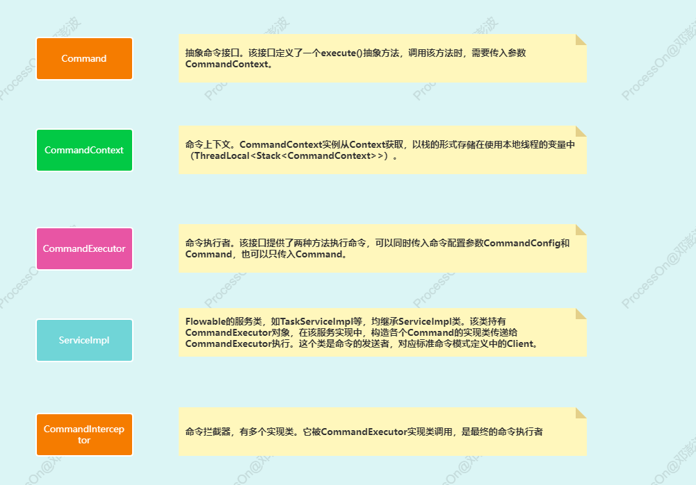
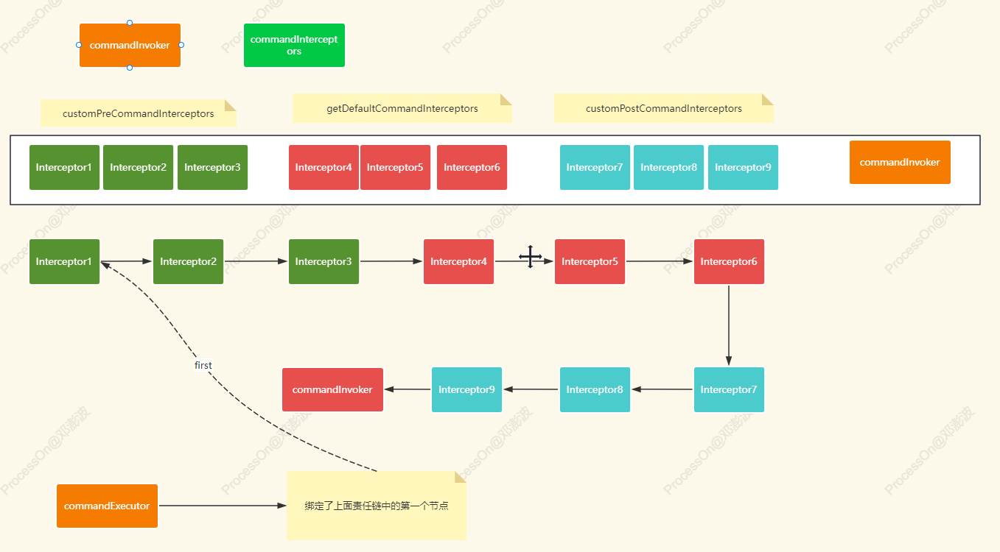
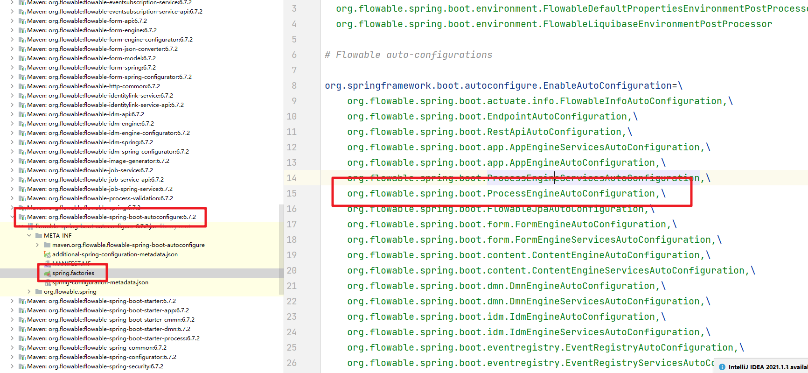
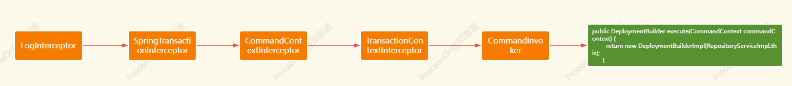
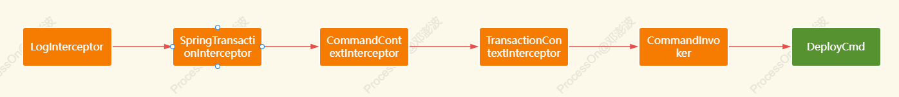
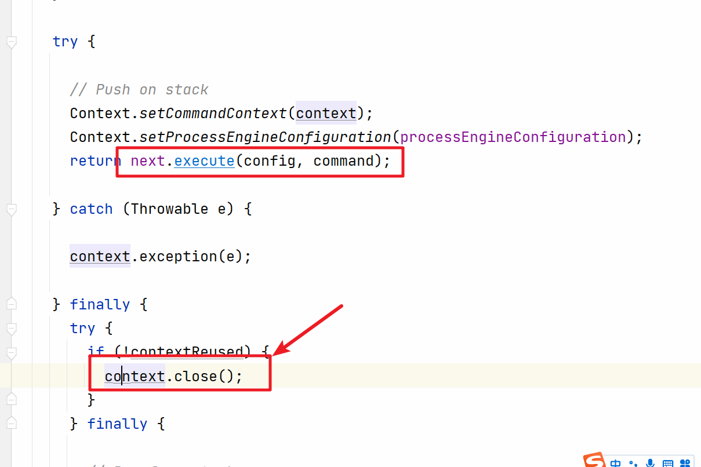
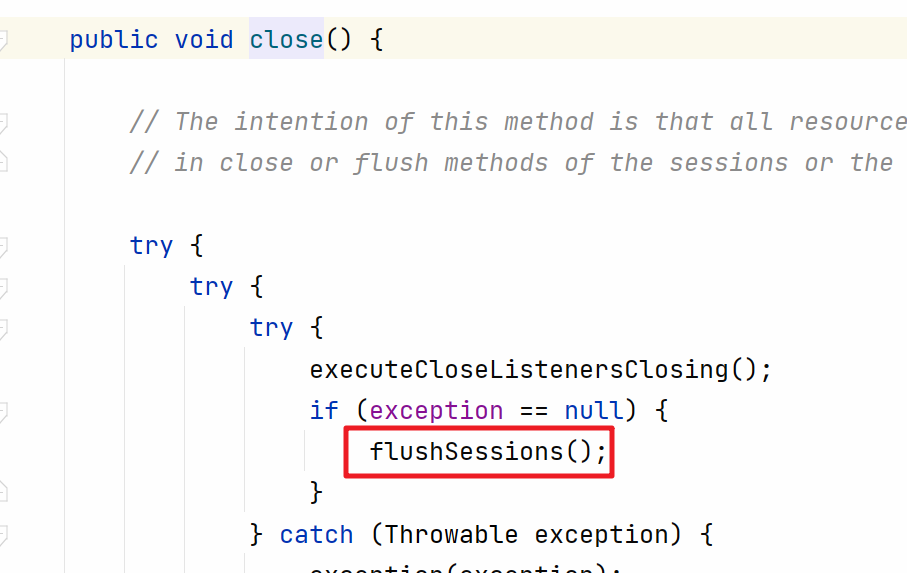
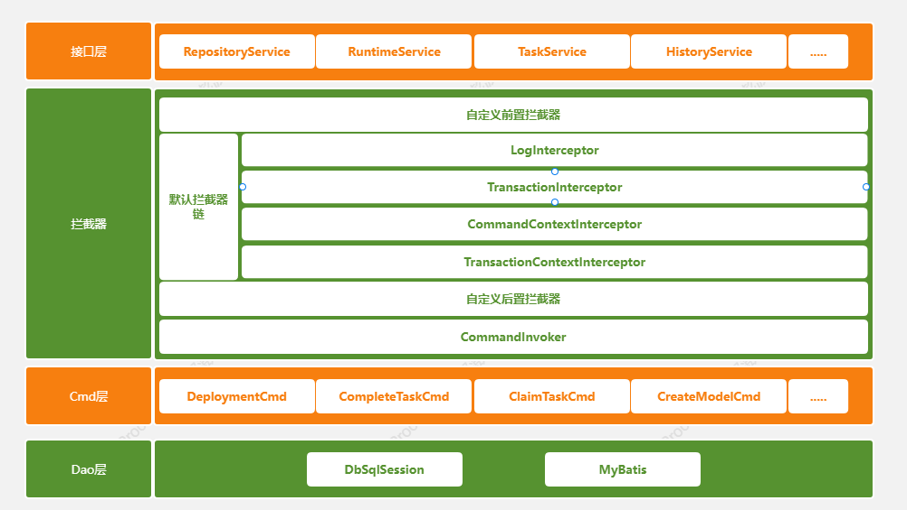

# Flowable源码篇

> lecture:波哥


# 一、设计模式

​	在学习各个框架源码中都会涉及到各种涉及模式。所以在分析相关源码之前最好能找下相关的设计模式。这样对源码的分析和理解是非常有好处的。在Flowable等工作流引擎中都设计到了`命令模式`和`责任链模式`。

### 1.1 命令模式




### 1.2 责任链模式

https://dpb-bobokaoya-sm.blog.csdn.net/article/details/89077040

# 二、初始化过程


## 1. 分析基础

​	我们先来单独的看看Flowable的使用案例。先不在Spring环境中的使用。

```java
    private static final String url = "jdbc:mysql://localhost:3306/flowable-learn?serverTimezone=UTC&nullCatalogMeansCurrent=true";

    /**
     * 部署流程到数据库中
     * 在非Spring环境下的应用
     */
    @Test
    void deployFlow(){
        // 流程引擎的配置对象 关联相关的数据源
        ProcessEngineConfiguration cfg = new StandaloneProcessEngineConfiguration()
                .setJdbcUrl(url)
                .setJdbcDriver("com.mysql.cj.jdbc.Driver")
                .setJdbcUsername("root")
                .setJdbcPassword("123456")
                .setDatabaseSchemaUpdate(ProcessEngineConfiguration.DB_SCHEMA_UPDATE_TRUE);
        // 获取流程引擎对象
        ProcessEngine processEngine = cfg.buildProcessEngine();
        // 部署流程需要获取 RepositoryService
        RepositoryService repositoryService = processEngine.getRepositoryService();
        Deployment deploy = repositoryService.createDeployment()
                // 一次部署操作可以部署多个流程定义
                .addClasspathResource("process/01-基础篇/FirstFlow.bpmn20.xml")
                .addClasspathResource("process/01-基础篇/HolidayDemo1.bpmn20.xml")
                .name("第一个流程图")
                .deploy();// 部署的方法
        System.out.println("deploy.getId() = " + deploy.getId());
    }
```

​	在上面的代码中我们先创建了一个`ProcessEngineConfiguration`对象。关联了对应的数据库信息和数据表结构的配置。然后通过`ProcessEngineConfiguration`获取到了`ProcessEngine`对象。然后就做了流程的部署操作。这里有两个是我们后面需要核心分析的内容：

1. Flowable初始化操作
2. Flowable怎么实现的流程部署、发起、审批等核心操作的

​	接下来我们先看核心的方法`cfg.buildProcessEngine()`做了什么操作。直接点开代码

```java
public abstract ProcessEngine buildProcessEngine();
```

​	然后进入到对应的实现类中`ProcessEngineConfigurationImpl`中

```java
    @Override
    public ProcessEngine buildProcessEngine() {
        init(); // 这是初始化的核心方法
        ProcessEngineImpl processEngine = new ProcessEngineImpl(this);

        if (handleProcessEngineExecutorsAfterEngineCreate) {
            processEngine.startExecutors();
        }

        // trigger build of Flowable 5 Engine
        if (flowable5CompatibilityEnabled && flowable5CompatibilityHandler != null) {
            commandExecutor.execute(new Command<Void>() {

                @Override
                public Void execute(CommandContext commandContext) {
                    flowable5CompatibilityHandler.getRawProcessEngine();
                    return null;
                }
            });
        }

        postProcessEngineInitialisation();

        return processEngine;
    }
```

​	`ProcessEngineConfigurationImpl`的作用：配置和初始化Flowable的流程引擎。通过该类，可以对流程引擎的各种参数进行配置，包括`数据库连接信息`、`事务管理器`、`缓存管理器`、`作业执行器`等。同时，该类还提供了创建和获取ProcessEngine实例的方法，用于启动和管理流程引擎的运行。

​	然后我们就看到了初始化的核心方法`init()`,init()方法的作用是初始化Flowable引擎的配置，为引擎的正常运行做准备。直接进去查看：

```java
public void init() {
    initEngineConfigurations();
    initConfigurators();
    configuratorsBeforeInit();
    initClock();
    initObjectMapper();
    initProcessDiagramGenerator();
    initCommandContextFactory();
    initTransactionContextFactory();
    initCommandExecutors();
    initIdGenerator();
    initHistoryLevel();
    initFunctionDelegates();
    initAstFunctionCreators();
    initDelegateInterceptor();
    initBeans();
    initExpressionManager();
    initAgendaFactory();

    if (usingRelationalDatabase) {
        initDataSource();
    } else {
        initNonRelationalDataSource();
    }

    if (usingRelationalDatabase || usingSchemaMgmt) {
        initSchemaManager();
        initSchemaManagementCommand();
    }
    
    configureVariableServiceConfiguration();
    configureJobServiceConfiguration();

    initHelpers();
    initVariableTypes();
    initFormEngines();
    initFormTypes();
    initScriptingEngines();
    initBusinessCalendarManager();
    initServices();
    initWsdlImporterFactory();
    initBehaviorFactory();
    initListenerFactory();
    initBpmnParser();
    initProcessDefinitionCache();
    initProcessDefinitionInfoCache();
    initAppResourceCache();
    initKnowledgeBaseCache();
    initJobHandlers();
    initHistoryJobHandlers();

    initTransactionFactory();

    if (usingRelationalDatabase) {
        initSqlSessionFactory();
    }

    initSessionFactories();
    initDataManagers();
    initEntityManagers();
    initCandidateManager();
    initVariableAggregator();
    initHistoryManager();
    initChangeTenantIdManager();
    initDynamicStateManager();
    initProcessInstanceMigrationValidationManager();
    initIdentityLinkInterceptor();
    initJpa();
    initDeployers();
    initEventHandlers();
    initFailedJobCommandFactory();
    initEventDispatcher();
    initProcessValidator();
    initFormFieldHandler();
    initDatabaseEventLogging();
    initFlowable5CompatibilityHandler();
    initVariableServiceConfiguration();
    initIdentityLinkServiceConfiguration();
    initEntityLinkServiceConfiguration();
    initEventSubscriptionServiceConfiguration();
    initTaskServiceConfiguration();
    initJobServiceConfiguration();
    initBatchServiceConfiguration();
    initAsyncExecutor();
    initAsyncHistoryExecutor();

    configuratorsAfterInit();
    afterInitTaskServiceConfiguration();
    afterInitEventRegistryEventBusConsumer();
    
    initHistoryCleaningManager();
    initLocalizationManagers();
}
```

## 2. 核心方法

​	上面初始化的内容有很多。刚开始我们没有必要一个个具体分析。我们需要掌握几个核心的方法分别如下：

- initCommandContextFactory();
- initTransactionContextFactory();
- initCommandExecutors();
- initServices();


### 2.1 initCommandContextFactory

&emsp;&emsp;initCommandContextFactory方法的作用很简单，完成`ProcessEngineConfigurationImpl`中的`commandContextFactory`属性的初始化操作。

```java
public void initCommandContextFactory() {
  if (commandContextFactory == null) {
    commandContextFactory = new CommandContextFactory();
  }
  commandContextFactory.setProcessEngineConfiguration(this);
}
```

### 2.2 initTransactionContextFactory

&emsp;&emsp;initTransactionContextFactory方法的作用也很简单，完成`ProcessEngineConfigurationImpl`中的`transactionContextFactory`属性的初始化操作。

```java
public void initTransactionContextFactory() {
  if (transactionContextFactory == null) {
    transactionContextFactory = new StandaloneMybatisTransactionContextFactory();
  }
}
```

### 2.3 initCommandExecutors

&emsp;&emsp;initCommandExecutors这是一个非常重要的方法。会完成`责任链`中相关拦截器的组织和加载。里面的方法有

- initDefaultCommandConfig() :初始化defaultCommandConfig属性【可重用Context上下文，支持事务传播属性】
- initSchemaCommandConfig() :初始化schemaCommandConfig属性【不可重用Context上下文，不支持事务传播属性】
- initCommandInvoker() :初始化commandInvoker属性。这个是责任链路中的最后一个节点
- initCommandInterceptors() :初始化commandInterceptors属性，组装所有的拦截器到集合中
- initCommandExecutor():初始化commandExecutor属性，完成责任链的关联并绑定链路的第一个节点【first】


核心代码：

```java
public void initCommandExecutor() {
  if (commandExecutor == null) {
      // 获取责任链中的第一个拦截器    初始化责任链
    CommandInterceptor first = initInterceptorChain(commandInterceptors);
    commandExecutor = new CommandExecutorImpl(getDefaultCommandConfig(), first);
  }
}

public CommandInterceptor initInterceptorChain(List<CommandInterceptor> chain) {
  if (chain == null || chain.isEmpty()) {
    throw new ActivitiException("invalid command interceptor chain configuration: " + chain);
  }
    // 设置责任链
  for (int i = 0; i < chain.size() - 1; i++) {
    chain.get(i).setNext(chain.get(i + 1));
  }
  return chain.get(0); // 返回第一个节点
}
```

对应的图解：



### 2.4 initServices

&emsp;&emsp;在Flowable中我们完成各种流程的操作，比如`部署`，`查询流程定义`、`流程审批`等各种操作都是通过`xxxService`来完成的。这些service在`ProcessEngineConfigurationImpl`中的成员变量中就会完成对象的实例化。

```java
  protected RepositoryService repositoryService = new RepositoryServiceImpl();
  protected RuntimeService runtimeService = new RuntimeServiceImpl();
  protected HistoryService historyService = new HistoryServiceImpl(this);
  protected TaskService taskService = new TaskServiceImpl(this);
  protected ManagementService managementService = new ManagementServiceImpl();
  protected DynamicBpmnService dynamicBpmnService = new DynamicBpmnServiceImpl(this);
```

&emsp;&emsp;在init方法的`initServices`完成的操作是和上面实例化的`commandExecutor`完成绑定。也就是`xxxService`中的各种执行操作最终都是由`commandExecutor`来完成的。

```java
  public void initServices() {
    initService(repositoryService);
    initService(runtimeService);
    initService(historyService);
    initService(taskService);
    initService(managementService);
    initService(dynamicBpmnService);
  }
```

绑定`commandExecutor`

```java
  public void initService(Object service) {
    if (service instanceof ServiceImpl) {
      ((ServiceImpl) service).setCommandExecutor(commandExecutor);
    }
  }
```


## 3.SpringBoot入口

​	当然我们现在更多的是在SpringBoot环境下使用Flowable的。基于自动装配这块是怎么和Flowable的初始化关联起来的呢。我们也需要给大家来介绍下。我们首先需要找到对应的`spring.factories`文件。然后找到对应的`ProcessEngineAutoConfiguration`这个配置类。



​	要看的核心方法是这个

```java
        @Bean
        @ConditionalOnMissingBean
        public ProcessEngineConfigurator processEngineConfigurator(SpringProcessEngineConfiguration processEngineConfiguration) {
            SpringProcessEngineConfigurator processEngineConfigurator = new SpringProcessEngineConfigurator();
            processEngineConfigurator.setProcessEngineConfiguration(processEngineConfiguration);
            processEngineConfiguration.setDisableIdmEngine(true);
            processEngineConfiguration.setDisableEventRegistry(true);
            this.invokeConfigurers(processEngineConfiguration);
            return processEngineConfigurator;
        }
```

​	然后进入到`SpringProcessEngineConfigurator`中的`configure`方法

```java
public void configure(AbstractEngineConfiguration engineConfiguration) {
    if (this.processEngineConfiguration == null) {
        this.processEngineConfiguration = new SpringProcessEngineConfiguration();
    }

    if (!(this.processEngineConfiguration instanceof SpringProcessEngineConfiguration)) {
        throw new FlowableException("SpringProcessEngineConfigurator accepts only SpringProcessEngineConfiguration. " + this.processEngineConfiguration.getClass().getName());
    } else {
        this.initialiseCommonProperties(engineConfiguration, this.processEngineConfiguration);
        SpringEngineConfiguration springEngineConfiguration = (SpringEngineConfiguration)engineConfiguration;
        SpringProcessEngineConfiguration springProcessEngineConfiguration = (SpringProcessEngineConfiguration)this.processEngineConfiguration;
        springProcessEngineConfiguration.setTransactionManager(springEngineConfiguration.getTransactionManager());
        if (springProcessEngineConfiguration.getBeans() == null) {
            springProcessEngineConfiguration.setBeans(springProcessEngineConfiguration.getBeans());
        }

        this.initProcessEngine(); // 这个是核心的串联方法
        this.initServiceConfigurations(engineConfiguration, this.processEngineConfiguration);
    }
}
```

 	`this.initProcessEngine()`方法就是初始化的方法了

```java
protected synchronized ProcessEngine initProcessEngine() {
    if (this.processEngineConfiguration == null) {
        throw new FlowableException("ProcessEngineConfiguration is required");
    } else {
        return this.processEngineConfiguration.buildProcessEngine();
    }
}
```

​	`buildProcessEngine`方法进入就可以看到前面的代码了。

# 三、核心步骤

## 1. 流程部署

### 1.1 流程部署

&emsp;&emsp;我们先来看看最基础的流程部署的源码过程

```java
    /**
     * 部署流程
     */
    @Test
    void deployFlow() {
        Deployment deploy = processEngine.getRepositoryService().createDeployment()
                .addClasspathResource("flow/04-mutiInstance/muti-instance-05-sub-process.bpmn20.xml")
                .name("多实例5")
                .deploy();
        System.out.println(deploy.getId());
    }
```

首先是`createDeployment()`方法创建了`DeploymentBuilder`这个构建对象。

```java
public DeploymentBuilder createDeployment() {
  return commandExecutor.execute(new Command<DeploymentBuilder>() {
    @Override
    public DeploymentBuilder execute(CommandContext commandContext) {
      return new DeploymentBuilderImpl(RepositoryServiceImpl.this);
    }
  });
}
```

里面调用了`commandExecutor`的execute方法。传递了一个`Command`接口的实现类。这块会通过如下的拦截器链来拦截这个请求。



返回了`DeploymentBuilderImpl`这个对象。然后就是`deploy`方法的调用，这个方法走的链路是：

```java
public Deployment deploy(DeploymentBuilderImpl deploymentBuilder) {
  return commandExecutor.execute(new DeployCmd<Deployment>(deploymentBuilder));
}
```

具体的链路为：



然后在DeployCmd中会完成`ACT_RE_DEPLOYMENT`和`ACT_RE_PROCDEF`信息的存储。

```java
// .....
// Save the data
    commandContext.getDeploymentEntityManager().insert(deployment);
// ....
// Actually deploy
    commandContext.getProcessEngineConfiguration().getDeploymentManager().deploy(deployment, deploymentSettings);
// ...
```

上面是操作的核心代码。进入到的insert方法中：

```java
@Override
public void insert(EntityImpl entity) {
  getDbSqlSession().insert(entity);
}
```

在insert方法中只会完成插入信息的缓存处理。而不会真实的操作提交到数据库中

```java
public void insert(Entity entity) {
        if (entity.getId() == null) {
            String id = dbSqlSessionFactory.getIdGenerator().getNextId();
            entity.setId(id);
        }

        Class<? extends Entity> clazz = entity.getClass();
        if (!insertedObjects.containsKey(clazz)) {
            insertedObjects.put(clazz,
                                new LinkedHashMap<String, Entity>()); // order of insert is important, hence LinkedHashMap
        }

        insertedObjects.get(clazz).put(entity.getId(),
                                       entity);
        entityCache.put(entity,
                        false); // False -> entity is inserted, so always changed
        entity.setInserted(true);
    }
```

等相关的插入操作都完成后会在`CommandContextInterceptor`中的`finally`中调用到`DbSqlSession`中的`flush`方法来完成真实的数据库操作



进入close方法可以看到`flushSessions`方法



然后可以看到`flush`方法的执行

```java
protected void flushSessions() {
    for (Session session : sessions.values()) {
        session.flush();
    }
}
```

具体进入后发现`flush`方法会完成`insert、update、delete`的具体操作


```java 
public void flush() {
    determineUpdatedObjects(); // Needs to be done before the removeUnnecessaryOperations, as removeUnnecessaryOperations will remove stuff from the cache
    removeUnnecessaryOperations();

    if (log.isDebugEnabled()) {
        debugFlush();
    }

    flushInserts();
    flushUpdates();
    flushDeletes();
}
```

最终进入到`flushRegularInsert`方法中看到了MyBatis的相关API来处理数据库的操作

```java
protected void flushRegularInsert(Entity entity,
                                  Class<? extends Entity> clazz) {
    String insertStatement = dbSqlSessionFactory.getInsertStatement(entity);
    insertStatement = dbSqlSessionFactory.mapStatement(insertStatement);

    if (insertStatement == null) {
        throw new ActivitiException("no insert statement for " + entity.getClass() + " in the ibatis mapping files");
    }

    log.debug("inserting: {}",
              entity);
    sqlSession.insert(insertStatement,
                      entity);

    // See https://activiti.atlassian.net/browse/ACT-1290
    if (entity instanceof HasRevision) {
        incrementRevision(entity);
    }
}
```


## 2.任务查询

然后我们来看看`TaskService`是如何实现任务查询的在源码层面上，这块就比流程部署的逻辑要简单很多。

```java
Task task = taskService.createTaskQuery().taskId("320003").singleResult();
```

`createTaskQuery`方法非常简单，创建了一个`TaskQuery`对，然后绑定了要查询的任务的id，关键是看`singleResult`方法。

```java
public U singleResult() {
  this.resultType = ResultType.SINGLE_RESULT; // 绑定返回结果的类型
  if (commandExecutor != null) {
    return (U) commandExecutor.execute(this); // 通过commandExecutor来处理
  }
  return executeSingleResult(Context.getCommandContext());
}
```

会只是对于的拦截器链最后会执行当前对象中的`executor`方法

```java
public Object execute(CommandContext commandContext) {
  if (resultType == ResultType.LIST) {
    return executeList(commandContext, null);
  } else if (resultType == ResultType.SINGLE_RESULT) { // 结合上面的设置 会走这块的逻辑
    return executeSingleResult(commandContext);
  } else if (resultType == ResultType.LIST_PAGE) {
    return executeList(commandContext, null);
  } else {
    return executeCount(commandContext);
  }
}
```

进入到executeSingleResult方法

```java
public U executeSingleResult(CommandContext commandContext) {
  List<U> results = executeList(commandContext, null);
  if (results.size() == 1) {
    return results.get(0);
  } else if (results.size() > 1) {
    throw new ActivitiException("Query return " + results.size() + " results instead of max 1");
  }
  return null;
}
```

然后进入到`TaskQueryImpl`中的`executeList`方法中

```java 
public List<Task> executeList(CommandContext commandContext, Page page) {
  ensureVariablesInitialized();
  checkQueryOk();
  List<Task> tasks = null;
  if (includeTaskLocalVariables || includeProcessVariables) {
    tasks = commandContext.getTaskEntityManager().findTasksAndVariablesByQueryCriteria(this);
  } else {
      // 开始进入查询处理
    tasks = commandContext.getTaskEntityManager().findTasksByQueryCriteria(this);
  }
  
  if (tasks != null && Context.getProcessEngineConfiguration().getPerformanceSettings().isEnableLocalization()) {
    for (Task task : tasks) {
      localize(task);
    }
  }
  
  return tasks;
}
```

通过`TaskEntityManager`来具体的处理数据库的查询操作。

```java
@Override
@SuppressWarnings("unchecked")
public List<Task> findTasksByQueryCriteria(TaskQueryImpl taskQuery) {
  final String query = "selectTaskByQueryCriteria";
  return getDbSqlSession().selectList(query, taskQuery);
}
```

最终操作的代码

```java
public List selectListWithRawParameter(String statement,
                                       Object parameter,
                                       int firstResult,
                                       int maxResults,
                                       boolean useCache) {
    statement = dbSqlSessionFactory.mapStatement(statement);
    if (firstResult == -1 || maxResults == -1) {
        return Collections.EMPTY_LIST;
    }
	// 通过MyBatis实现数据库操作
    List loadedObjects = sqlSession.selectList(statement,
                                               parameter);
    // 缓存 逻辑
    if (useCache) {
        return cacheLoadOrStore(loadedObjects);
    } else {
        return loadedObjects;
    }
}
```




