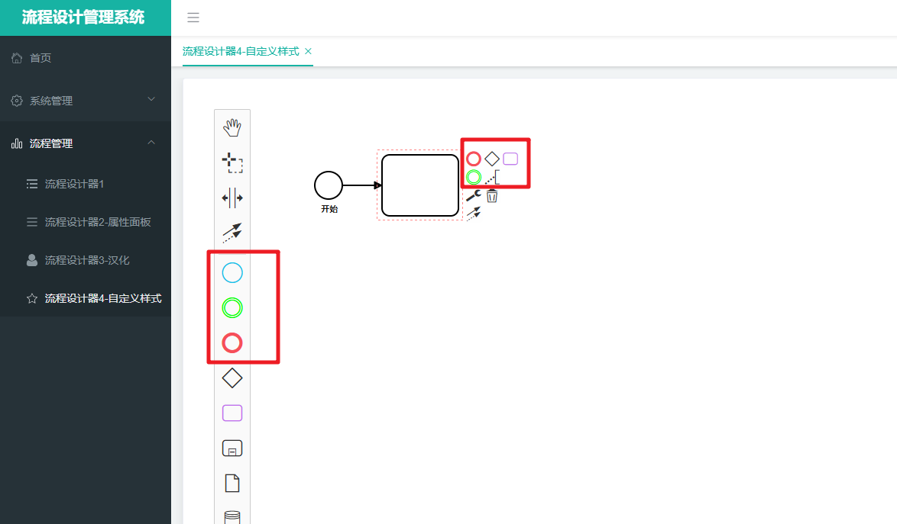
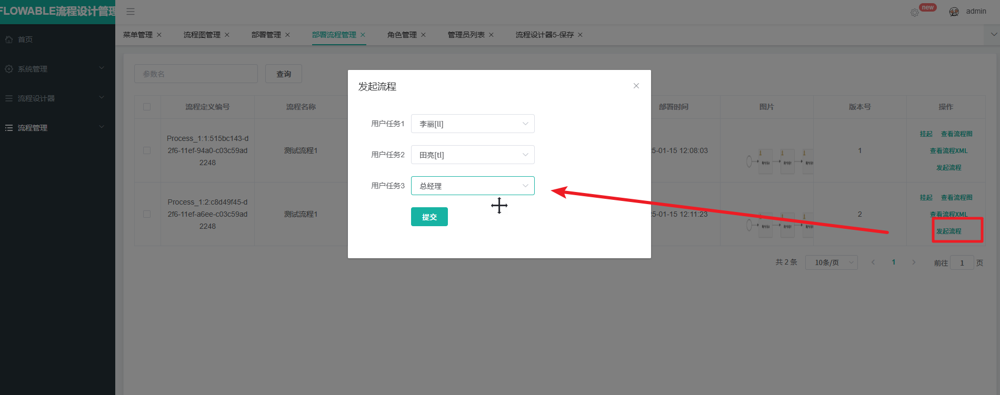

# Flowable项目实战

> lecture：波哥


# 一、流程设计器

​	前端环境：


> 卸载：npm uninstall -g cnpm
>
> 安装cnpm: npm install -g cnpm@7.1.0 --registry=https://registry.npmmirror.com

&emsp;&emsp;在项目中我们需要设计通过bpmn.js实现流程的设计工作

## 1.基础设计器

在程序中通过`cnpm`安装`bpmn.js`

```vue
cnpm install bpmn-js@6.0.4
cnpm install bpmn-js-properties-panel@0.33.0
cnpm install camunda-bpmn-moddle@4.3.0
```

这三个依赖的说明：

1. bpmn-js：最核心的流程绘制工具
2. bpmn-js-properties-panel：配置流程节点的属性信息我们需要用到
3. camunda-bpmn-moddle：配置流程支持的任务需要使用到


然后在`main.js`中添加bpmn的相关样式

```js
// 以下为bpmn工作流绘图工具的样式
import 'bpmn-js/dist/assets/diagram-js.css' // 左边工具栏以及编辑节点的样式
import 'bpmn-js/dist/assets/bpmn-font/css/bpmn.css'
import 'bpmn-js/dist/assets/bpmn-font/css/bpmn-codes.css'
import 'bpmn-js/dist/assets/bpmn-font/css/bpmn-embedded.css'
import 'bpmn-js-properties-panel/dist/assets/bpmn-js-properties-panel.css' // 右边工具栏样式
```

准备基础的流程图文件

```js
export var xmlStr = `<?xml version="1.0" encoding="UTF-8"?>
<definitions xmlns="http://www.omg.org/spec/BPMN/20100524/MODEL" xmlns:bpmndi="http://www.omg.org/spec/BPMN/20100524/DI" xmlns:omgdi="http://www.omg.org/spec/DD/20100524/DI" xmlns:omgdc="http://www.omg.org/spec/DD/20100524/DC" xmlns:xsi="http://www.w3.org/2001/XMLSchema-instance" id="sid-38422fae-e03e-43a3-bef4-bd33b32041b2" targetNamespace="http://bpmn.io/bpmn" exporter="bpmn-js (https://demo.bpmn.io)" exporterVersion="5.1.2">
<process id="Process_1" isExecutable="false">
    <startEvent id="StartEvent_1y45yut" name="开始">
    <outgoing>SequenceFlow_0h21x7r</outgoing>
    </startEvent>
    <task id="Task_1hcentk">
    <incoming>SequenceFlow_0h21x7r</incoming>
    </task>
    <sequenceFlow id="SequenceFlow_0h21x7r" sourceRef="StartEvent_1y45yut" targetRef="Task_1hcentk" />
</process>
<bpmndi:BPMNDiagram id="BpmnDiagram_1">
    <bpmndi:BPMNPlane id="BpmnPlane_1" bpmnElement="Process_1">
    <bpmndi:BPMNShape id="StartEvent_1y45yut_di" bpmnElement="StartEvent_1y45yut">
        <omgdc:Bounds x="152" y="102" width="36" height="36" />
        <bpmndi:BPMNLabel>
        <omgdc:Bounds x="160" y="145" width="22" height="14" />
        </bpmndi:BPMNLabel>
    </bpmndi:BPMNShape>
    <bpmndi:BPMNShape id="Task_1hcentk_di" bpmnElement="Task_1hcentk">
        <omgdc:Bounds x="240" y="80" width="100" height="80" />
    </bpmndi:BPMNShape>
    <bpmndi:BPMNEdge id="SequenceFlow_0h21x7r_di" bpmnElement="SequenceFlow_0h21x7r">
        <omgdi:waypoint x="188" y="120" />
        <omgdi:waypoint x="240" y="120" />
    </bpmndi:BPMNEdge>
    </bpmndi:BPMNPlane>
</bpmndi:BPMNDiagram>
</definitions>`
```

然后创建第一个流程设计器页面`basic.vue`

```vue
<template>
  <div class="containers">
    <div class="canvas" ref="canvas"></div>
  </div>
</template>
<script>
// 引入相关的依赖
import BpmnModeler from 'bpmn-js/lib/Modeler'
import { xmlStr } from '@/mock/xmlStr'


export default {
  name: '',
  components: {},
// 生命周期 - 创建完成（可以访问当前this实例）
  created() {},
// 生命周期 - 载入后, Vue 实例挂载到实际的 DOM 操作完成，一般在该过程进行 Ajax 交互
  mounted() {
    this.init()
  },
  data() {
    return {
      // bpmn建模器
      bpmnModeler: null,
      container: null,
      canvas: null
    }
  },
// 方法集合
  methods: {
    init () {
      // 获取到属性ref为“canvas”的dom节点
      const canvas = this.$refs.canvas
      // 建模
      this.bpmnModeler = new BpmnModeler({
        container: canvas
      })
      this.createNewDiagram()
		},
		createNewDiagram () {
			// 将字符串转换成图显示出来
			this.bpmnModeler.importXML(xmlStr, (err) => {
				if (err) {
					// console.error(err)
				}
				else {
					// 这里是成功之后的回调, 可以在这里做一系列事情
					this.success()
				}
			})
		},
		success () {
			// console.log('创建成功!')
		}
  },
// 计算属性
  computed: {}
}
</script>

<style scoped>
.containers{
	background-color: #ffffff;
	width: 100%;
	height: calc(100vh - 52px);
}
.canvas{
	width: 100%;
	height: 100%;
}
.panel{
	position: absolute;
	right: 0;
	top: 0;
	width: 300px;
}
</style>


```

具体的样式效果为：


## 2.引入右侧属性栏

​	接下来我们看看如果在流程设计器中添加对应的属性工具栏，首先在布局中添加属性栏的标签信息

```vue
<template>
  <div class="containers">
    <div class="canvas" ref="canvas"></div>
    <div id="js-properties-panel" class="panel"></div>
  </div>
</template>
```

然后引入右侧属性栏的内容

```js
// 引入相关的依赖
import BpmnModeler from 'bpmn-js/lib/Modeler'
import { xmlStr } from '@/mock/xmlStr'
// 这里引入的是右侧属性栏这个框
import propertiesPanelModule from 'bpmn-js-properties-panel'
// 而这个引入的是右侧属性栏里的内容
import propertiesProviderModule from 'bpmn-js-properties-panel/lib/provider/camunda'
 // 一个描述的json
import camundaModdleDescriptor from 'camunda-bpmn-moddle/resources/camunda'
```

然后我们需要在建模对象中添加属性面板相关的信息

```js
init () {
      // 获取到属性ref为“canvas”的dom节点
      const canvas = this.$refs.canvas
      // 建模
      this.bpmnModeler = new BpmnModeler({
        container: canvas,
        //添加控制板
        propertiesPanel: {
          parent: '#js-properties-panel'
        },
        additionalModules: [
          propertiesPanelModule,
          propertiesProviderModule
         ],
        moddleExtensions: {
          //如果要在属性面板中维护camunda：XXX属性，则需要此
          camunda: camundaModdleDescriptor
        }
      })
      this.createNewDiagram()
		}
```

具体添加的代码为


展示的效果为


## 3.国际化处理

​	在上面的流程设计器中显示的都是英文。在国内软件设计中还是不太符合企业的需要。所以国际化还是很有必要的。我们可以按照如下的步骤来实现中文汉化的处理。

​	首先我们需要自己提供一个汉化的物料,我们命名为`translationsGerman.js`

```js
export default {
  // Labels
  'Activate the global connect tool': '激活全局连接工具',
  'Append {type}': '追加 {type}',
  'Append EndEvent': '追加 结束事件 ',
  'Append Task': '追加 任务',
  'Append Gateway': '追加 网关',
  'Append Intermediate/Boundary Event': '追加 中间/边界 事件',
  'Add Lane above': '在上面添加道',
  'Divide into two Lanes': '分割成两个道',
  'Divide into three Lanes': '分割成三个道',
  'Add Lane below': '在下面添加道',
  'Append compensation activity': '追加补偿活动',
  'Change type': '修改类型',
  'Connect using Association': '使用关联连接',
  'Connect using Sequence/MessageFlow or Association': '使用顺序/消息流或者关联连接',
  'Connect using DataInputAssociation': '使用数据输入关联连接',
  'Remove': '移除',
  'Activate the hand tool': '激活抓手工具',
  'Activate the lasso tool': '激活套索工具',
  'Activate the create/remove space tool': '激活创建/删除空间工具',
  'Create expanded SubProcess': '创建扩展子过程',
  'Create IntermediateThrowEvent/BoundaryEvent': '创建中间抛出事件/边界事件',
  'Create Pool/Participant': '创建池/参与者',
  'Parallel Multi Instance': '并行多重事件',
  'Sequential Multi Instance': '时序多重事件',
  'DataObjectReference': '数据对象参考',
  'DataStoreReference': '数据存储参考',
  'Loop': '循环',
  'Ad-hoc': '即席',
  'Create {type}': '创建 {type}',
  'Create Task': '创建任务',
  'Create StartEvent': '创建开始事件',
  'Create EndEvent': '创建结束事件',
  'Create Group': '创建组',
  'Task': '任务',
  'Send Task': '发送任务',
  'Receive Task': '接收任务',
  'User Task': '用户任务',
  'Manual Task': '手工任务',
  'Business Rule Task': '业务规则任务',
  'Service Task': '服务任务',
  'Script Task': '脚本任务',
  'Call Activity': '调用活动',
  'Sub Process (collapsed)': '子流程（折叠的）',
  'Sub Process (expanded)': '子流程（展开的）',
  'Start Event': '开始事件',
  'StartEvent': '开始事件',
  'Intermediate Throw Event': '中间事件',
  'End Event': '结束事件',
  'EndEvent': '结束事件',
  'Create Gateway': '创建网关',
  'GateWay': '网关',
  'Create Intermediate/Boundary Event': '创建中间/边界事件',
  'Message Start Event': '消息开始事件',
  'Timer Start Event': '定时开始事件',
  'Conditional Start Event': '条件开始事件',
  'Signal Start Event': '信号开始事件',
  'Error Start Event': '错误开始事件',
  'Escalation Start Event': '升级开始事件',
  'Compensation Start Event': '补偿开始事件',
  'Message Start Event (non-interrupting)': '消息开始事件（非中断）',
  'Timer Start Event (non-interrupting)': '定时开始事件（非中断）',
  'Conditional Start Event (non-interrupting)': '条件开始事件（非中断）',
  'Signal Start Event (non-interrupting)': '信号开始事件（非中断）',
  'Escalation Start Event (non-interrupting)': '升级开始事件（非中断）',
  'Message Intermediate Catch Event': '消息中间捕获事件',
  'Message Intermediate Throw Event': '消息中间抛出事件',
  'Timer Intermediate Catch Event': '定时中间捕获事件',
  'Escalation Intermediate Throw Event': '升级中间抛出事件',
  'Conditional Intermediate Catch Event': '条件中间捕获事件',
  'Link Intermediate Catch Event': '链接中间捕获事件',
  'Link Intermediate Throw Event': '链接中间抛出事件',
  'Compensation Intermediate Throw Event': '补偿中间抛出事件',
  'Signal Intermediate Catch Event': '信号中间捕获事件',
  'Signal Intermediate Throw Event': '信号中间抛出事件',
  'Message End Event': '消息结束事件',
  'Escalation End Event': '定时结束事件',
  'Error End Event': '错误结束事件',
  'Cancel End Event': '取消结束事件',
  'Compensation End Event': '补偿结束事件',
  'Signal End Event': '信号结束事件',
  'Terminate End Event': '终止结束事件',
  'Message Boundary Event': '消息边界事件',
  'Message Boundary Event (non-interrupting)': '消息边界事件（非中断）',
  'Timer Boundary Event': '定时边界事件',
  'Timer Boundary Event (non-interrupting)': '定时边界事件（非中断）',
  'Escalation Boundary Event': '升级边界事件',
  'Escalation Boundary Event (non-interrupting)': '升级边界事件（非中断）',
  'Conditional Boundary Event': '条件边界事件',
  'Conditional Boundary Event (non-interrupting)': '条件边界事件（非中断）',
  'Error Boundary Event': '错误边界事件',
  'Cancel Boundary Event': '取消边界事件',
  'Signal Boundary Event': '信号边界事件',
  'Signal Boundary Event (non-interrupting)': '信号边界事件（非中断）',
  'Compensation Boundary Event': '补偿边界事件',
  'Exclusive Gateway': '互斥网关',
  'Parallel Gateway': '并行网关',
  'Inclusive Gateway': '相容网关',
  'Complex Gateway': '复杂网关',
  'Event based Gateway': '事件网关',
  'Transaction': '转运',
  'Sub Process': '子流程',
  'Event Sub Process': '事件子流程',
  'Collapsed Pool': '折叠池',
  'Expanded Pool': '展开池',
  // Errors
  'no parent for {element} in {parent}': '在{parent}里，{element}没有父类',
  'no shape type specified': '没有指定的形状类型',
  'flow elements must be children of pools/participants': '流元素必须是池/参与者的子类',
  'out of bounds release': 'out of bounds release',
  'more than {count} child lanes': '子道大于{count} ',
  'element required': '元素不能为空',
  'diagram not part of bpmn:Definitions': '流程图不符合bpmn规范',
  'no diagram to display': '没有可展示的流程图',
  'no process or collaboration to display': '没有可展示的流程/协作',
  'element {element} referenced by {referenced}#{property} not yet drawn': '由{referenced}#{property}引用的{element}元素仍未绘制',
  'already rendered {element}': '{element} 已被渲染',
  'failed to import {element}': '导入{element}失败',
  'Available process variables, identified in the diagram.': '图中标识的可用过程变量。',
  'No variables found.': '找不到变量。',
  // 属性面板的参数
  'Id': '编号',
  'Name': '名称',
  'General': '常规',
  'Details': '详情',
  'Message Name': '消息名称',
  'Message': '消息',
  'Initiator': '创建者',
  'Asynchronous Continuations': '持续异步',
  'Asynchronous Before': '异步前',
  'Asynchronous After': '异步后',
  'Job Configuration': '工作配置',
  'Exclusive': '排除',
  'Job Priority': '工作优先级',
  'Retry Time Cycle': '重试时间周期',
  'Documentation': '文档',
  'Element Documentation': '元素文档',
  'History Configuration': '历史配置',
  'History Time To Live': '历史的生存时间',
  'Forms': '表单',
  'Form Key': '表单key',
  'Form Fields': '表单字段',
  'Business Key': '业务key',
  'Form Field': '表单字段',
  'ID': '编号',
  'Type': '类型',
  'Label': '名称',
  'Default Value': '默认值',
  'Validation': '校验',
  'Add Constraint': '添加约束',
  'Config': '配置',
  'Properties': '属性',
  'Add Property': '添加属性',
  'Value': '值',
  'Add': '添加',
  'Values': '值',
  'Add Value': '添加值',
  'Listeners': '监听器',
  'Execution Listener': '执行监听',
  'Event Type': '事件类型',
  'Listener Type': '监听器类型',
  'Java Class': 'Java类',
  'Expression': '表达式',
  'Must provide a value': '必须提供一个值',
  'Delegate Expression': '代理表达式',
  'Script': '脚本',
  'Script Format': '脚本格式',
  'Script Type': '脚本类型',
  'Inline Script': '内联脚本',
  'External Script': '外部脚本',
  'Resource': '资源',
  'Field Injection': '字段注入',
  'Extensions': '扩展',
  'Input/Output': '输入/输出',
  'Input Parameters': '输入参数',
  'Output Parameters': '输出参数',
  'Parameters': '参数',
  'Output Parameter': '输出参数',
  'Timer Definition Type': '定时器定义类型',
  'Timer Definition': '定时器定义',
  'Date': '日期',
  'Duration': '持续',
  'Cycle': '循环',
  'Signal': '信号',
  'Signal Name': '信号名称',
  'Escalation': '升级',
  'Error': '错误',
  'Link Name': '链接名称',
  'Condition': '条件名称',
  'Variable Name': '变量名称',
  'Variable Event': '变量事件',
  'Specify more than one variable change event as a comma separated list.': '多个变量事件以逗号隔开',
  'Wait for Completion': '等待完成',
  'Activity Ref': '活动参考',
  'Version Tag': '版本标签',
  'Executable': '可执行文件',
  'External Task Configuration': '扩展任务配置',
  'Task Priority': '任务优先级',
  'External': '外部',
  'Connector': '连接器',
  'Must configure Connector': '必须配置连接器',
  'Connector Id': '连接器编号',
  'Implementation': '实现方式',
  'Field Injections': '字段注入',
  'Fields': '字段',
  'Result Variable': '结果变量',
  'Topic': '主题',
  'Configure Connector': '配置连接器',
  'Input Parameter': '输入参数',
  'Assignee': '代理人',
  'Candidate Users': '候选用户',
  'Candidate Groups': '候选组',
  'Due Date': '到期时间',
  'Follow Up Date': '跟踪日期',
  'Priority': '优先级',
  'The follow up date as an EL expression (e.g. ${someDate} or an ISO date (e.g. 2015-06-26T09:54:00)': '跟踪日期必须符合EL表达式，如： ${someDate} ,或者一个ISO标准日期，如：2015-06-26T09:54:00',
  'The due date as an EL expression (e.g. ${someDate} or an ISO date (e.g. 2015-06-26T09:54:00)':'跟踪日期必须符合EL表达式，如： ${someDate} ,或者一个ISO标准日期，如：2015-06-26T09:54:00',
  'Variables': '变量',
  'Candidate Starter Configuration': '候选开始配置',
  'Task Listener': '任务监听器',
  'Candidate Starter Groups': '候选开始组',
  'Candidate Starter Users': '候选开始用户',
  'Tasklist Configuration': '任务列表配置',
  'Startable': '启动',
  'Specify more than one group as a comma separated list.': '指定多个组,用逗号分隔',
  'Specify more than one user as a comma separated list.': '指定多个用户,用逗号分隔',
  'This maps to the process definition key.': '这会映射为流程定义的键',
  'CallActivity Type': '调用活动类型',
  'Condition Type': '条件类型',
  'Create UserTask': '创建用户任务',
  'Create CallActivity': '创建调用活动',
  'Called Element': '调用元素',
  'Create DataObjectReference': '创建数据对象引用',
  'Create DataStoreReference': '创建数据存储引用',
  'Multi Instance': '多实例',
  'Loop Cardinality': '实例数量',
  'Collection': '任务参与人列表',
  'Element Variable': '元素变量',
  'Completion Condition': '完成条件'
}
```

​	然后创建一个语言转换函数，该函数的作用也非常简单，也就是先查找是否配置了相关的物料。如果有配置就进行替换，否则还用原来的。

```js
import translations from './translationsGerman'

export default function customTranslate(template, replacements) {
  replacements = replacements || {}

  // Translate
  template = translations[template] || template

  // Replace
  return template.replace(/{([^}]+)}/g, function(_, key) {
    return replacements[key] || '{' + key + '}'
  })
}

```

然后在我们需要汉化的页面中添加相关的配置即可


然后我们再看看具体的效果


## 4.自定义样式

​	有时候我们还需要对流程设计器中的相关元素来自定义相关的样式信息。我们可以按照如下的步骤来实现。

我们先创建一个自定义的样式文件,创建在 style目录下：bpmn-custom-color.css

```css
.bpmn-color .bpmn-icon-start-event-none:before {
  color: #12c2e9;
}
.bpmn-color .bpmn-icon-task:before {
  color: #c471ed;
}
.bpmn-color .bpmn-icon-end-event-none:before {
  color: #f64f59;
}

.bpmn-color .bpmn-icon-intermediate-event-none:before{
  color: #00ff00
}
```

然后在main.js中引入这个样式文件


然后我们在需要使用自定义样式文件的vue页面中添加这个class bpmn-color这个属性即可


然后来看效果




## 5.保存流程定义

​	我们通过流程设计器设计的流程图最终还是需要保存起来。并且完成相关的部署操作的。接下来我们看看如何来获取和保存我们的流程定义信息呢。

​	我们先定义一个保存按钮


然后定义对应的保存方法


方法很简单就把定义信息打印到了控制台上


到这儿我们就获取到了流程定义的信息。当然我们最好是能把流程定义信息存储在数据库中。这个我们下个章节来介绍。


# 二、流程定义管理

​	前端的设计器我们处理好了。接下来我们需要整合后端服务串联起来

## 1.项目集成Flowable

​	我们需要在SpringBoot项目中集成Flowable。安装如下步骤即可

对应的添加相关的依赖，本项目中使用的版本是`6.6.0`版本，同时添加相关的属性配置即可。

```xml
<dependency>
    <groupId>org.flowable</groupId>
    <artifactId>flowable-spring-boot-starter</artifactId>
    <version>6.6.0</version>
</dependency>
```

然后添加Flowable的配置信息

```properties
# 添加Flowable的配置
flowable.async-executor-activate=false
flowable.database-schema-update=true
```

&emsp;&emsp;数据源配置的时候要注意添加`nullCatalogMeansCurrent=true`属性,不然启动会报错。

然后对应的测试代码

```java
@RunWith(SpringRunner.class)
@SpringBootTest
public class FlowableTest {

    @Autowired
    private ProcessEngine processEngine;

    @Test
    public void testProcessEngine(){
        System.out.println("processEngine = " + processEngine);
    }
}
```

测试的效果


## 2.流程图绘制的保存

​	我们需要自定义流程定义的存储表结构

```sql
CREATE TABLE `flw_de_model` (
  `id` int NOT NULL AUTO_INCREMENT COMMENT '流程模型id',
  `name` varchar(64) DEFAULT NULL COMMENT '流程模型的名称',
  `model_key` varchar(255) DEFAULT NULL COMMENT '流程模型的标识符',
  `tenant_id` varchar(255) DEFAULT NULL COMMENT '租户id',
  `model_xml` longtext COMMENT '记录流程定义的信息xml',
  `version` int DEFAULT NULL COMMENT '版本号',
  `created_by` varchar(32) DEFAULT NULL COMMENT '创建人',
  `created` datetime DEFAULT CURRENT_TIMESTAMP COMMENT '创建时间',
  `last_updated_by` varchar(32) DEFAULT NULL COMMENT '最后更新人',
  `last_updated` datetime DEFAULT CURRENT_TIMESTAMP COMMENT '最后更新时间',
  PRIMARY KEY (`id`)
) ENGINE=InnoDB DEFAULT CHARSET=utf8mb4 COLLATE=utf8mb4_0900_ai_ci;
```

​	然后通过人人开源提供的代码生成器快速生成相关的后端的代码。通过idea打开这个项目代码


​	修改相关的数据库信息和生成的代码信息


​	启动服务后然后访问项目。默认端口是80


​	生成的代码有3部分。

- 后端的模版代码
- Mapper映射文件
- Vue的crud模版代码

分别把这三部分拷贝到对应的位置


然后我们就可以通过菜单的配置来访问流程定义的信息。


然后我们就可以修改下流程设计器中的逻辑。点击保存按钮弹出窗口录入流程定义的信息。然后保存到后台数据库中。

```vue
    <el-dialog
      title="保存流程定义信息"
      :visible.sync="dialogVisible"
      width="30%"
      :before-close="handleClose">
      <el-form :model="dataForm"  ref="dataForm" @keyup.enter.native="dataFormSubmit()" label-width="80px">
    <el-form-item label="流程名称" prop="name">
      <el-input v-model="dataForm.name" placeholder="流程名称"></el-input>
    </el-form-item>
    <el-form-item label="流程KEY" prop="modelKey">
      <el-input v-model="dataForm.modelKey" placeholder="流程KEY"></el-input>
    </el-form-item>

    </el-form>
    <span slot="footer" class="dialog-footer">
      <el-button @click="visible = false">取消</el-button>
      <el-button type="primary" @click="dataFormSubmit()">确定</el-button>
    </span>
  </el-dialog>

// --------

  data() {
    return {
      // bpmn建模器
      bpmnModeler: null,
      container: null,
      canvas: null,
      dialogVisible:false,
      dataForm:{
        name:'',
        modelKey:''
      }
    }
  }

// --------涉及到的方法

,saveDigram(){
      // 打开窗口
      this.dialogVisible = true

    },
      // 表单提交
      dataFormSubmit () {
        var my = this
        // 保存流程定义信息
      this.bpmnModeler.saveXML({format:true},function(error,xml){
          my.saveFlowData(xml)
      })
    },saveFlowData(xmlStr){
      this.$http({
              url: this.$http.adornUrl(`/flow/flwdemodel/save`),
              method: 'post',
              data: this.$http.adornData({
                'name': this.dataForm.name,
                'modelKey': this.dataForm.modelKey,
                'modelXml': xmlStr
              })
            }).then(({data}) => {
              if (data && data.code === 0) {
                this.$message({
                  message: '操作成功',
                  type: 'success',
                  duration: 1500,
                  onClose: () => {
                    // 关闭窗口
                    this.dialogVisible = false
                  }
                })
              } else {
                this.$message.error(data.msg)
              }
            })
    }
```

对应的效果为


同时调整后台的代码和逻辑

```java
    /**
     * 保存
     */
    @RequestMapping("/save")
    //@RequiresPermissions("flow:flwdemodel:save")
    public R save(@RequestBody FlwDeModelEntity flwDeModel){
        // 绑定流程的创建人
        SysUserEntity userEntity = ShiroUtils.getUserEntity();
        flwDeModel.setCreatedBy(userEntity.getUsername()); // 绑定流程的创建人
        // 最后更新人 第一次的时候和创建人 一致
        flwDeModel.setLastUpdatedBy(userEntity.getUsername());
        // 版本号的管理 默认从1开始 我们需要根据key 去后台查询是否有相同。如果有相同的我们就自增
        String modelKey = flwDeModel.getModelKey();
        if(StringUtils.isBlank(modelKey)){
            // 如果key为空
            return R.error("流程定义的Key不能为空");
        }
        // 需要根据key来查询流程定义信息
        List<FlwDeModelEntity> list = flwDeModelService.list(
                new LambdaQueryWrapper<FlwDeModelEntity>()
                        .eq(FlwDeModelEntity::getModelKey, modelKey)
                        .orderByDesc(FlwDeModelEntity::getVersion));
        if(list != null && list.size() > 0){
            // 说明key对应的记录是存在的 获取key的最大值
            Integer version = list.get(0).getVersion();
            version += 1;
            flwDeModel.setVersion(version);
        }else{
            flwDeModel.setVersion(1);
        }
        flwDeModelService.save(flwDeModel);

        return R.ok();
    }

    /**
     * 修改
     */
    @RequestMapping("/update")
    //@RequiresPermissions("flow:flwdemodel:update")
    public R update(@RequestBody FlwDeModelEntity flwDeModel){
        // 记录最后的更新用户和更新时间
        flwDeModel.setLastUpdated(new Date());
        flwDeModel.setLastUpdatedBy(ShiroUtils.getUserEntity().getUsername());
		flwDeModelService.updateById(flwDeModel);

        return R.ok();
    }
```

保存成功后我们在流程定义管理界面就可以看到对应的信息


## 3.部署流程

​	接下来我们就可以在流程图管理中完成部署的操作。首先我们在后端服务完成相关的部署接口的逻辑实现

在FlwDeModelController中添加deployFlow方法

```Java
/**
 * 完成流程部署的操作
 * @param id
 * @return
 */
@RequestMapping("/deployFlow/{id}")
public R deployFlow(@PathVariable("id") Integer id){
    if(id == null){
        return R.error("流程定义ID不能为空!");
    }
    flwDeModelService.deployFlow(id);
    return R.ok("流程部署成功");
}
```

然后在对应的service中添加具体的部署实现

```java
    @Override
    public void deployFlow(Integer id) {
        // 1.根据流程定义id找到对应的流程定义信息
        FlwDeModelEntity entity = this.getById(id);
        // 2.完成流程的部署操作
        repositoryService.createDeployment()
                .name(entity.getName())
                .key(entity.getModelKey())
                .addString(entity.getName()+ FlowConstant.BPMN_FILE_SUFFIX,entity.getModelXml())
                .deploy(); // 部署操作
    }
```

同时为了方便Flowable相关API的应用我们提供了对应的工厂类

```java
@Data
public class FlowServiceFactory <M extends BaseMapper<T>, T> extends ServiceImpl<M,T> {

    @Autowired
    protected ProcessEngine processEngine;

    @Autowired
    protected RepositoryService repositoryService;
    @Autowired
    protected RuntimeService runtimeService;
    @Autowired
    protected TaskService taskService;
    @Autowired
    protected IdentityService identityService;

    @Autowired
    protected ManagementService managementServicel;
    @Autowired
    protected DynamicBpmnService dynamicBpmnService;
    @Autowired
    protected HistoryService historyService;
}

```

在service中添加了这个继承关系


然后在前端Vue中添加了对应的调用逻辑

```js
,deployFlowHandle(id){
        // 部署流程
        this.$confirm('确定要部署该流程吗?', '提示', {
          confirmButtonText: '确定',
          cancelButtonText: '取消',
          type: 'warning'
        }).then(() => {
          this.$http({
              url: this.$http.adornUrl(`/flow/flwdemodel/deployFlow/`+id),
              method: 'get',
              params: this.$http.adornParams()
            }).then(({data}) => {
              if (data && data.code === 0) {
                this.$message({
                  message: '部署操作成功',
                  type: 'success',
                  duration: 1500,
                  onClose: () => {
                    this.getDataList()
                  }
                })
              }
            })
        })
      }
```


注意点：

1. 创建的流程图需要勾选可执行选项
2. 流程图中文乱码的问题，需要添加对应的配置类设置字体


```java
@Configuration
public class FlowableConfig implements EngineConfigurationConfigurer<SpringProcessEngineConfiguration> {
    @Override
    public void configure(SpringProcessEngineConfiguration con) {
        // 防止生成的流程图的中文乱码问题
        con.setActivityFontName("宋体");
        con.setLabelFontName("宋体");
        con.setAnnotationFontName("宋体");
    }
}
```


## 4.流程部署管理

​	我们上面完成了流程的部署。我们可以在前端来对部署的信息管理起来。我们需要先创建对应的实体对象。

```java
@Data
public class FlwDeployEntity {

    private String id;
    private String name;
    private String category;
    private String key;
    private String tenantId;
    private Date deployTime;
    private String derivedFrom;
    private String derivedFromRoot;
    private String parentDeploymentId;
    private String engineVersion;

}
```

然后创建对应的service来完成部署信息的查询

```java
@Service
public class FlwDeployServiceImpl extends FlowServiceNoFactory implements FlwDeployService {

    /**
     * 查询分页的数据
     * @param params
     * @return
     */
    @Override
    public PageUtils queryPage(Map<String, Object> params) {
        // 获取到分页的信息
        Integer page = Integer.parseInt((String)params.getOrDefault(Constant.PAGE,1));
        Integer limit = Integer.parseInt((String) params.getOrDefault(Constant.LIMIT,5));

        String key = (String) params.get("key");
        List<Deployment> deployments = null;

        long count = 0;
        if(StringUtils.isNotBlank(key)){
            // 查询所有的部署信息 int firstResult, int maxResults
            deployments = repositoryService
                    .createDeploymentQuery().deploymentNameLike("%"+key+"%").listPage((page - 1) * limit, page * limit);
            count = repositoryService.createDeploymentQuery().deploymentNameLike("%"+key+"%").count();
        }else{
            // 查询所有的部署信息 int firstResult, int maxResults
            deployments = repositoryService
                    .createDeploymentQuery().listPage((page - 1) * limit, page * limit);
            count = repositoryService.createDeploymentQuery().count();
        }

        List<FlwDeployEntity> list = new ArrayList<>();
        if(deployments != null){
            for (Deployment deployment : deployments) {
                FlwDeployEntity deployEntity = new FlwDeployEntity();
                deployEntity.setId(deployment.getId());
                deployEntity.setName(deployment.getName());
                deployEntity.setKey(deployment.getKey());
                deployEntity.setCategory(deployment.getCategory());
                deployEntity.setDeployTime(deployment.getDeploymentTime());
                deployEntity.setDerivedFrom(deployment.getDerivedFrom());
                deployEntity.setTenantId(deployment.getTenantId());
                deployEntity.setDerivedFromRoot(deployment.getDerivedFromRoot());
                deployEntity.setParentDeploymentId(deployment.getParentDeploymentId());
                list.add(deployEntity);
            }
        }
        PageUtils pageUtils = new PageUtils(list,(int)count,limit,page);
        return pageUtils;
    }
}

```

这里是直接通过Flowable的API来完成对应的查询操作的。所以我们需要再创建一个Flowable核心对应的API

```java
@Data
public class FlowServiceNoFactory {

    @Autowired
    protected ProcessEngine processEngine;

    @Autowired
    protected RepositoryService repositoryService;
    @Autowired
    protected RuntimeService runtimeService;
    @Autowired
    protected TaskService taskService;
    @Autowired
    protected IdentityService identityService;

    @Autowired
    protected ManagementService managementServicel;
    @Autowired
    protected DynamicBpmnService dynamicBpmnService;
    @Autowired
    protected HistoryService historyService;
}

```

然后创建一个部署相关的Controller

```java
@RestController
@RequestMapping("/flow/deploy")
public class FlwDeployController {

    @Autowired
    private FlwDeployService deployService;

    @RequestMapping("/list")
    public R list(@RequestParam Map<String, Object> params){
        PageUtils page = deployService.queryPage(params);
        return R.ok().put("page", page);
    }
}
```

然后在前端展示对应的数据即可

```vue
<template>
  <div class="mod-config">
    <el-form :inline="true" :model="dataForm" @keyup.enter.native="getDataList()">
      <el-form-item>
        <el-input v-model="dataForm.key" placeholder="参数名" clearable></el-input>
      </el-form-item>
      <el-form-item>
        <el-button @click="getDataList()">查询</el-button>
      </el-form-item>
    </el-form>
    <el-table
      :data="dataList"
      border
      v-loading="dataListLoading"
      @selection-change="selectionChangeHandle"
      style="width: 100%;">
      <el-table-column
        type="selection"
        header-align="center"
        align="center"
        width="50">
      </el-table-column>
      <el-table-column
        prop="id"
        header-align="center"
        align="center"
        label="部署编号">
      </el-table-column>
      <el-table-column
        prop="name"
        header-align="center"
        align="center"
        label="部署名称">
      </el-table-column>
      <el-table-column
        prop="key"
        header-align="center"
        align="center"
        label="部署KEY">
      </el-table-column>
      <el-table-column
        prop="tenantId"
        header-align="center"
        align="center"
        label="租户id">
      </el-table-column>
      <el-table-column
        fixed="right"
        header-align="center"
        align="center"
        width="150"
        label="操作">
        <template slot-scope="scope">
          <el-button type="text" size="small" @click="deleteHandle(scope.row.id)">删除</el-button>
        </template>
      </el-table-column>
    </el-table>
    <el-pagination
      @size-change="sizeChangeHandle"
      @current-change="currentChangeHandle"
      :current-page="pageIndex"
      :page-sizes="[10, 20, 50, 100]"
      :page-size="pageSize"
      :total="totalPage"
      layout="total, sizes, prev, pager, next, jumper">
    </el-pagination>

  </div>
</template>

<script>
  export default {
    data () {
      return {
        dataForm: {
          key: ''
        },
        dataList: [],
        pageIndex: 1,
        pageSize: 10,
        totalPage: 0,
        dataListLoading: false,
        dataListSelections: [],
        addOrUpdateVisible: false
      }
    },
    activated () {
      this.getDataList()
    },
    methods: {
      // 获取数据列表
      getDataList () {
        this.dataListLoading = true
        this.$http({
          url: this.$http.adornUrl('/flow/deploy/list'),
          method: 'get',
          params: this.$http.adornParams({
            'page': this.pageIndex,
            'limit': this.pageSize,
            'key': this.dataForm.key
          })
        }).then(({data}) => {
          if (data && data.code === 0) {
            this.dataList = data.page.list
            this.totalPage = data.page.totalCount
          } else {
            this.dataList = []
            this.totalPage = 0
          }
          this.dataListLoading = false
        })
      },
      // 每页数
      sizeChangeHandle (val) {
        this.pageSize = val
        this.pageIndex = 1
        this.getDataList()
      },
      // 当前页
      currentChangeHandle (val) {
        this.pageIndex = val
        this.getDataList()
      },
      // 多选
      selectionChangeHandle (val) {
        this.dataListSelections = val
      },
      // 删除
      deleteHandle (id) {
        var ids = id ? [id] : this.dataListSelections.map(item => {
          return item.id
        })
        this.$confirm(`确定对[id=${ids.join(',')}]进行[${id ? '删除' : '批量删除'}]操作?`, '提示', {
          confirmButtonText: '确定',
          cancelButtonText: '取消',
          type: 'warning'
        }).then(() => {
          this.$http({
            url: this.$http.adornUrl('/flow/flwdemodel/delete'),
            method: 'post',
            data: this.$http.adornData(ids, false)
          }).then(({data}) => {
            if (data && data.code === 0) {
              this.$message({
                message: '操作成功',
                type: 'success',
                duration: 1500,
                onClose: () => {
                  this.getDataList()
                }
              })
            } else {
              this.$message.error(data.msg)
            }
          })
        })
      }
    }
  }
</script>

```

展示效果为


## 5.部署流程定义管理

​	后端的实现处理

```java
/**
 * 部署的流程定义信息
 *   流程定义的信息+流程部署的关键信息
 */
@Data
public class FlwDeployProDefEntity {

    private String id;
    private String name;
    private String flowKey;
    private String category;
    private String deploymentId;
    private String deploymentName;
    private Date deploymentDate;
    private String resourceName;
    private String descroption;
    private String tenantId;
    private boolean suupensionState; // 是否挂起的状态 1 正常 2 挂起
    private Integer version;

}

```

对应的service实现

```java
    @Override
    public PageUtils queryProDefPage(Map<String, Object> params) {

        // 获取到分页的信息
        Integer page = Integer.parseInt((String)params.getOrDefault(Constant.PAGE,1));
        Integer limit = Integer.parseInt((String) params.getOrDefault(Constant.LIMIT,5));

        String key = (String) params.get("key");

        List<ProcessDefinition> processDefinitions = null;
        long count = 0;
        ProcessDefinitionQuery processDefinitionQuery = repositoryService.createProcessDefinitionQuery();

        processDefinitions = processDefinitionQuery.listPage((page - 1) * limit, page * limit);
        count = processDefinitionQuery.count();

        List<FlwDeployProDefEntity> list = new ArrayList<>();
        for (ProcessDefinition definition : processDefinitions) {
            // 需要根据流程定义id查询关联的部署信息
            Deployment deployment = repositoryService.createDeploymentQuery().deploymentId(definition.getDeploymentId()).singleResult();
            // 创建对应的FlwDeployProDefEntity对象。保存返回的信息
            FlwDeployProDefEntity entity = new FlwDeployProDefEntity();
            entity.setId(definition.getId());
            entity.setName(definition.getName());
            entity.setCategory(definition.getCategory());
            entity.setDeploymentId(deployment.getId());
            entity.setDeploymentDate(deployment.getDeploymentTime());
            entity.setDeploymentName(deployment.getName());
            entity.setDescroption(definition.getDescription());
            entity.setTenantId(definition.getTenantId());
            entity.setFlowKey(definition.getKey());
            entity.setSuupensionState(definition.isSuspended());
            entity.setVersion(definition.getVersion());
            list.add(entity);
        }
        PageUtils pageUtils = new PageUtils(list,(int)count,limit,page);
        return pageUtils;
    }
```

然后Controller中对外提供接口

```java
    @RequestMapping("/listProcDef")
    public R listProcDef(@RequestParam Map<String, Object> params){
        PageUtils page = deployService.queryProDefPage(params);
        return R.ok().put("page", page);
    }
```

前端的处理

```vue
<template>
  <div class="mod-config">
    <el-form :inline="true" :model="dataForm" @keyup.enter.native="getDataList()">
      <el-form-item>
        <el-input v-model="dataForm.key" placeholder="参数名" clearable></el-input>
      </el-form-item>
      <el-form-item>
        <el-button @click="getDataList()">查询</el-button>
      </el-form-item>
    </el-form>
    <el-table
      :data="dataList"
      border
      v-loading="dataListLoading"
      @selection-change="selectionChangeHandle"
      style="width: 100%;">
      <el-table-column
        type="selection"
        header-align="center"
        align="center"
        width="50">
      </el-table-column>
      <el-table-column
        prop="id"
        header-align="center"
        align="center"
        label="流程定义编号">
      </el-table-column>
      <el-table-column
        prop="name"
        header-align="center"
        align="center"
        label="流程名称">
      </el-table-column>
      <el-table-column
        prop="flowKey"
        header-align="center"
        align="center"
        label="流程KEY">
      </el-table-column>

      <el-table-column
        prop="suupensionState"
        header-align="center"
        align="center"
        label="状态">
        <template scope="scoped">
          <span v-if="scoped.row.suupensionState">挂起</span>
          <span v-else>正常</span>
        </template>
      </el-table-column>
      <el-table-column
        prop="deploymentId"
        header-align="center"
        align="center"
        label="部署id">
      </el-table-column>
      <el-table-column
        prop="deploymentDate"
        header-align="center"
        align="center"
        label="部署时间">
      </el-table-column>
      <el-table-column
        prop="version"
        header-align="center"
        align="center"
        label="版本号">
      </el-table-column>
      <el-table-column
        fixed="right"
        header-align="center"
        align="center"
        width="150"
        label="操作">
        <template slot-scope="scope">
          <el-button type="text" v-if="scope.row.suupensionState" size="small" @click="suupensHandle(scope.row.id,1)">激活</el-button>
          <el-button type="text" v-if="!scope.row.suupensionState" size="small" @click="suupensHandle(scope.row.id,2)">挂起</el-button>
        </template>
      </el-table-column>
    </el-table>
    <el-pagination
      @size-change="sizeChangeHandle"
      @current-change="currentChangeHandle"
      :current-page="pageIndex"
      :page-sizes="[10, 20, 50, 100]"
      :page-size="pageSize"
      :total="totalPage"
      layout="total, sizes, prev, pager, next, jumper">
    </el-pagination>

  </div>
</template>

<script>
  export default {
    data () {
      return {
        dataForm: {
          key: ''
        },
        dataList: [],
        pageIndex: 1,
        pageSize: 10,
        totalPage: 0,
        dataListLoading: false,
        dataListSelections: [],
        addOrUpdateVisible: false
      }
    },
    activated () {
      this.getDataList()
    },
    methods: {
      // 获取数据列表
      getDataList () {
        this.dataListLoading = true
        this.$http({
          url: this.$http.adornUrl('/flow/deploy/listProcDef'),
          method: 'get',
          params: this.$http.adornParams({
            'page': this.pageIndex,
            'limit': this.pageSize,
            'key': this.dataForm.key
          })
        }).then(({data}) => {
          if (data && data.code === 0) {
            this.dataList = data.page.list
            this.totalPage = data.page.totalCount
          } else {
            this.dataList = []
            this.totalPage = 0
          }
          this.dataListLoading = false
        })
      },
      // 每页数
      sizeChangeHandle (val) {
        this.pageSize = val
        this.pageIndex = 1
        this.getDataList()
      },
      // 当前页
      currentChangeHandle (val) {
        this.pageIndex = val
        this.getDataList()
      },
      // 多选
      selectionChangeHandle (val) {
        this.dataListSelections = val
      },
      // 删除
      suupensHandle (id,state) {

        this.$confirm(`确定对该记录进行[${state==2 ? '挂起' : '激活'}]操作?`, '提示', {
          confirmButtonText: '确定',
          cancelButtonText: '取消',
          type: 'warning'
        }).then(() => {
          this.$http({
            url: this.$http.adornUrl('/flow/deploy/updateState'),
            method: 'get',
            params: this.$http.adornParams({
              'id': id
            })
          }).then(({data}) => {
            if (data && data.code === 0) {
              this.$message({
                message: '操作成功',
                type: 'success',
                duration: 1500,
                onClose: () => {
                  this.getDataList()
                }
              })
            } else {
              this.$message.error(data.msg)
            }
          })
        })
      }
    }
  }
</script>

```

然后同时在后端添加挂起的逻辑

```java
    @Override
    public void updateProcDefState(String id) {
        // 更新状态的逻辑
        ProcessDefinition definition = repositoryService.createProcessDefinitionQuery().processDefinitionId(id).singleResult();
        boolean suspended = definition.isSuspended();
        // suspended true 说明挂起 false 正常
        if(suspended){
            // 激活 第三个参数是 之前挂起或者激活的时间 给null即可
            repositoryService.activateProcessDefinitionById(id,true,null);
        }else {
            repositoryService.suspendProcessDefinitionById(id,true,null);
        }
    }
```


## 6.查看流程图

​	我们部署了流程定义信息后需要查看流程图的内容，这块在Flowable中是支持的。流程定义的信息存储在`act_ge_bytearray`中。我们先看后端的接口

```java
    @Override
    public byte[] flowImg(String defId) {
        // 需要根据流程定义的Id 查询出流程部署的信息
        ProcessDefinition definition = repositoryService.createProcessDefinitionQuery()
                .processDefinitionId(defId).singleResult();
        try{
            InputStream in = repositoryService
                    .getResourceAsStream(definition.getDeploymentId()
                            , definition.getDiagramResourceName());
            byte[] b = new byte[in.available()];
            in.read(b);
            return b;
        }catch (IOException e){
            System.out.println("读取的流程图文件不存在!!!");
        }
        return new byte[0];
    }
```

在FileController中提供对的接口

```Java
@GetMapping("/downloadFlowImg")
public void downloadFlowImg(String defId, HttpServletRequest request, HttpServletResponse response) throws IOException {
    if(StringUtils.isBlank(defId)|| "null".equals(defId) || "undefined".equals(defId)){
        return ;
    }

    byte[] bytes = deployService.flowImg(defId);
    response.setContentType("image/png");
    ServletOutputStream outputStream = response.getOutputStream();
    outputStream.write(bytes);
    outputStream.flush();
}
```

然后是前端Vue的处理。添加对应的弹出窗口。然后展示图片信息即可

```vue
    <el-dialog
      title="流程图"
      :visible.sync="dialogVisible"
      width="50%">
      <div style="height: auto;margin-bottom: 30px;">
        
      </div>
    </el-dialog>
```

```js
showFlowImgHandle(id){
        this.flowImg = this.$imgBasePath + "downloadFlowImg?defId="+id
        this.dialogVisible = true
      }
```


## 7.查看流程定义XML

​	在流程定义信息中我们还需要展示流程定义的xml文件。和上面的流程图的展示差不多。后端的接口为

```java
    @RequestMapping(value = "/flowXML/{id}")
    public R flowXML(@PathVariable("id") String id){
        if(id == null){
            return R.error("流程定义ID不能为空!");
        }
        String xml = deployService.flowXML(id);

        return R.ok("返回信息成功").put("flowXML",xml);
    }
```

```java
    @Override
    public String flowXML(String defId) {
        // 需要根据流程定义的Id 查询出流程部署的信息
        ProcessDefinition definition = repositoryService.createProcessDefinitionQuery()
                .processDefinitionId(defId).singleResult();
        try{
            InputStream in = repositoryService.getResourceAsStream(definition.getDeploymentId(), definition.getResourceName());
            return IOUtils.toString(in, StandardCharsets.UTF_8);
        }catch (IOException e){
            System.out.println("流程定义的xml获取失败");
        }
        return null;
    }
```

然后是Vue的处理。同样的添加一个弹出窗口

```vue

    <el-dialog
      title="流程定义XML内容"
      :visible.sync="dialogXMLVisible"
      width="85%">
      <div style="height: auto;margin-bottom: 30px;">
        <pre>{{ flowXML }}</pre>
      </div>
    </el-dialog>
```

为了xml展示的格式化我们需要添加vkbeautify 组件

```vue
cnpm install vkbeautify
```

操作的样式案例

```vue
<template>
  <div>
    <pre>{{ formattedXml }}</pre>
  </div>
</template>

<script>
import vkbeautify from 'vkbeautify';

export default {
  data() {
    return {
      xmlSource: `<xml><data>这是一段测试XML数据</data></xml>`,
      formattedXml: '',
    };
  },
  mounted() {
    this.formattedXml = vkbeautify.xml(this.xmlSource);
  },
};
</script>

```

最终的展示效果


# 三、流程运转管理

​	接下来我们就可以根据前面的流程定义来完成流程运转的相关操作了。

## 1.启动流程

​	我们可以根据前面部署的流程来实现流程的启动操作。

### 1.1 流程定义的兼容性问题

​	因为bpmn-js是Camunda提供的一个流程设计器工具。在Flowable使用的时候还是会有对应的兼容性问题。我们可以在获取到对应的定义信息后做下内容的调整。具体如下

```java
@Override
    public void deployFlow(Integer id) {
        // 1.根据流程定义id找到对应的流程定义信息
        FlwDeModelEntity entity = this.getById(id);
        String modelXml = entity.getModelXml();
        modelXml=modelXml.replaceAll("xmlns:camunda=\"http://camunda.org/schema/1.0/bpmn\"","xmlns:flowable=\"http://flowable.org/bpmn\" ");
        modelXml=modelXml.replaceAll("targetNamespace=\"http://bpmn.io/bpmn\"","targetNamespace=\"http://www.flowable.org/processdef\"");
        modelXml=modelXml.replaceAll("exporterVersion=\"5.1.2\"","exporterVersion=\"6.7.2\"");
        modelXml=modelXml.replaceAll("camunda:","flowable:");
        // 强制设置为 可执行 流程
        modelXml=modelXml.replaceAll("isExecutable=\"false\"","isExecutable=\"true\"");
        // 2.完成流程的部署操作
        repositoryService.createDeployment()
                .name(entity.getName())
                .key(entity.getModelKey())
                .addString(entity.getName()+ FlowConstant.BPMN_FILE_SUFFIX,modelXml)
                .deploy(); // 部署操作
    }
```


### 1.2 后端接口处理

​	然后我们可以处理下后端的启动流程的接口功能。

```java
@RestController
@RequestMapping("/flw/instance")
public class FlwInstanceController {

    @Autowired
    private FlwInstanceService instanceService;

    /**
     * 保存
     */
    @RequestMapping("/startFlowInstance")
    public R startFlowInstance(@RequestParam Map<String, Object> params){
        Object id = params.get("id");
        if(id == null){
            return R.error("流程定义ID必须要传递");
        }
        instanceService.startFlowInstance(params);
        return R.ok();
    }

}

@Override
    public void startFlowInstance(Map<String, Object> params) {
        // 获取需要发起的流程信息
        String defId = (String) params.get("id");
        Map<String, Object> variable = new HashMap<>();
        // 结合传递过来的数据动态的绑定流程变量
        Set<String> keys = params.keySet();
        if(keys != null){
            for (String key : keys) {
                if("id".equals(key) || "t".equals(key)){
                    continue;
                }
                String value = (String) params.get(key);
                if(key.contains(",")){
                    String[] split = key.split(",");
                    int i = 0;
                    for (String s : split) {
                        if(value.contains(",")){
                            String[] split1 = value.split(",");
                            if(split1.length >= i){
                                variable.put(s,split1[i]);
                            }else{
                                variable.put(s,split1[0]);
                            }
                        }else{
                            variable.put(s,value);
                        }
                        i++;
                    }
                }else{
                    variable.put(key,value);
                }
            }
        }

        // 启动流程
        runtimeService.startProcessInstanceById(defId,variable);

    }
```

在service中完成了流程变量的动态赋值。

### 1.3 动态变量赋值的处理

​	流程图的绘制是非常灵活的。针对流程图中的流程变量我们需要能够动态的赋值处理。后端接口我们通过BpmnModel对象来获取相关的信息

```java
   /**
     * 根据Id查询流程定义信息
     * @param id
     * @return
     */
    @RequestMapping(value = "/flowDef/{id}")
    public R flowDef(@PathVariable("id") String id){
        if(id == null){
            return R.error("流程定义ID不能为空!");
        }
        // 我们通过BpmnModel对象来处理
        R r = deployService.flowDef(id);

        return r;
    }

    @Override
    public R flowDef(String id) {
        BpmnModel bpmnModel = repositoryService.getBpmnModel(id);
        List<Map<String,Object>> list = new ArrayList<>();
        // 从BpmnModel对象中获取相关的 userTask 信息
        Process mainProcess = bpmnModel.getMainProcess();
        Collection<FlowElement> flowElements = mainProcess.getFlowElements();
        for (FlowElement flowElement : flowElements) {
            //System.out.println(flowElement.getName()+"" + flowElement);
            if(flowElement instanceof UserTask){
                UserTask userTask = (UserTask) flowElement;
                String assignee = userTask.getAssignee();
                List<String> candidateUsers = userTask.getCandidateUsers();
                List<String> candidateGroups = userTask.getCandidateGroups();
                if(StringUtils.isNotBlank(assignee) && assignee.contains("${")){
                    // 说明制定的审批人 同时指定了流程变量
                    Map<String,Object> map = new HashMap<>();
                    map.put("name",flowElement.getName());
                    map.put("type","assignee");
                    // ${user1}  ${user2},${user3}  ${group1}
                    map.put("value","");
                    map.put("key",findFlowDefUserOrGroup(assignee));
                    list.add(map);
                }else if(candidateUsers != null && candidateUsers.size() > 0){
                    // 指定的候选人
                    String join = String.join(",", candidateUsers);
                    Map<String,Object> map = new HashMap<>();
                    map.put("name",flowElement.getName());
                    map.put("type","candidateUsers");
                    // ${user1}  ${user2},${user3}  ${group1}
                    map.put("value","");
                    map.put("key",findFlowDefUserOrGroup(join));
                    list.add(map);

                }else if(candidateGroups != null && candidateGroups.size()>0){
                    String join = String.join(",", candidateGroups);
                    Map<String,Object> map = new HashMap<>();
                    map.put("name",flowElement.getName());
                    map.put("type","candidateGroups");
                    // ${user1}  ${user2},${user3}  ${group1}
                    map.put("value","");
                    map.put("key",findFlowDefUserOrGroup(join));
                    list.add(map);
                }

            }
        }
        // 获取所有的用户和所有的角色信息
        List<SysUserEntity> users = userService.list();
        List<SysRoleEntity> roles = roleService.list();
        return R.ok("获取数据成功")
                .put("data",list)
                .put("users",users)
                .put("roles",roles)
                ;
    }

    public String findFlowDefUserOrGroup(String str){
        Pattern pattern = Pattern.compile("\\$\\{([^}]+)}");
        Matcher matcher = pattern.matcher(str);
        List<String> list = new ArrayList<>();
        while (matcher.find()) {
            String user = matcher.group(1);
            list.add(user);
        }
        if(list.size() == 1){
            return list.get(0);
        }
        return String.join(",",list);
    }
```


### 1.4 前端处理

​	在前端我们需要通过操作按钮来弹出对话框


​	然后在对话框中动态的添加表单信息

```vue
    <el-dialog
      title="发起流程"
      :visible.sync="dialogFormVisible"
      width="30%">
      <div style="height: auto;margin-bottom: 30px;">
        <el-form :model="dynamiForm"  label-width="100px" class="demo-dynamic">

          <el-form-item
            v-for="(form) in dynamiForm"
            :label="form.name"
            :key="form.key"
            :prop="form.key"

          >
              <el-select v-if="form.type == 'assignee'" v-model="form.value" placeholder="请选择">
                <el-option
                  v-for="item in users"
                  :key="item.userId"
                  :label="item.nickname+'['+item.username+']'"
                  :value="item.userId">
                </el-option>
              </el-select>
              <el-select v-if="form.type == 'candidateUsers'" v-model="form.value" placeholder="请选择">
                <el-option
                  v-for="item in users"
                  :key="item.userId"
                  :label="item.nickname+'['+item.username+']'"
                  :value="item.userId">
                </el-option>
              </el-select>
              <el-select v-if="form.type == 'candidateGroups'" v-model="form.value" placeholder="请选择">
                <el-option
                  v-for="item in roles"
                  :key="item.roleId"
                  :label="item.roleName"
                  :value="item.roleId">
                </el-option>
              </el-select>
          </el-form-item>
          <el-form-item>
            <el-button type="primary"  @click="submitStartFlow()">提交</el-button>
          </el-form-item>
      </el-form>
      </div>
    </el-dialog>
```

定义相关的变量


触发的对应的方法

```js
,submitStartFlow(){
        for( var item of this.dynamiForm){
            this.flowForm[item.key] = item.value
        }
        this.flowForm.id = this.id
        // 提交表单数据
        this.$http({
              url: this.$http.adornUrl(`/flw/instance/startFlowInstance`),
              method: 'get',
              params: this.$http.adornParams(this.flowForm)
            }).then(({data}) => {
              if (data && data.code === 0) {
                this.$message({
                  message: '操作成功',
                  type: 'success',
                  duration: 1500,
                  onClose: () => {
                    this.dialogFormVisible = false
                    this.flowForm = {}
                  }
                })
              } else {
                this.$message.error(data.msg)
              }
            })
      },
      // 多选
      selectionChangeHandle (val) {
        this.dataListSelections = val
      },startFlowHandle(id){
        this.id = id
        // 查询出相关的动态的流程定义信息和相关的动态的数据。然后加载动态的表单
        this.flowForm = {}
        this.$http({
              url: this.$http.adornUrl(`/flow/deploy/flowDef/${id}`),
              method: 'get',
              params: this.$http.adornParams()
            }).then(({data}) => {
              if (data && data.code === 0) {
                this.dynamiForm = data.data
                this.users = data.users
                this.roles = data.roles
                // 需要动态的给 flowForm 绑定元素
                this.dialogFormVisible = true
              }
            })
      }
```

最终的效果



待办中的记录


## 2.待办任务

